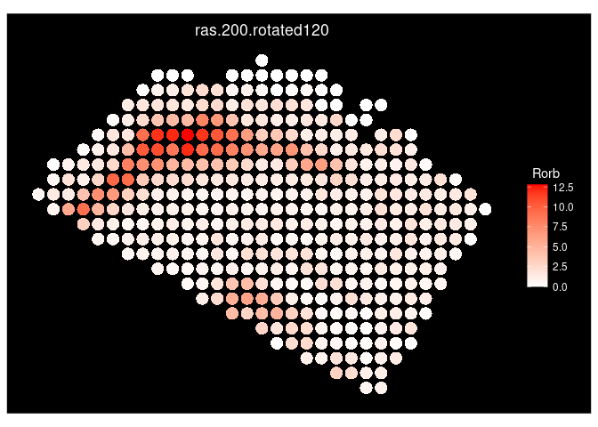

Getting Started With SEraster
================
Compiled: June 07, 2024

# Getting Started with SEraster

In this vignette, we show how to run basic functionalities of `SEraster`
using SeuratWrappers on Seurat objects. `SEraster` is a rasterization
preprocessing framework that aggregates cellular information into
spatial pixels to reduce resource requirements for spatial omics data
analysis, developed by the JEFworks Lab. Functionalities provided by
`SEraster` reduces the number of spots in spatial datasets for
downstream analysis through a process of rasterization, where single
cells’ gene expression or cell-type labels are aggregated into equally
sized pixels based on a user-defined resolution.

While the original framework was created to accomodate SpatialExperiment
objects, running `SEraster` with SeuratWrapper allows users to perform
rasterization on Seurat spatial objects, supporting datatypes such as
Vizgen MERSCOPE, Nanostring CosMx, Akoya CODEX, the 10x Genomics Visium
system, and SLIDE-seq.

## Load libraries

``` r
library(Seurat)
library(SeuratWrappers)
library(SeuratData)
library(SEraster)
library(ggplot2)
```

## Load example dataset

This vignette uses the Tiny subset dataset provided in the [Fresh Frozen
Mouse Brain for Xenium Explorer
Demo](https://www.10xgenomics.com/resources/datasets/fresh-frozen-mouse-brain-for-xenium-explorer-demo-1-standard)
and the [Visium HD mouse brain
dataset](https://support.10xgenomics.com/spatial-gene-expression/datasets),
both from from 10x Genomics. When using Seurat, we use different
plotting functions for image-based and sequencing-based spatial
datasets, and will therefore demonstrate SEraster behavior using both
examples.

``` r
path <- "/brahms/hartmana/vignette_data/xenium_tiny_subset"
# Load the Xenium data
xenium.obj <- LoadXenium(path, fov = "fov")
# remove cells with 0 counts
xenium.obj <- subset(xenium.obj, subset = nCount_Xenium > 0)
```

``` r
# visualize
ImageFeaturePlot(xenium.obj, features = "nCount_Xenium")
```

<!-- -->

``` r
localdir <- "/brahms/lis/visium_hd/mouse/new_mousebrain/"
# Load the VisiumHD data
visiumhd.obj <- Load10X_Spatial(data.dir = localdir, bin.size = 16)
```

``` r
# visualize
SpatialDimPlot(visiumhd.obj, alpha = 0.5) + NoLegend()
```

<!-- -->

### Rasterize gene expression

For continuous variables such as gene expression or other molecular
information, `SEraster` aggregates the observed raw counts or normalized
expression values for each molecule within each pixel using means by
default (can be changed using the `fun` argument). When rasterizing
Seurat objects, users can specify the `assay_name`, `slot`, and `image`
for spatial objects with associated images.

Let’s try rasterizing the gene expression of the Xenium mouse brain
dataset we loaded.

``` r
rastGexp <- RunRasterizeGeneExpression(xenium.obj, assay_name = "Xenium", resolution = 100)

# check dimensions of spot by gene matrix after rasterization
dim(rastGexp[['Xenium']])
```

    ## [1]  248 1424

Here, 36602 spots were rasterized into 248 spots.

``` r
# plot total rasterized gene expression
ImageDimPlot(rastGexp, size = 2)
```

<!-- -->

``` r
# plot specific genes on rasterized object
ImageFeaturePlot(rastGexp, size = 1.5, features = c("Cux2", "Rorb", "Bcl11b", "Foxp2"), max.cutoff = c(25, 35, 12, 10), cols = c("white", "red"))
```

<!-- -->

``` r
# compare to original object
ImageFeaturePlot(xenium.obj, features = c("Cux2", "Rorb", "Bcl11b", "Foxp2"), max.cutoff = c(25, 35, 12, 10), size = 0.75, cols = c("white", "red"))
```

<!-- -->

### Rasterize cell-type

For categorical variables such as cell-type or cluster labels,
`SEraster` aggregates the number of cells for each label within each
pixel using sums by default (can be changed using the `fun` argument).

Let’s try rasterizing the cluster labels of the Xenium Tiny dataset.

``` r
xenium.obj <- NormalizeData(xenium.obj, assay = "Xenium")
xenium.obj <- ScaleData(xenium.obj, assay = "Xenium")
xenium.obj <- RunPCA(xenium.obj, npcs = 30, features = rownames(xenium.obj))
xenium.obj <- RunUMAP(xenium.obj, dims = 1:30)
xenium.obj <- FindNeighbors(xenium.obj, reduction = "pca", dims = 1:30)
xenium.obj <- FindClusters(xenium.obj, resolution = 0.3)
```

    ## Modularity Optimizer version 1.3.0 by Ludo Waltman and Nees Jan van Eck
    ## 
    ## Number of nodes: 36553
    ## Number of edges: 1410292
    ## 
    ## Running Louvain algorithm...
    ## Maximum modularity in 10 random starts: 0.9504
    ## Number of communities: 23
    ## Elapsed time: 8 seconds

``` r
DimPlot(xenium.obj, group.by='seurat_clusters')
```

<!-- -->

``` r
ImageDimPlot(xenium.obj, group.by='seurat_clusters')
```

<!-- -->

``` r
rastCt <- RunRasterizeCellType(xenium.obj, col_name = "seurat_clusters", resolution = 200)

# check the dimension of the cell-types-by-cells matrix after rasterizing cell-type labels
dim(rastCt[['seurat_clusters']])
```

    ## [1]  23 396

``` r
# plot total cell counts per rasterized spot
ImageFeaturePlot(rastCt, size = 5, features = 'num_cell')
```

<!-- -->

``` r
# plot number of seurat clusters for each rasterized spot
ImageFeaturePlot(rastCt, size = 5, features = 'nFeature_seurat_clusters')
```

<!-- -->

### Setting rasterization resolution

Rasterization resolution can be controlled by the `resolution` argument
of the `rasterizeGeneExpression` and `rasterizeCellType` functions.
Here, we refer to a particular resolution of rasterization by the side
length for square pixels and the distance between opposite edges for
hexagonal pixels such that finer resolution indicates smaller pixel size
and vice versa.

Let’s see how the rasterized VisiumHD mouse brain dataset looks with
various resolutions using square pixels, which is specified by `shape`.

``` r
# rasterize at defined resolution
rast2000 <- RunRasterizeGeneExpression(visiumhd.obj, assay_name="Spatial.016um", resolution = 2000)
rast2000 <- NormalizeData(rast2000)

rast1000 <- RunRasterizeGeneExpression(visiumhd.obj, assay_name="Spatial.016um", resolution = 1000)
rast1000 <- NormalizeData(rast1000)

# visualize
SpatialFeaturePlot(rast2000, shape = 22, pt.size.factor = 2, features = "Hpca") + ggtitle("Hpca expression (res = 2000)")
```

<!-- -->

``` r
SpatialFeaturePlot(rast1000, shape = 22, pt.size.factor = 2, features = "Hpca") + ggtitle("Hpca expression (res = 1000)")
```

<!-- -->

### Creating and rasterizing permutations

Since rasterized values may be sensitive to edge effects such as the
specific boundaries of grids upon rasterization, `SEraster` enables
permutation by rotating the dataset at various angles before
rasterization, which has been enabled in the SeuratWrappers
implementation.

For example, we create 3 permutations of the Xenium Tiny mouse brain
dataset, which would return the object with x,y coordinates rotated at
0, 120, and 240 degrees around the midrange point as new field of views.

In addition to a single `Seurat` spatial object,
`rasterizeGeneExpression` and `rasterizeCellType` functions can both
take a `list` of `Seurat` objects. This essentially allows users to
streamline the preprocessing of permutations with `SEraster`; followed
by a downstream analysis of choice. When`SEraster` rasterizes a `list`
of objects, all objects in the inputted `list` are rasterized with the
same pixel coordinate framework (same bounding box, resolution, centroid
coordinates). This feature may not be particularly useful for
permutations; however, it can potentially be applied to compare two or
more datasets, such as structurally aligned tissues as well as healthy
vs. disease tissues.

``` r
# permutate
DefaultAssay(xenium.obj) <- "Xenium"
spe_list <- RunPermutateByRotation(xenium.obj, n_perm = 3)

# rasterize permutated datasets at once
out_list <- RunRasterizeGeneExpression(spe_list, assay_name = "Xenium", resolution = 200)

for (i in seq_along(out_list)) {
  # extract rotated angle
  angle <- Images(out_list[[i]])
  # plot a specific gene
  plt <- ImageFeaturePlot(out_list[[i]], features = "Rorb", max.cutoff = 35, size = 5, cols = c("white", "red")) + ggtitle(angle)
  show(plt)
}
```

<!-- --><!-- --><!-- -->

<details>

<summary>**Session Info**</summary>

``` r
sessionInfo()
```

    ## R version 4.2.2 Patched (2022-11-10 r83330)
    ## Platform: x86_64-pc-linux-gnu (64-bit)
    ## Running under: Ubuntu 20.04.6 LTS
    ## 
    ## Matrix products: default
    ## BLAS:   /usr/lib/x86_64-linux-gnu/blas/libblas.so.3.9.0
    ## LAPACK: /usr/lib/x86_64-linux-gnu/lapack/liblapack.so.3.9.0
    ## 
    ## locale:
    ##  [1] LC_CTYPE=en_US.UTF-8       LC_NUMERIC=C              
    ##  [3] LC_TIME=en_US.UTF-8        LC_COLLATE=en_US.UTF-8    
    ##  [5] LC_MONETARY=en_US.UTF-8    LC_MESSAGES=en_US.UTF-8   
    ##  [7] LC_PAPER=en_US.UTF-8       LC_NAME=C                 
    ##  [9] LC_ADDRESS=C               LC_TELEPHONE=C            
    ## [11] LC_MEASUREMENT=en_US.UTF-8 LC_IDENTIFICATION=C       
    ## 
    ## attached base packages:
    ## [1] stats     graphics  grDevices utils     datasets  methods   base     
    ## 
    ## other attached packages:
    ##  [1] ggplot2_3.5.1                   SEraster_0.99.0                
    ##  [3] thp1.eccite.SeuratData_3.1.5    stxBrain.SeuratData_0.1.1      
    ##  [5] ssHippo.SeuratData_3.1.4        pbmcsca.SeuratData_3.0.0       
    ##  [7] pbmcref.SeuratData_1.0.0        pbmcMultiome.SeuratData_0.1.4  
    ##  [9] pbmc3k.SeuratData_3.1.4         panc8.SeuratData_3.0.2         
    ## [11] mousecortexref.SeuratData_1.0.0 ifnb.SeuratData_3.0.0          
    ## [13] hcabm40k.SeuratData_3.0.0       cbmc.SeuratData_3.1.4          
    ## [15] bonemarrowref.SeuratData_1.0.0  bmcite.SeuratData_0.3.0        
    ## [17] SeuratData_0.2.2.9001           SeuratWrappers_0.3.6           
    ## [19] Seurat_5.0.3.9922               SeuratObject_5.0.2             
    ## [21] sp_2.1-3                       
    ## 
    ## loaded via a namespace (and not attached):
    ##   [1] rappdirs_0.3.3              scattermore_1.2            
    ##   [3] SpatialExperiment_1.8.1     R.methodsS3_1.8.2          
    ##   [5] tidyr_1.3.1                 bit64_4.0.5                
    ##   [7] knitr_1.45                  irlba_2.3.5.1              
    ##   [9] DelayedArray_0.24.0         R.utils_2.12.3             
    ##  [11] data.table_1.15.2           RCurl_1.98-1.14            
    ##  [13] generics_0.1.3              BiocGenerics_0.44.0        
    ##  [15] callr_3.7.3                 cowplot_1.1.3              
    ##  [17] usethis_2.1.6               RANN_2.6.1                 
    ##  [19] proxy_0.4-27                future_1.33.1              
    ##  [21] bit_4.0.5                   spatstat.data_3.0-4        
    ##  [23] httpuv_1.6.14               assertthat_0.2.1           
    ##  [25] SummarizedExperiment_1.28.0 xfun_0.43                  
    ##  [27] evaluate_0.23               promises_1.2.1             
    ##  [29] fansi_1.0.6                 igraph_2.0.3               
    ##  [31] DBI_1.2.2                   htmlwidgets_1.6.4          
    ##  [33] spatstat.geom_3.2-9         stats4_4.2.2               
    ##  [35] purrr_1.0.2                 ellipsis_0.3.2             
    ##  [37] RSpectra_0.16-1             backports_1.4.1            
    ##  [39] dplyr_1.1.4                 deldir_2.0-4               
    ##  [41] sparseMatrixStats_1.10.0    MatrixGenerics_1.10.0      
    ##  [43] vctrs_0.6.5                 SingleCellExperiment_1.20.1
    ##  [45] Biobase_2.58.0              remotes_2.5.0              
    ##  [47] ROCR_1.0-11                 abind_1.4-5                
    ##  [49] cachem_1.0.8                withr_3.0.0                
    ##  [51] progressr_0.14.0            checkmate_2.3.1            
    ##  [53] sctransform_0.4.1           prettyunits_1.2.0          
    ##  [55] goftest_1.2-3               cluster_2.1.6              
    ##  [57] dotCall64_1.1-1             lazyeval_0.2.2             
    ##  [59] crayon_1.5.2                arrow_15.0.1               
    ##  [61] hdf5r_1.3.10                spatstat.explore_3.2-7     
    ##  [63] edgeR_3.40.2                pkgconfig_2.0.3            
    ##  [65] labeling_0.4.3              units_0.8-5                
    ##  [67] GenomeInfoDb_1.34.9         nlme_3.1-162               
    ##  [69] pkgload_1.3.3               devtools_2.4.5             
    ##  [71] rlang_1.1.3                 globals_0.16.3             
    ##  [73] lifecycle_1.0.4             miniUI_0.1.1.1             
    ##  [75] fastDummies_1.7.3           rsvd_1.0.5                 
    ##  [77] rprojroot_2.0.4             polyclip_1.10-6            
    ##  [79] RcppHNSW_0.6.0              matrixStats_1.3.0          
    ##  [81] lmtest_0.9-40               Matrix_1.6-5               
    ##  [83] Rhdf5lib_1.20.0             zoo_1.8-12                 
    ##  [85] ggridges_0.5.6              processx_3.8.2             
    ##  [87] png_0.1-8                   viridisLite_0.4.2          
    ##  [89] rjson_0.2.21                bitops_1.0-7               
    ##  [91] R.oo_1.26.0                 KernSmooth_2.23-22         
    ##  [93] spam_2.10-0                 rhdf5filters_1.10.1        
    ##  [95] DelayedMatrixStats_1.20.0   classInt_0.4-10            
    ##  [97] stringr_1.5.1               parallelly_1.37.1          
    ##  [99] spatstat.random_3.2-3       S4Vectors_0.36.2           
    ## [101] beachmat_2.14.2             scales_1.3.0               
    ## [103] memoise_2.0.1               magrittr_2.0.3             
    ## [105] plyr_1.8.9                  ica_1.0-3                  
    ## [107] zlibbioc_1.44.0             compiler_4.2.2             
    ## [109] dqrng_0.3.2                 RColorBrewer_1.1-3         
    ## [111] fitdistrplus_1.1-11         cli_3.6.2                  
    ## [113] XVector_0.38.0              urlchecker_1.0.1           
    ## [115] listenv_0.9.1               patchwork_1.2.0            
    ## [117] pbapply_1.7-2               ps_1.7.5                   
    ## [119] MASS_7.3-58.2               tidyselect_1.2.1           
    ## [121] stringi_1.8.3               highr_0.10                 
    ## [123] yaml_2.3.8                  locfit_1.5-9.9             
    ## [125] ggrepel_0.9.5               grid_4.2.2                 
    ## [127] tools_4.2.2                 future.apply_1.11.1        
    ## [129] parallel_4.2.2              rstudioapi_0.16.0          
    ## [131] gridExtra_2.3               farver_2.1.1               
    ## [133] Rtsne_0.17                  DropletUtils_1.18.1        
    ## [135] rearrr_0.3.4                digest_0.6.35              
    ## [137] BiocManager_1.30.22         shiny_1.8.0                
    ## [139] Rcpp_1.0.12                 GenomicRanges_1.50.2       
    ## [141] scuttle_1.8.4               later_1.3.2                
    ## [143] RcppAnnoy_0.0.22            httr_1.4.7                 
    ## [145] sf_1.0-16                   colorspace_2.1-0           
    ## [147] fs_1.6.3                    tensor_1.5                 
    ## [149] reticulate_1.35.0           IRanges_2.32.0             
    ## [151] splines_4.2.2               uwot_0.1.16                
    ## [153] spatstat.utils_3.0-4        plotly_4.10.4              
    ## [155] sessioninfo_1.2.2           xtable_1.8-4               
    ## [157] jsonlite_1.8.8              R6_2.5.1                   
    ## [159] profvis_0.3.7               pillar_1.9.0               
    ## [161] htmltools_0.5.7             mime_0.12                  
    ## [163] glue_1.7.0                  fastmap_1.1.1              
    ## [165] BiocParallel_1.32.6         class_7.3-21               
    ## [167] codetools_0.2-19            pkgbuild_1.4.2             
    ## [169] utf8_1.2.4                  lattice_0.21-9             
    ## [171] spatstat.sparse_3.0-3       tibble_3.2.1               
    ## [173] leiden_0.4.3.1              magick_2.8.3               
    ## [175] survival_3.5-7              limma_3.54.2               
    ## [177] rmarkdown_2.26              desc_1.4.2                 
    ## [179] munsell_0.5.1               e1071_1.7-14               
    ## [181] rhdf5_2.42.1                GenomeInfoDbData_1.2.9     
    ## [183] HDF5Array_1.26.0            reshape2_1.4.4             
    ## [185] gtable_0.3.5

</details>
