Running BANKSY with Seurat
================
Compiled: May 24, 2026

- [Introduction](#introduction)
- [Overview](#overview)
- [Running BANKSY within Seurat’s spatial
  framework](#running-banksy-within-seurats-spatial-framework)
- [Running BANKSY with locations provided
  explicitly](#running-banksy-with-locations-provided-explicitly)
- [Multi-sample analysis](#multi-sample-analysis)
- [Spatial data integration with
  Harmony](#spatial-data-integration-with-harmony)
- [Scaling to large datasets](#scaling-to-large-datasets)
- [Getting help](#getting-help)

## Introduction

In this vignette, we describe how to run BANKSY with Seurat objects. If
you use BANKSY in your research, please cite

> *BANKSY unifies cell typing and tissue domain segmentation for
> scalable spatial omics data analysis*
>
> Vipul Singhal, Nigel Chou, Joseph Lee, Yifei Yue, Jinyue Liu, Wan Kee
> Chock, Li Lin, Yun-Ching Chang, Erica Mei Ling Teo, Jonathan Aow, Hwee
> Kuan Lee, Kok Hao Chen & Shyam Prabhakar
>
> Nature Genetics, 2024
>
> doi:
> [10.1038/s41588-024-01664-3](https://doi.org/10.1038/s41588-024-01664-3)
>
> Website: <https://prabhakarlab.github.io/Banksy>

BANKSY is a method that incorporates neighborhood information for
clustering spatial omics data. By doing so, BANKSY is able to

- improve cell-type assignment in noisy data
- distinguish subtly different cell-types stratified by microenvironment
- identify spatial domains sharing the same microenvironment

The amount of neighborhood information incorporated is controlled by a
parameter `lambda` in \[0,1\], with higher values giving more weight to
the neighbourhood information during clustering.

## Overview

The `RunBanksy` function implemented with the *SeuratWrappers* package
allows users to run BANKSY with Seurat objects. We describe two options
of running `RunBanksy`. The first is within Seurat’s spatial framework
(see [here](https://satijalab.org/seurat/articles/spatial_vignette.html)
and
[here](https://satijalab.org/seurat/articles/spatial_vignette_2.html))
and requires a Seurat object and a lambda parameter as mandatory input.
The second option works with Seurat objects that do not have spatial
information stored within, and therefore requires an additional argument
giving the locations of the cell centroids or spots.

**Caveat**: `ScaleData` should not be run after a call to `RunBanksy`;
`RunBanksy` populates the `scale.data` slot with the scaled BANKSY
matrix. Calling `ScaleData` after `RunBanksy` performs gene-wise
z-scaling, negating the effect of `lambda`.

Prerequisites to install:

- [Seurat](https://satijalab.org/seurat/install)
- [SeuratData](https://github.com/satijalab/seurat-data)
- [SeuratWrappers](https://github.com/satijalab/seurat-wrappers)
- [Banksy](https://github.com/prabhakarlab/Banksy/)

``` r
library(Banksy)
library(Seurat)
library(SeuratData)
library(SeuratWrappers)

library(ggplot2)
library(gridExtra)
library(pals)

# Kelly palette for visualization
mypal <- kelly()[-1]
```

## Running BANKSY within Seurat’s spatial framework

We demonstrate how to run BANKSY within Seurat’s spatial analysis
framework with a mouse hippocampus Slide-seq v2 dataset from the
*SeuratData* package.

After installing *SeuratData*, the data can be accessed as follows:

``` r
InstallData('ssHippo')
ss.hippo <- LoadData("ssHippo")
```

We perform simple preprocessing by filtering beads with high mito
percentage and keeping only beads within the 5th and 98th percentile of
total UMI counts. To keep runtime of this vignette short, we downsample
the data to 10,000 beads.

``` r
# Filtering
ss.hippo[['percent.mt']] <- PercentageFeatureSet(ss.hippo, pattern = '^MT-')
ss.hippo <- subset(ss.hippo, percent.mt < 10 &
                    nCount_Spatial > quantile(ss.hippo$nCount_Spatial, 0.05) &
                    nCount_Spatial < quantile(ss.hippo$nCount_Spatial, 0.98))
# Downsample
set.seed(42)
ss.hippo <- ss.hippo[,sample(colnames(ss.hippo), 1e4)]
```

Next, normalize the data and find variable genes:

``` r
# Normalize
ss.hippo <- NormalizeData(ss.hippo)
ss.hippo <- FindVariableFeatures(ss.hippo)
ss.hippo <- ScaleData(ss.hippo)
```

To run BANKSY, we specify the following:

- `lambda`: a numeric value in \[0,1\]. With low values of lambda,
  BANKSY operates in cell-typing mode, while high values of lambda find
  spatial domains.
- `assay` and `slot`: determines where to pull the expression data from
- `features`: specifies features for downstream analysis. This can be
  `'all'`, `'variable'` or a subset of features.  
- `k_geom`: the number of neighbors that defines a cell’s neighborhood

Call `?RunBanksy` for more details on function parameters.

``` r
# Run BANKSY
ss.hippo <- RunBanksy(ss.hippo, lambda = 0.2, verbose=TRUE, 
                      assay = 'Spatial', slot = 'data', features = 'variable',
                      k_geom = 15)
ss.hippo
```

    ## An object of class Seurat 
    ## 27264 features across 10000 samples within 2 assays 
    ## Active assay: BANKSY (4000 features, 0 variable features)
    ##  2 layers present: data, scale.data
    ##  1 other assay present: Spatial
    ##  1 image present: image

Note that the `RunBanksy` function sets the default assay to `BANKSY` (
determined by the `assay_name` argument) and fills the `scale.data`
slot. Users should not call `ScaleData` on the `BANKSY` assay as this
negates the effects of `lambda`.

The rest of the pipeline is similar to the ‘default’ Seurat pipline. We
scale the data and run dimensionality reduction with PCA and UMAP:

``` r
# Run PCA and UMAP
ss.hippo <- RunPCA(ss.hippo, assay = 'BANKSY', features = rownames(ss.hippo), npcs = 30)
ss.hippo <- RunUMAP(ss.hippo, dims = 1:30)
```

Next, find BANKSY clusters:

``` r
# Clustering
ss.hippo <- FindNeighbors(ss.hippo, dims = 1:30)
ss.hippo <- FindClusters(ss.hippo, resolution = 0.5)
```

    ## Modularity Optimizer version 1.3.0 by Ludo Waltman and Nees Jan van Eck
    ## 
    ## Number of nodes: 10000
    ## Number of edges: 365658
    ## 
    ## Running Louvain algorithm...
    ## Maximum modularity in 10 random starts: 0.9033
    ## Number of communities: 13
    ## Elapsed time: 0 seconds

Visualize the UMAP and Spatial plot:

``` r
# Viz
coords <- GetTissueCoordinates(ss.hippo)
coords$cluster <- Idents(ss.hippo)[coords$cells]
spatial_plot <- ggplot(coords, aes(x = x, y = y, color = cluster)) +
    geom_point(size = 0.25) + theme_minimal() +
    guides(color = guide_legend(override.aes = list(size = 3)))
grid.arrange(
    DimPlot(ss.hippo, pt.size = 0.25, label = TRUE, label.size = 3, repel = TRUE),
    spatial_plot,
    ncol = 2
)
```

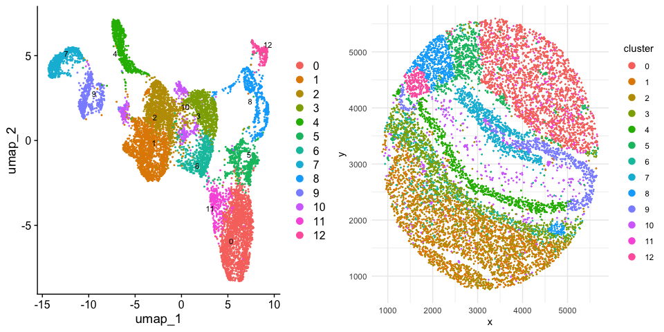

Find markers based on the BANKSY clusters and visualize them. Here, we
find differentially expressed genes between the CA1 and CA3 regions.

``` r
# Find markers
DefaultAssay(ss.hippo) <- 'Spatial'
markers <- FindMarkers(ss.hippo, ident.1 = 4, ident.2 = 9, only.pos = F,
                       logfc.threshold = 1, min.pct = 0.5)
markers <- markers[markers$p_val_adj < 0.01,]
markers
```

    ##               p_val avg_log2FC pct.1 pct.2    p_val_adj
    ## SNAP25 1.127235e-46  -1.260312 0.658 0.823 2.622400e-42
    ## CHGB   9.840001e-44  -1.985343 0.439 0.697 2.289178e-39
    ## STMN2  1.281230e-24  -1.430138 0.335 0.574 2.980653e-20
    ## SYN2   3.272800e-23  -1.609355 0.332 0.564 7.613842e-19
    ## ATP2B1 1.545647e-22   1.251540 0.639 0.474 3.595793e-18
    ## CPLX2  4.619232e-21  -1.220110 0.289 0.522 1.074618e-16
    ## PRKCB  1.276453e-18   1.394809 0.552 0.341 2.969539e-14
    ## PCP4   2.006224e-18  -1.269671 0.379 0.578 4.667279e-14
    ## TUBB2A 1.330787e-16  -1.054176 0.450 0.629 3.095942e-12
    ## DDN    1.784378e-14   1.401976 0.592 0.396 4.151176e-10
    ## SNCA   7.596526e-12  -1.022314 0.397 0.544 1.767256e-07

``` r
genes <- c('ATP2B1', 'CHGB')
coords <- GetTissueCoordinates(ss.hippo)
gene_plots <- lapply(genes, function(g) {
    val <- GetAssayData(ss.hippo, assay = 'Spatial', layer = 'data')[g, coords$cells]
    val[val > quantile(val, 0.95)] <- quantile(val, 0.95)
    coords$expr <- val
    ggplot(coords, aes(x = x, y = y, color = expr)) +
        geom_point(size = 0.25) + theme_minimal() +
        scale_color_gradient(low = 'grey90', high = 'red') +
        ggtitle(g) + theme(legend.title = element_blank())
})
grid.arrange(grobs = gene_plots, ncol = 2)
```

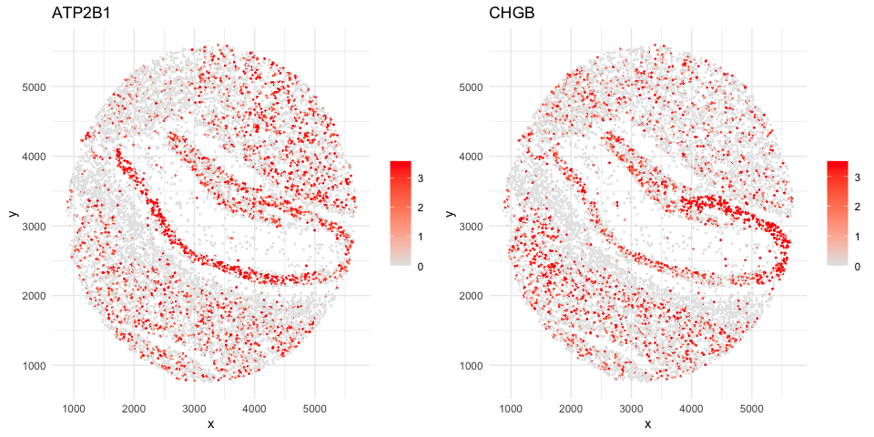

## Running BANKSY with locations provided explicitly

One can also call `RunBanksy` on a Seurat object created from counts by
providing the location of cell centroids or spots explicitly. In this
case, the locations must be stored as metadata. Here, we use a mouse
hippocampus VeraFISH dataset provided with the *Banksy* package.

``` r
data(hippocampus)
head(hippocampus$expression[,1:5])
```

    ##         cell_1276 cell_8890 cell_691 cell_396 cell_9818
    ## Sparcl1        45         0       11       22         0
    ## Slc1a2         17         0        6        5         0
    ## Map            10         0       12       16         0
    ## Sqstm1         26         0        0        2         0
    ## Atp1a2          0         0        4        3         0
    ## Tnc             0         0        0        0         0

``` r
head(hippocampus$locations)
```

    ##                 sdimx    sdimy
    ## cell_1276  -13372.899 15776.37
    ## cell_8890    8941.101 15866.37
    ## cell_691   -14882.899 15896.37
    ## cell_396   -15492.899 15835.37
    ## cell_9818   11308.101 15846.37
    ## cell_11310  14894.101 15810.37

Construct the Seurat object by storing the locations of cell centroids
as metadata. We keep cells with total count between 5th and 98th
percentile:

``` r
# Create manually
vf.hippo <- CreateSeuratObject(counts = hippocampus$expression,
                               meta.data = hippocampus$locations)
vf.hippo <- subset(vf.hippo,
                   nCount_RNA > quantile(vf.hippo$nCount_RNA, 0.05) & 
                   nCount_RNA < quantile(vf.hippo$nCount_RNA, 0.98))
```

Next, we normalize the data by library size and scale the data:

``` r
# Normalize
vf.hippo <- NormalizeData(vf.hippo, scale.factor = 100, normalization.method = 'RC')
vf.hippo <- ScaleData(vf.hippo)
```

Now, run BANKSY. Here, we provide the column names of the x and y
spatial coordinates as stored in the metadata to `dimx` and `dimy`
respectively:

``` r
# Run BANKSY
vf.hippo <- RunBanksy(vf.hippo, lambda = 0.2, dimx = 'sdimx', dimy = 'sdimy', 
                      assay = 'RNA', slot = 'data', features = 'all', k_geom = 10)
```

Note that the `RunBanksy` function sets the default assay to `BANKSY` (
determined by the `assay_name` argument) and fills the `scale.data`
slot. Users should not call `ScaleData` on the `BANKSY` assay as this
negates the effects of `lambda`.

Run PCA on the BANKSY matrix:

``` r
# PCA
vf.hippo <- RunPCA(vf.hippo, assay = 'BANKSY', features = rownames(vf.hippo), npcs = 20)
```

Find BANKSY clusters:

``` r
# Cluster
vf.hippo <- FindNeighbors(vf.hippo, dims = 1:20)
vf.hippo <- FindClusters(vf.hippo, resolution = 0.5)
```

    ## Modularity Optimizer version 1.3.0 by Ludo Waltman and Nees Jan van Eck
    ## 
    ## Number of nodes: 10205
    ## Number of edges: 446178
    ## 
    ## Running Louvain algorithm...
    ## Maximum modularity in 10 random starts: 0.9099
    ## Number of communities: 15
    ## Elapsed time: 0 seconds

Visualise BANKSY clusters in spatial dimensions:

``` r
# Viz
FeatureScatter(vf.hippo, 'sdimx', 'sdimy', cols = mypal, pt.size = 0.75)
```

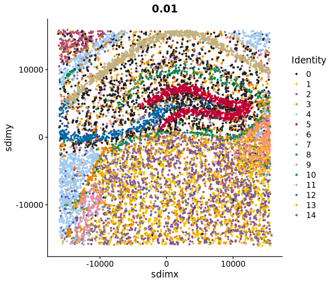

``` r
FeatureScatter(vf.hippo, 'sdimx', 'sdimy', cols = mypal, pt.size = 0.1) + facet_wrap(~ colors)
```

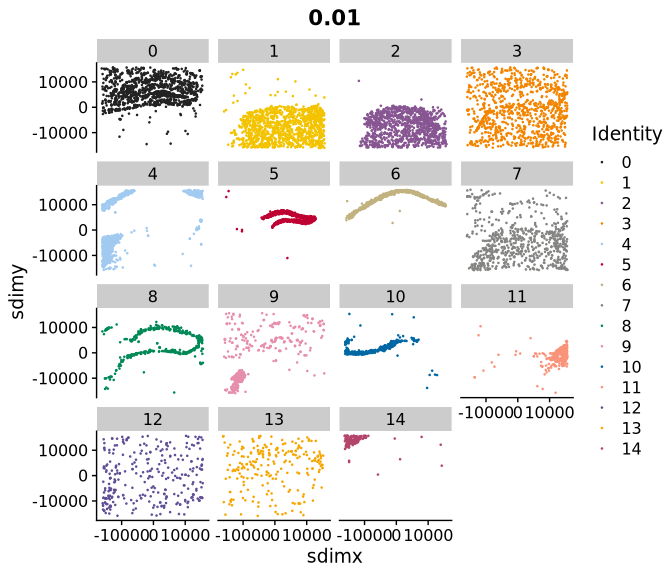

Find markers and visualise them. Here, we do so for a cluster defined by
a thin layer of cells expressing Gfap. We also write a simple function
`genePlot` that plots marker genes in spatial dimensions.

``` r
# Find markers
DefaultAssay(vf.hippo) <- 'RNA'
markers <- FindMarkers(vf.hippo, ident.1 = 6, only.pos = TRUE)

genePlot <- function(object, dimx, dimy, gene, assay = 'RNA',
                     layer = 'scale.data', q.low = 0.01, q.high = 0.99,
                     col.low='blue', col.high='red') {
    val <- GetAssayData(object, assay=assay, layer=layer)[gene,]
    val.low <- quantile(val, q.low)
    val.high <- quantile(val, q.high)
    val[val < val.low] <- val.low
    val[val > val.high] <- val.high
    pdf <- data.frame(x=object[[dimx]], y=object[[dimy]], gene=val)
    colnames(pdf) <- c('sdimx','sdimy', 'gene')
    ggplot(pdf, aes(x=sdimx,y=sdimy,color=gene)) + geom_point(size = 1) + 
        theme_minimal() + theme(legend.title = element_blank()) +
        scale_color_gradient2(low = col.low, high = col.high) +
        ggtitle(gene)
}

genePlot(vf.hippo, 'sdimx', 'sdimy', 'Gfap')
```

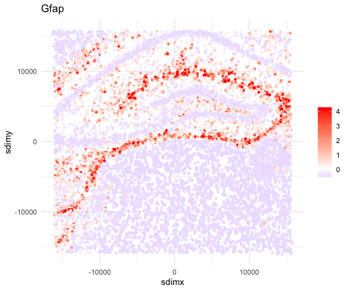

## Multi-sample analysis

This section demonstrate demonstrates multi-sample analysis. Such an
approach is appropriate when analysing multiple spatial omics datasets
with non-contiguous spatial coordinates, and when large batch effects
are not present.

Here, we use a mouse hippocampus VeraFISH dataset provided with the
*Banksy* package.

``` r
data(hippocampus)
head(hippocampus$expression[,1:5])
```

    ##         cell_1276 cell_8890 cell_691 cell_396 cell_9818
    ## Sparcl1        45         0       11       22         0
    ## Slc1a2         17         0        6        5         0
    ## Map            10         0       12       16         0
    ## Sqstm1         26         0        0        2         0
    ## Atp1a2          0         0        4        3         0
    ## Tnc             0         0        0        0         0

``` r
head(hippocampus$locations)
```

    ##                 sdimx    sdimy
    ## cell_1276  -13372.899 15776.37
    ## cell_8890    8941.101 15866.37
    ## cell_691   -14882.899 15896.37
    ## cell_396   -15492.899 15835.37
    ## cell_9818   11308.101 15846.37
    ## cell_11310  14894.101 15810.37

For demonstration purposes, we create three separate datasets by
splitting the data.

``` r
# Number of groups
n_groups = 3
group_names = paste0('group', seq(n_groups))
group_size = 1000
starts = seq(1, by=group_size, length.out=n_groups)
ends = starts + group_size - 1

# List of Seurat objects
seu_list = lapply(seq(n_groups), function(i) {
  idx = seq(starts[i], ends[i])
  seu = CreateSeuratObject(
    counts = hippocampus$expression[,idx],
    meta.data = data.frame(scale(hippocampus$locations[idx,], scale = FALSE))
  )
  # Set original identity of cell
  seu$orig.ident = group_names[i]
  seu
})
seu_list
```

    ## [[1]]
    ## An object of class Seurat 
    ## 120 features across 1000 samples within 1 assay 
    ## Active assay: RNA (120 features, 0 variable features)
    ##  1 layer present: counts
    ## 
    ## [[2]]
    ## An object of class Seurat 
    ## 120 features across 1000 samples within 1 assay 
    ## Active assay: RNA (120 features, 0 variable features)
    ##  1 layer present: counts
    ## 
    ## [[3]]
    ## An object of class Seurat 
    ## 120 features across 1000 samples within 1 assay 
    ## Active assay: RNA (120 features, 0 variable features)
    ##  1 layer present: counts

Perform normalisation for each dataset.

``` r
seu_list = lapply(seu_list, NormalizeData,
                  scale.factor = 100, normalization.method = 'RC')
```

Merge the datasets. Note that the spatial coordinates overlap.

``` r
# Merge
seu = Reduce(merge, seu_list)
seu = JoinLayers(seu) # run this for Seurat v5 objects

# Plot spatial coordinates colored by group
plot(FetchData(seu, c('sdimx', 'sdimy')), col = factor(seu$orig.ident))
```

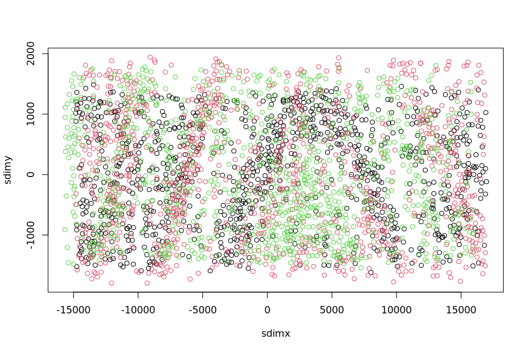

Now run BANKSY. For multi-sample analysis, the argument `group` must be
provided, which specifies the name of the metadata column that gives the
assignment of each cell or spot to its original Seurat object. Here, we
use `orig.ident`. Internally, providing the `group` argument tells the
function to compute neighborhood matrices based on locations staggered
by `group`, ensuring that cells from different spatial datasets do not
overlap. The staggered locations are stored in the metadata for sanity
checking. The `split.scale` argument allows for within-group scaling,
accounting for minor differences in datasets.

``` r
# Grouping variable
head(seu@meta.data)
```

    ##            orig.ident nCount_RNA nFeature_RNA     sdimx    sdimy
    ## cell_1276      group1        266           51 -11933.19 1366.934
    ## cell_8890      group1         13            3  10380.81 1456.934
    ## cell_691       group1        132           36 -13443.19 1486.934
    ## cell_396       group1         95           27 -14053.19 1425.934
    ## cell_9818      group1         10            5  12747.81 1436.934
    ## cell_11310     group1         15            5  16333.81 1400.934

``` r
table(seu$orig.ident)
```

    ## 
    ## group1 group2 group3 
    ##   1000   1000   1000

``` r
# Run BANKSY
seu = RunBanksy(seu, lambda = 0.2, assay = 'RNA', slot = 'data',
                dimx = 'sdimx', dimy = 'sdimy', features = 'all',
                group = 'orig.ident', split.scale = TRUE, k_geom = 15)

# Staggered locations added to metadata
head(seu@meta.data)
```

    ##            orig.ident nCount_RNA nFeature_RNA     sdimx    sdimy
    ## cell_1276      group1        266           51 -11933.19 1366.934
    ## cell_8890      group1         13            3  10380.81 1456.934
    ## cell_691       group1        132           36 -13443.19 1486.934
    ## cell_396       group1         95           27 -14053.19 1425.934
    ## cell_9818      group1         10            5  12747.81 1436.934
    ## cell_11310     group1         15            5  16333.81 1400.934
    ##            staggered_sdimx staggered_sdimy
    ## cell_1276         3728.686        1366.934
    ## cell_8890        26042.686        1456.934
    ## cell_691          2218.686        1486.934
    ## cell_396          1608.686        1425.934
    ## cell_9818        28409.686        1436.934
    ## cell_11310       31995.686        1400.934

The rest of the workflow follows as before:

``` r
seu = RunPCA(seu, assay = 'BANKSY', features = rownames(seu), npcs = 30)
seu = RunUMAP(seu, dims = 1:30)
seu = FindNeighbors(seu, dims = 1:30)
seu = FindClusters(seu, resolution = 1)
```

    ## Modularity Optimizer version 1.3.0 by Ludo Waltman and Nees Jan van Eck
    ## 
    ## Number of nodes: 3000
    ## Number of edges: 171757
    ## 
    ## Running Louvain algorithm...
    ## Maximum modularity in 10 random starts: 0.8094
    ## Number of communities: 12
    ## Elapsed time: 0 seconds

Visualise clusters:

``` r
mypal <- kelly()[-1]
DimPlot(seu, pt.size = 0.25, label = TRUE, label.size = 3, cols = mypal)
```

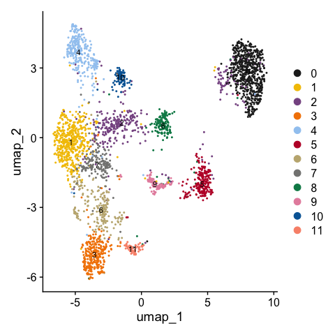

``` r
FeatureScatter(seu, 'staggered_sdimx', 'staggered_sdimy', pt.size = 0.75, cols = mypal)
```

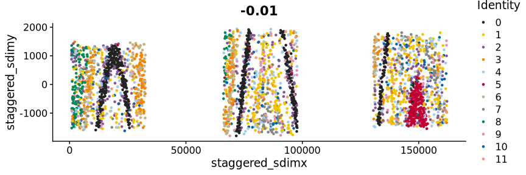

## Spatial data integration with Harmony

BANKSY can be used with Harmony for integrating multiple spatial omics
datasets in the presence of strong batch effects.

Download the data.

``` r
library(spatialLIBD)
library(ExperimentHub)
library(harmony)

ehub <- ExperimentHub::ExperimentHub()
spe <- spatialLIBD::fetch_data(type = "spe", eh = ehub)

imgData(spe) <- NULL
assay(spe, "logcounts") <- NULL
reducedDims(spe) <- NULL
rowData(spe) <- NULL
colData(spe) <- DataFrame(
  sample_id = spe$sample_id,
  clust_annotation = factor(
    addNA(spe$layer_guess_reordered_short),
    exclude = NULL, labels = seq(8)
  ),
  in_tissue = spe$in_tissue,
  row.names = colnames(spe)
)
invisible(gc())

# Subset to first sample of each subject
sample_names <- c("151507", "151669", "151673")
spe_list <- lapply(sample_names, function(x) spe[, spe$sample_id == x])
rm(spe)
invisible(gc())
```

Normalise the data and compute highly variable features.

``` r
# Convert to Seurat and Normalize data
seu_list <- lapply(spe_list, function(x) {
  x <- as.Seurat(x, data = NULL)
  NormalizeData(x, scale.factor = 3000, normalization.method = 'RC')
})

# Compute HVGs for each dataset and take the union
hvgs <- lapply(seu_list, function(x) {
  VariableFeatures(FindVariableFeatures(x, nfeatures = 2000))
})
hvgs <- Reduce(union, hvgs)

# Subset to HVGs
seu_list <- lapply(seu_list, function(x) x[hvgs,])
seu <- Reduce(merge, seu_list)

locs <- do.call(rbind.data.frame, lapply(spe_list, spatialCoords))
seu@meta.data <- cbind(seu@meta.data, locs)

seu
```

    ## An object of class Seurat 
    ## 4467 features across 11526 samples within 1 assay 
    ## Active assay: originalexp (4467 features, 0 variable features)
    ##  2 layers present: counts, data

Run BANKSY. When analysing multiple samples, the argument `group` must
be provided, which specifies the name of the metadata column that gives
the assignment of each cell or spot to its original Seurat object. Here,
we use `sample_id`. Internally, providing the `group` argument tells the
function to compute neighborhood matrices based on locations staggered
by `group`, ensuring that cells from different spatial datasets do not
overlap. The staggered locations are stored in the metadata for sanity
checking. Within-group scaling has little effect in the presence of
strong batch effects, hence, we set `split.scale=FALSE` for efficiency.

``` r
# Grouping variable
head(seu@meta.data)
```

    ##                         orig.ident nCount_originalexp nFeature_originalexp
    ## AAACAACGAATAGTTC-1_1 SeuratProject                288                  197
    ## AAACAAGTATCTCCCA-1_1 SeuratProject               1546                  550
    ## AAACAATCTACTAGCA-1_1 SeuratProject                525                  247
    ## AAACACCAATAACTGC-1_1 SeuratProject               1123                  457
    ## AAACAGCTTTCAGAAG-1_1 SeuratProject               1008                  415
    ## AAACAGGGTCTATATT-1_1 SeuratProject               1431                  539
    ##                      sample_id clust_annotation in_tissue pxl_col_in_fullres
    ## AAACAACGAATAGTTC-1_1    151507                1      TRUE               3276
    ## AAACAAGTATCTCCCA-1_1    151507                3      TRUE               9178
    ## AAACAATCTACTAGCA-1_1    151507                1      TRUE               5133
    ## AAACACCAATAACTGC-1_1    151507                7      TRUE               3462
    ## AAACAGCTTTCAGAAG-1_1    151507                6      TRUE               2779
    ## AAACAGGGTCTATATT-1_1    151507                6      TRUE               3053
    ##                      pxl_row_in_fullres
    ## AAACAACGAATAGTTC-1_1               2514
    ## AAACAAGTATCTCCCA-1_1               8520
    ## AAACAATCTACTAGCA-1_1               2878
    ## AAACACCAATAACTGC-1_1               9581
    ## AAACAGCTTTCAGAAG-1_1               7663
    ## AAACAGGGTCTATATT-1_1               8143

``` r
table(seu$sample_id)
```

    ## 
    ## 151507 151669 151673 
    ##   4226   3661   3639

``` r
sdimx <- 'pxl_col_in_fullres'
sdimy <- 'pxl_row_in_fullres'

# Run BANKSY
seu <- RunBanksy(seu, lambda = 0.2, assay = 'originalexp', slot = 'data',
                dimx = sdimx, dimy = sdimy, features = 'all',
                group = 'sample_id', split.scale = FALSE, k_geom = 6)
```

Compute a spatially-aware embedding with PCA on the BANKSY matrix, and
run Harmony on this embedding.

``` r
seu <- RunPCA(seu, assay = 'BANKSY', features = rownames(seu), npcs = 10)
seu <- RunHarmony(seu, group.by.vars='sample_id')
```

The rest of the workflow follows as before:

``` r
seu <- RunUMAP(seu, dims = 1:10, reduction = 'harmony')
seu <- FindNeighbors(seu, dims = 1:10, reduction = 'harmony')
seu <- FindClusters(seu, resolution = 0.4)
```

    ## Modularity Optimizer version 1.3.0 by Ludo Waltman and Nees Jan van Eck
    ## 
    ## Number of nodes: 11526
    ## Number of edges: 377720
    ## 
    ## Running Louvain algorithm...
    ## Maximum modularity in 10 random starts: 0.8798
    ## Number of communities: 6
    ## Elapsed time: 1 seconds

Visualise clusters:

``` r
grid.arrange(
    DimPlot(seu, pt.size = 0.25, label = TRUE, label.size = 3, cols = mypal),
    DimPlot(seu, pt.size = 0.25, group.by = 'sample_id'),
    ncol = 2
)
```

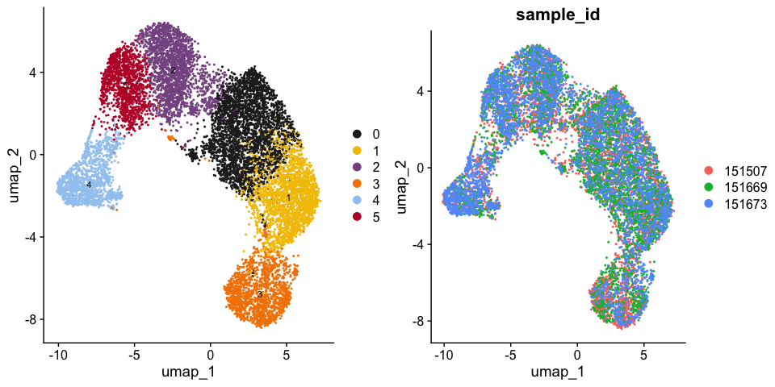

``` r
spatial_plots <- lapply(sample_names, function(s) {
    sub <- subset(seu, sample_id == s)
    ggplot(sub@meta.data, aes(x = pxl_col_in_fullres, y = pxl_row_in_fullres,
                              color = seurat_clusters)) +
        geom_point(size = 1) + coord_equal() + theme_minimal() +
        scale_color_manual(values = mypal) +
        ggtitle(s) + theme(legend.position = 'none') +
        labs(x = NULL, y = NULL)
})
grid.arrange(grobs = spatial_plots, ncol = 3)
```

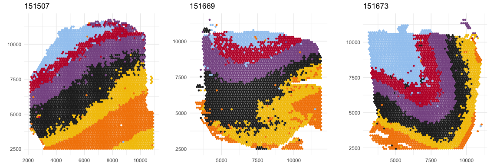

## Scaling to large datasets

For large datasets (millions of cells), materializing the full BANKSY
matrix can exceed memory limits. The `lazy` option in `RunBanksy` avoids
this by computing PCs of the BANKSY matrix directly via a lazy linear
operator. The BANKSY matrix is never formed; instead, matrix-vector
products are evaluated on-the-fly using the sparse expression matrix and
weight matrix. This reduces peak memory from
$O(\text{genes} \times \text{cells})$ (the dense BANKSY matrix) to
$O(\text{nnz}(\text{input}))$ (the number of non-zero entries in the
sparse input), since only the sparse input and sparse weight matrix are
held in memory.

**Note**: `lazy=TRUE` currently supports M=0 only (no azimuthal Gabor
filter).

This feature requires the development versions of Banksy and
SeuratWrappers:

``` r
devtools::install_github('prabhakarlab/Banksy@feat-sparse-matmul')
devtools::install_github('jleechung/seurat-wrappers@feat-sparse-matmul')
```

We demonstrate this with a 10X Xenium mouse brain dataset (~37k cells),
performing domain segmentation with `lambda = 0.8`.

Download the dataset:

``` r
download.file(
    url = 'https://cf.10xgenomics.com/samples/xenium/1.0.2/Xenium_V1_FF_Mouse_Brain_Coronal_Subset_CTX_HP/Xenium_V1_FF_Mouse_Brain_Coronal_Subset_CTX_HP_outs.zip',
    destfile = '~/Downloads/xenium_subset.zip'
)
unzip('~/Downloads/xenium_subset.zip', exdir = '~/Downloads/xenium_subset')
```

Load and preprocess:

``` r
xenium <- LoadXenium('~/Downloads/xenium_subset', fov = 'fov')
xenium <- NormalizeData(xenium)
xenium <- FindVariableFeatures(xenium)
```

With `lazy = TRUE`, `RunBanksy` reads the expression matrix from the
`data` slot of the `Xenium` assay, computes `npcs` principal components
of the BANKSY matrix (default 50, matching Seurat’s `RunPCA`) directly
via a sparse linear operator, and stores the result as a dimensionality
reduction named by `assay_name`. No `BANKSY` assay is created, and there
is no need to call `RunPCA` separately. For multi-sample integration,
you can run Harmony on the BANKSY reduction before `FindNeighbors` (see
the [Harmony section](#spatial-data-integration-with-harmony) above).

``` r
xenium_input <- xenium
xenium <- RunBanksy(xenium, lazy = TRUE, npcs = 50,
                    lambda = 0.8, k_geom = 30, use_agf = FALSE,
                    assay = 'Xenium', slot = 'data', features = 'variable',
                    assay_name = 'BANKSY', verbose = TRUE)

# Optionally, run Harmony for batch correction
# xenium <- RunHarmony(xenium, group.by.vars = 'batch', reduction.use = 'BANKSY')

xenium <- FindNeighbors(xenium, reduction = 'BANKSY', dims = 1:50)
xenium <- FindClusters(xenium, resolution = 0.5)
```

    ## Modularity Optimizer version 1.3.0 by Ludo Waltman and Nees Jan van Eck
    ## 
    ## Number of nodes: 36602
    ## Number of edges: 1017035
    ## 
    ## Running Louvain algorithm...
    ## Maximum modularity in 10 random starts: 0.9441
    ## Number of communities: 23
    ## Elapsed time: 3 seconds

Visualize the spatial domains:

``` r
n_clust <- length(levels(Idents(xenium)))
pal <- c(mypal, hcl.colors(max(0, n_clust - length(mypal))))
ImageDimPlot(xenium, size = 0.5, cols = pal) +
    coord_flip() + scale_x_reverse() + NoLegend() +
    theme(plot.background = element_rect(fill = 'white'),
          panel.background = element_rect(fill = 'white'))
```

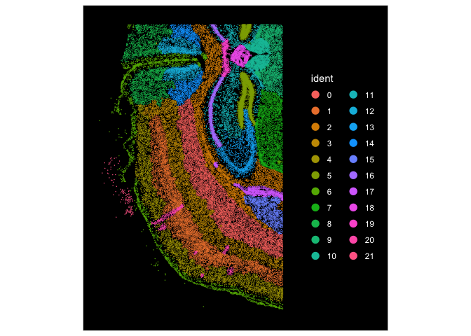

<details>
<summary>
Equivalence with the standard workflow
</summary>

The standard workflow constructs the full BANKSY matrix
$$\mathbf{M} = \begin{bmatrix} \sqrt{1-\lambda}\;\mathbf{Z}(\mathbf{X}) \\[4pt] \sqrt{\lambda}\;\mathbf{Z}(\mathbf{X}\mathbf{W}) \end{bmatrix}$$
where $\mathbf{X}$ is the expression matrix ($g \times n$), $\mathbf{W}$
is the sparse neighbor-weight matrix ($n \times n$, $k$ non-zeros per
column), and $\mathbf{Z}(\cdot)$ denotes row-wise z-scoring followed by
clipping to $[-10, 10]$ (matching Seurat’s `FastRowScale`). PCA is then
computed on $\mathbf{M}$ via `RunPCA`.

With `lazy=TRUE`, $\mathbf{M}$ is never formed. Instead, `irlba`
accesses $\mathbf{M}$ through a lazy linear operator that evaluates
matrix–vector products on the fly. Writing the row-wise z-score as
$\mathbf{Z}(\mathbf{A})_{ij} = (A_{ij} - \mu_i) / \sigma_i$, since
`irlba` only requires the ability to compute forward products
$\mathbf{M}\mathbf{v}$ and adjoint products
$\mathbf{M}^{\!\top}\mathbf{u}$ for arbitrary vectors
$\mathbf{v} \in \mathbb{R}^n$ and $\mathbf{u} \in \mathbb{R}^{2g}$,
rather than access to $\mathbf{M}$ itself, each block of the forward
product is evaluated as:

$$\mathbf{Z}(\mathbf{X})\,\mathbf{v}
= \frac{\mathbf{X}\mathbf{v} - \boldsymbol{\mu}\,\mathbf{1}^{\!\top}\mathbf{v}}
       {\boldsymbol{\sigma}}$$

$$\mathbf{Z}(\mathbf{X}\mathbf{W})\,\mathbf{v}
= \frac{\mathbf{X}(\mathbf{W}\mathbf{v}) - \boldsymbol{\mu}_{H_0}\,\mathbf{1}^{\!\top}\mathbf{v}}
       {\boldsymbol{\sigma}_{H_0}}$$

where the key step is
$(\mathbf{X}\mathbf{W})\mathbf{v} = \mathbf{X}(\mathbf{W}\mathbf{v})$ by
associativity: the sparse $\mathbf{W}$ is applied to $\mathbf{v}$ first
($O(kn)$), then the result is left-multiplied by the sparse $\mathbf{X}$
($O(\mathrm{nnz}(\mathbf{X}))$), avoiding formation of the dense
$g \times n$ product $\mathbf{X}\mathbf{W}$. The adjoint is derived
analogously. Row means, standard deviations, and a sparse correction for
Seurat’s z-score clipping are precomputed once before the Lanczos
iterations begin.

This reduces peak memory from $O(gn)$ (the dense BANKSY matrix) to
$O(\mathrm{nnz}(\mathbf{X}) + kn)$ (the sparse input plus the sparse
weight matrix), while producing numerically identical PCA embeddings.

The standard workflow materializes the full BANKSY matrix as a Seurat
assay, then runs PCA via `RunPCA`:

``` r
xenium_std <- RunBanksy(xenium_input, lambda = 0.8, verbose = TRUE,
                        assay = 'Xenium', slot = 'data', features = 'variable',
                        use_agf = FALSE, k_geom = 30)
xenium_std <- RunPCA(xenium_std, assay = 'BANKSY', features = rownames(xenium_std),
                     npcs = 50)
xenium_std <- FindNeighbors(xenium_std, dims = 1:50)
xenium_std <- FindClusters(xenium_std, resolution = 0.5)
```

    ## Modularity Optimizer version 1.3.0 by Ludo Waltman and Nees Jan van Eck
    ## 
    ## Number of nodes: 36602
    ## Number of edges: 1016983
    ## 
    ## Running Louvain algorithm...
    ## Maximum modularity in 10 random starts: 0.9441
    ## Number of communities: 23
    ## Elapsed time: 3 seconds

``` r
n_clust <- length(levels(Idents(xenium_std)))
pal <- c(mypal, hcl.colors(max(0, n_clust - length(mypal))))
ImageDimPlot(xenium_std, size = 0.5, cols = pal) +
    coord_flip() + scale_x_reverse() + NoLegend() +
    theme(plot.background = element_rect(fill = 'white'),
          panel.background = element_rect(fill = 'white'))
```


We compare the two embeddings with three checks:

``` r
U1 <- scale(Embeddings(xenium_std, 'pca'), scale = FALSE)
U2 <- scale(Embeddings(xenium, 'BANKSY'), scale = FALSE)
npcs <- ncol(U1)
```

**Subspace overlap.** Individual PCs may differ due to near-degenerate
singular values, but the subspaces they span should be equivalent. We
measure this via principal angles between the top-k subspaces from each
path. A minimum cosine near 1 means the two subspaces are effectively
identical:

``` r
subspace_cos <- sapply(seq_len(npcs), function(k) {
    Q1 <- qr.Q(qr(U1[, 1:k, drop = FALSE]))
    Q2 <- qr.Q(qr(U2[, 1:k, drop = FALSE]))
    min(svd(crossprod(Q1, Q2))$d)
})

plot(seq_len(npcs), subspace_cos, type = 'b', pch = 19, ylim = c(0.5, 1),
     xlab = 'Number of PCs (k)', ylab = 'Min cosine of principal angles',
     main = 'Subspace overlap: standard vs lazy')
abline(h = 0.99, lty = 2, col = 'grey50')
```

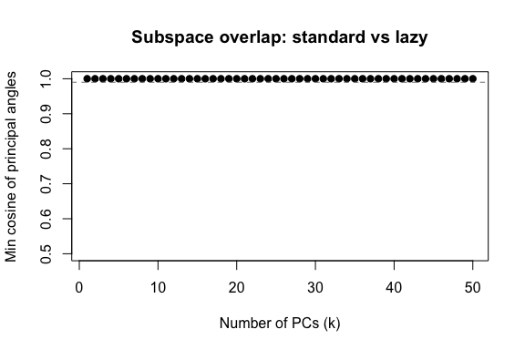

**kNN overlap.** Since clustering operates on the nearest-neighbor
graph, we compare the 30-NN graphs built from each embedding. The mean
Jaccard index measures what fraction of each cell’s neighbors are shared
between the two paths:

``` r
nn1 <- RANN::nn2(U1, k = 30)$nn.idx
nn2 <- RANN::nn2(U2, k = 30)$nn.idx
jaccard <- mean(sapply(seq_len(nrow(nn1)), function(i) {
    length(intersect(nn1[i,], nn2[i,])) / length(union(nn1[i,], nn2[i,]))
}))
cat('Mean kNN Jaccard overlap (k=30):', round(jaccard, 4), '\n')
```

    ## Mean kNN Jaccard overlap (k=30): 0.9999

**Clustering agreement.** The adjusted Rand index (ARI) measures how
closely the two sets of cluster labels agree, adjusted for chance:

``` r
ari <- mclust::adjustedRandIndex(
    as.integer(Idents(xenium_std)),
    as.integer(Idents(xenium))
)
cat('Adjusted Rand Index:', round(ari, 4), '\n')
```

    ## Adjusted Rand Index: 0.8503

</details>

## Getting help

For more information, visit <https://github.com/prabhakarlab/Banksy>.

<details>
<summary>
Vignette runtime
</summary>

    ## Time difference of 3.279604 mins

</details>
<details>
<summary>
Session info
</summary>

``` r
sessionInfo()
```

    ## R version 4.5.1 (2025-06-13)
    ## Platform: aarch64-apple-darwin20
    ## Running under: macOS Sonoma 14.6.1
    ## 
    ## Matrix products: default
    ## BLAS:   /Library/Frameworks/R.framework/Versions/4.5-arm64/Resources/lib/libRblas.0.dylib 
    ## LAPACK: /Library/Frameworks/R.framework/Versions/4.5-arm64/Resources/lib/libRlapack.dylib;  LAPACK version 3.12.1
    ## 
    ## locale:
    ## [1] en_US.UTF-8/en_US.UTF-8/en_US.UTF-8/C/en_US.UTF-8/en_US.UTF-8
    ## 
    ## time zone: America/Los_Angeles
    ## tzcode source: internal
    ## 
    ## attached base packages:
    ## [1] stats4    stats     graphics  grDevices utils     datasets  methods  
    ## [8] base     
    ## 
    ## other attached packages:
    ##  [1] harmony_1.2.4               Rcpp_1.1.0                 
    ##  [3] ExperimentHub_2.99.5        AnnotationHub_3.99.6       
    ##  [5] BiocFileCache_2.99.5        dbplyr_2.5.0               
    ##  [7] spatialLIBD_1.21.6          SpatialExperiment_1.18.1   
    ##  [9] SingleCellExperiment_1.30.1 SummarizedExperiment_1.39.1
    ## [11] Biobase_2.69.0              GenomicRanges_1.61.1       
    ## [13] Seqinfo_0.99.1              IRanges_2.43.0             
    ## [15] S4Vectors_0.47.0            BiocGenerics_0.55.0        
    ## [17] generics_0.1.4              MatrixGenerics_1.21.0      
    ## [19] matrixStats_1.5.0           future_1.58.0              
    ## [21] pals_1.10                   gridExtra_2.3              
    ## [23] ggplot2_3.5.2               SeuratWrappers_0.4.0       
    ## [25] stxBrain.SeuratData_0.1.2   ssHippo.SeuratData_3.1.4   
    ## [27] bmcite.SeuratData_0.3.0     SeuratData_0.2.2.9002      
    ## [29] Seurat_5.4.0                SeuratObject_5.3.0         
    ## [31] sp_2.2-0                    Banksy_1.9.1               
    ## 
    ## loaded via a namespace (and not attached):
    ##   [1] bitops_1.0-9             spatstat.sparse_3.1-0    httr_1.4.7              
    ##   [4] RColorBrewer_1.1-3       doParallel_1.0.17        tools_4.5.1             
    ##   [7] sctransform_0.4.2        R6_2.6.1                 DT_0.34.0               
    ##  [10] lazyeval_0.2.2           uwot_0.2.3               GetoptLong_1.0.5        
    ##  [13] withr_3.0.2              progressr_0.15.1         cli_3.6.5               
    ##  [16] spatstat.explore_3.4-3   fastDummies_1.7.5        sass_0.4.10             
    ##  [19] labeling_0.4.3           spatstat.data_3.1-6      ggridges_0.5.6          
    ##  [22] pbapply_1.7-2            Rsamtools_2.25.1         dbscan_1.2.2            
    ##  [25] R.utils_2.13.0           aricode_1.0.3            scater_1.37.0           
    ##  [28] dichromat_2.0-0.1        sessioninfo_1.2.3        parallelly_1.45.0       
    ##  [31] attempt_0.3.1            maps_3.4.3               limma_3.65.5            
    ##  [34] RSQLite_2.4.1            BiocIO_1.19.0            shape_1.4.6.1           
    ##  [37] ica_1.0-3                spatstat.random_3.4-1    dplyr_1.1.4             
    ##  [40] Matrix_1.7-3             ggbeeswarm_0.7.2         abind_1.4-8             
    ##  [43] R.methodsS3_1.8.2        lifecycle_1.0.4          edgeR_4.7.6             
    ##  [46] yaml_2.3.10              SparseArray_1.9.0        Rtsne_0.17              
    ##  [49] paletteer_1.6.0          grid_4.5.1               blob_1.2.4              
    ##  [52] promises_1.3.3           crayon_1.5.3             miniUI_0.1.2            
    ##  [55] lattice_0.22-7           beachmat_2.25.1          cowplot_1.2.0           
    ##  [58] KEGGREST_1.49.1          mapproj_1.2.12           magick_2.8.7            
    ##  [61] pillar_1.11.0            knitr_1.50               ComplexHeatmap_2.25.2   
    ##  [64] rjson_0.2.23             future.apply_1.20.0      codetools_0.2-20        
    ##  [67] glue_1.8.0               spatstat.univar_3.1-3    data.table_1.17.6       
    ##  [70] remotes_2.5.0            vctrs_0.6.5              png_0.1-8               
    ##  [73] spam_2.11-1              gtable_0.3.6             rematch2_2.1.2          
    ##  [76] cachem_1.1.0             xfun_0.52                S4Arrays_1.9.1          
    ##  [79] mime_0.13                survival_3.8-3           RcppHungarian_0.3       
    ##  [82] iterators_1.0.14         statmod_1.5.1            fitdistrplus_1.2-4      
    ##  [85] ROCR_1.0-11              nlme_3.1-168             bit64_4.6.0-1           
    ##  [88] filelock_1.0.3           RcppAnnoy_0.0.22         GenomeInfoDb_1.45.7     
    ##  [91] bslib_0.9.0              irlba_2.3.5.1            vipor_0.4.7             
    ##  [94] KernSmooth_2.23-26       colorspace_2.1-1         DBI_1.2.3               
    ##  [97] tidyselect_1.2.1         bit_4.6.0                compiler_4.5.1          
    ## [100] curl_6.4.0               httr2_1.1.2              BiocNeighbors_2.3.1     
    ## [103] DelayedArray_0.35.2      plotly_4.11.0            rtracklayer_1.69.1      
    ## [106] scales_1.4.0             lmtest_0.9-40            rappdirs_0.3.3          
    ## [109] stringr_1.5.1            digest_0.6.37            goftest_1.2-3           
    ## [112] spatstat.utils_3.1-4     rmarkdown_2.29           benchmarkmeData_1.0.4   
    ## [115] RhpcBLASctl_0.23-42      XVector_0.49.0           htmltools_0.5.8.1       
    ## [118] pkgconfig_2.0.3          fastmap_1.2.0            rlang_1.1.6             
    ## [121] GlobalOptions_0.1.2      htmlwidgets_1.6.4        UCSC.utils_1.5.0        
    ## [124] shiny_1.11.1             jquerylib_0.1.4          farver_2.1.2            
    ## [127] zoo_1.8-14               jsonlite_2.0.0           BiocParallel_1.43.4     
    ## [130] mclust_6.1.1             config_0.3.2             R.oo_1.27.1             
    ## [133] BiocSingular_1.24.0      RCurl_1.98-1.17          magrittr_2.0.3          
    ## [136] scuttle_1.19.0           dotCall64_1.2            patchwork_1.3.1         
    ## [139] viridis_0.6.5            reticulate_1.42.0        leidenAlg_1.1.5         
    ## [142] stringi_1.8.7            MASS_7.3-65              plyr_1.8.9              
    ## [145] parallel_4.5.1           listenv_0.9.1            ggrepel_0.9.6           
    ## [148] deldir_2.0-4             Biostrings_2.77.2        sccore_1.0.6            
    ## [151] splines_4.5.1            tensor_1.5.1             circlize_0.4.16         
    ## [154] locfit_1.5-9.12          igraph_2.1.4             spatstat.geom_3.4-1     
    ## [157] RcppHNSW_0.6.0           ScaledMatrix_1.16.0      reshape2_1.4.4          
    ## [160] XML_3.99-0.18            BiocVersion_3.22.0       evaluate_1.0.4          
    ## [163] golem_0.5.1              BiocManager_1.30.26      foreach_1.5.2           
    ## [166] httpuv_1.6.16            RANN_2.6.2               tidyr_1.3.1             
    ## [169] purrr_1.0.4              polyclip_1.10-7          benchmarkme_1.0.8       
    ## [172] clue_0.3-66              scattermore_1.2          rsvd_1.0.5              
    ## [175] xtable_1.8-4             restfulr_0.0.16          RSpectra_0.16-2         
    ## [178] later_1.4.2              viridisLite_0.4.2        tibble_3.3.0            
    ## [181] beeswarm_0.4.0           GenomicAlignments_1.45.1 memoise_2.0.1           
    ## [184] AnnotationDbi_1.71.0     cluster_2.1.8.1          shinyWidgets_0.9.0      
    ## [187] globals_0.18.0

</details>
