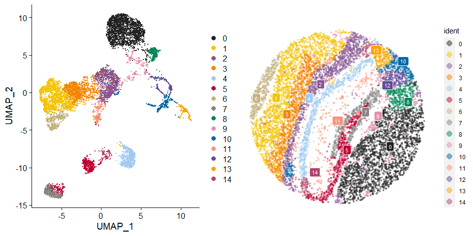
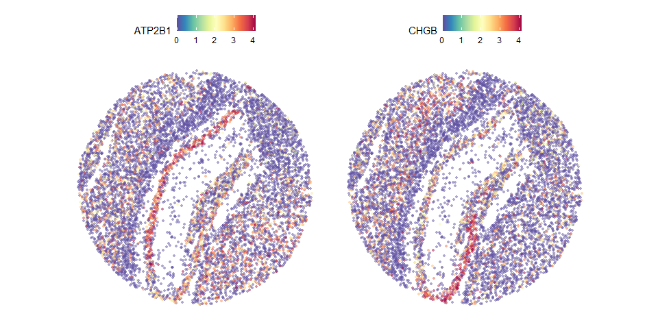

Running BANKSY with Seurat
================
Compiled: August 31, 2022

-   <a href="#introduction" id="toc-introduction">Introduction</a>
-   <a href="#overview" id="toc-overview">Overview</a>
-   <a href="#running-banksy-within-seurats-spatial-framework"
    id="toc-running-banksy-within-seurats-spatial-framework">Running BANKSY
    within Seurat’s spatial framework</a>
-   <a href="#running-banksy-with-locations-provided-explicitly"
    id="toc-running-banksy-with-locations-provided-explicitly">Running
    BANKSY with locations provided explicitly</a>
-   <a href="#getting-help" id="toc-getting-help">Getting help</a>

## Introduction

In this vignette, we describe how to run BANKSY with Seurat objects. If
you use BANKSY in your research, please cite

> *BANKSY: A Spatial Omics Algorithm that Unifies Cell Type Clustering
> and Tissue Domain Segmentation*
>
> Vipul Singhal, Nigel Chou, Joseph Lee, Jinyue Liu, Wan Kee Chock, Li
> Lin, Yun-Ching Chang, Erica Teo, Hwee Kuan Lee, Kok Hao Chen, Shyam
> Prabhakar
>
> bioRxiv, 2022
>
> doi:
> [10.1101/2022.04.14.488259](https://www.biorxiv.org/content/10.1101/2022.04.14.488259)
>
> Website: <https://prabhakarlab.github.io/Banksy>

BANKSY is a method that incorporates neighborhood information for
clustering spatial omics data. By doing so, BANKSY is able to

-   improve cell-type assignment in noisy data
-   distinguish subtly different cell-types stratified by
    microenvironment
-   identify spatial domains sharing the same microenvironment

The amount of neighborhood information incorporated is controlled by a
parameter `lambda` in \[0,1\], with higher values giving more weight to
the neighbourhood information during clustering.

## Overview

The `RunBanksy` function implemented with the *SeuratWrappers* package
allows users to run BANKSY with Seurat objects. We describe two options
of running `RunBanksy`. The first is within Seurat’s spatial framework
(see [here](https://satijalab.org/seurat/articles/spatial_vignette.html)
and
[here](https://satijalab.org/seurat/articles/spatial_vignette_2.html))
and requires a Seurat object and a lambda parameter as mandatory input.
The second option works with Seurat objects that do not have spatial
information stored within, and therefore requires an additional argument
giving the locations of the cell centroids or spots.

Prerequisites to install:

-   [Seurat](https://satijalab.org/seurat/install)
-   [SeuratData](https://github.com/satijalab/seurat-data)
-   [SeuratWrappers](https://github.com/satijalab/seurat-wrappers)
-   [Banksy](https://github.com/prabhakarlab/Banksy/)

``` r
library(Banksy)
library(Seurat)
library(SeuratData)
library(SeuratWrappers)

library(ggplot2)
library(gridExtra)
library(pals)

# Kelly palette for visualization
mypal <- kelly()[-1]
```

## Running BANKSY within Seurat’s spatial framework

We demonstrate how to run BANKSY within Seurat’s spatial analysis
framework with a mouse hippocampus Slide-seq v2 dataset from the
*SeuratData* package.

After installing *SeuratData*, the data can be accessed as follows:

``` r
InstallData('ssHippo')
ss.hippo <- LoadData("ssHippo")
```

We perform simple preprocessing by filtering beads with high mito
percentage and keeping only beads within the 5th and 98th percentile of
total UMI counts. To keep runtime of this vignette short, we downsample
the data to 10,000 beads.

``` r
# Filtering
ss.hippo[['percent.mt']] <- PercentageFeatureSet(ss.hippo, pattern = '^MT-')
ss.hippo <- subset(ss.hippo, percent.mt < 10 &
                    nCount_Spatial > quantile(ss.hippo$nCount_Spatial, 0.05) &
                    nCount_Spatial < quantile(ss.hippo$nCount_Spatial, 0.98))
# Downsample
set.seed(42)
ss.hippo <- ss.hippo[,sample(colnames(ss.hippo), 1e4)]
```

Next, normalize the data and find variable genes:

``` r
# Normalize
ss.hippo <- NormalizeData(ss.hippo)
ss.hippo <- FindVariableFeatures(ss.hippo)
```

To run BANKSY, we specify the following:

-   `lambda`: a numeric value in \[0,1\]. With low values of lambda,
    BANKSY operates in cell-typing mode, while high values of lambda
    find spatial domains.
-   `assay` and `slot`: determines where to pull the expression data
    from
-   `features`: specifies features for downstream analysis. This can be
    `'all'`, `'variable'` or a subset of features.  
-   `k_geom`: the number of neighbors that defines a cell’s neighborhood

Call `?RunBanksy` for more details on function parameters.

``` r
# Run BANKSY
ss.hippo <- RunBanksy(ss.hippo, lambda = 0.3, verbose=TRUE, 
                      assay = 'Spatial', slot = 'data', features = 'variable',
                      k_geom = 10)
ss.hippo
```

    ## An object of class Seurat 
    ## 27264 features across 10000 samples within 2 assays 
    ## Active assay: BANKSY (4000 features, 0 variable features)
    ##  1 other assay present: Spatial
    ##  1 image present: image

Note that the `RunBanksy` function sets the default assay to `BANKSY` (
determined by the `assay_name` argument) and fills the `scale.data`
slot.

The rest of the pipeline is similar to the ‘default’ Seurat pipline. We
scale the data and run dimensionality reduction with PCA and UMAP:

``` r
# Run PCA and UMAP
ss.hippo <- RunPCA(ss.hippo, assay = 'BANKSY', features = rownames(ss.hippo), npcs = 50)
ss.hippo <- RunUMAP(ss.hippo, dims = 1:30)
```

Next, find BANKSY clusters:

``` r
# Clustering
ss.hippo <- FindNeighbors(ss.hippo, dims = 1:30)
ss.hippo <- FindClusters(ss.hippo, resolution = 0.5)
```

    ## Modularity Optimizer version 1.3.0 by Ludo Waltman and Nees Jan van Eck
    ## 
    ## Number of nodes: 10000
    ## Number of edges: 348389
    ## 
    ## Running Louvain algorithm...
    ## Maximum modularity in 10 random starts: 0.9019
    ## Number of communities: 12
    ## Elapsed time: 1 seconds

Visualize the UMAP and Spatial plot:

``` r
# Viz
grid.arrange(
    DimPlot(ss.hippo, cols = mypal, pt.size = 0.25),
    SpatialDimPlot(ss.hippo, stroke = NA, label = TRUE, label.size = 3, 
                   repel = TRUE, alpha = 0.5, cols = mypal, pt.size.factor = 2),
    ncol = 2
)
```



Find markers based on the BANKSY clusters and visualize them. Here, we
find differentially expressed genes between the CA1 and CA3 regions.

``` r
# Find markers
DefaultAssay(ss.hippo) <- 'Spatial'
markers <- FindMarkers(ss.hippo, ident.1 = 4, ident.2 = 8, only.pos = F, 
                       logfc.threshold = 1, min.pct = 0.5)
markers <- markers[markers$p_val_adj < 0.01,]
markers
```

    ##               p_val avg_log2FC pct.1 pct.2    p_val_adj
    ## SNAP25 1.632615e-44  -1.220761 0.662 0.818 3.798115e-40
    ## CHGB   5.256876e-41  -1.811216 0.442 0.688 1.222960e-36
    ## ATP2B1 2.396039e-25   1.231292 0.648 0.461 5.574144e-21
    ## STMN2  8.820624e-23  -1.225031 0.341 0.565 2.052030e-18
    ## SYN2   1.923082e-21  -1.387140 0.339 0.557 4.473858e-17
    ## CPLX2  5.480717e-20  -1.017802 0.290 0.516 1.275034e-15
    ## PRKCB  3.093593e-19   1.205415 0.555 0.337 7.196936e-15
    ## PCP4   3.510875e-18  -1.138038 0.385 0.580 8.167700e-14
    ## DDN    1.749830e-14   1.221791 0.595 0.398 4.070805e-10

``` r
genes <- c('ATP2B1', 'CHGB')
SpatialFeaturePlot(ss.hippo, features = genes, pt.size.factor = 3, 
                   stroke = NA, alpha = 0.5, max.cutoff = 'q95')
```



## Running BANKSY with locations provided explicitly

One can also call `RunBanksy` on a Seurat object created from counts by
providing the location of cell centroids or spots explicitly. In this
case, the locations must be stored as metadata. Here, we use a mouse
hippocampus VeraFISH dataset provided with the *Banksy* package.

``` r
data(hippocampus)
head(hippocampus$expression[,1:5])
```

    ##         cell_1276 cell_8890 cell_691 cell_396 cell_9818
    ## Sparcl1        45         0       11       22         0
    ## Slc1a2         17         0        6        5         0
    ## Map            10         0       12       16         0
    ## Sqstm1         26         0        0        2         0
    ## Atp1a2          0         0        4        3         0
    ## Tnc             0         0        0        0         0

``` r
head(hippocampus$locations)
```

    ##                 sdimx    sdimy
    ## cell_1276  -13372.899 15776.37
    ## cell_8890    8941.101 15866.37
    ## cell_691   -14882.899 15896.37
    ## cell_396   -15492.899 15835.37
    ## cell_9818   11308.101 15846.37
    ## cell_11310  14894.101 15810.37

Construct the Seurat object by storing the locations of cell centroids
as metadata. We keep cells with total count between 5th and 98th
percentile:

``` r
# Create manually
vf.hippo <- CreateSeuratObject(counts = hippocampus$expression,
                               meta.data = hippocampus$locations)
vf.hippo <- subset(vf.hippo,
                   nCount_RNA > quantile(vf.hippo$nCount_RNA, 0.05) & 
                   nCount_RNA < quantile(vf.hippo$nCount_RNA, 0.98))
```

Next, we normalize the data by library size and scale the data:

``` r
# Normalize
vf.hippo <- NormalizeData(vf.hippo, scale.factor = 100, normalization.method = 'RC')
vf.hippo <- ScaleData(vf.hippo)
```

Now, run BANKSY. Here, we provide the column names of the x and y
spatial coordinates as stored in the metadata to `dimx` and `dimy`
respectively:

``` r
# Run BANKSY
vf.hippo <- RunBanksy(vf.hippo, lambda = 0.3, dimx = 'sdimx', dimy = 'sdimy', 
                      assay = 'RNA', slot = 'data', features = 'all', k_geom = 10)
```

Scale the BANKSY matrix and run PCA:

``` r
# PCA
vf.hippo <- RunPCA(vf.hippo, assay = 'BANKSY', features = rownames(vf.hippo), npcs = 50)
```

Find BANKSY clusters:

``` r
# Cluster
vf.hippo <- FindNeighbors(vf.hippo, dims = 1:30)
vf.hippo <- FindClusters(vf.hippo, resolution = 0.5)
```

    ## Modularity Optimizer version 1.3.0 by Ludo Waltman and Nees Jan van Eck
    ## 
    ## Number of nodes: 10205
    ## Number of edges: 501038
    ## 
    ## Running Louvain algorithm...
    ## Maximum modularity in 10 random starts: 0.9083
    ## Number of communities: 15
    ## Elapsed time: 1 seconds

Visualise BANKSY clusters in spatial dimensions:

``` r
# Viz
FeatureScatter(vf.hippo, 'sdimx', 'sdimy', cols = mypal, pt.size = 0.75)
```


Find markers and visualise them. Here, we do so for a cluster defined by
a thin layer of cells expressing Gfap. We also write a simple function
`genePlot` that plots marker genes in spatial dimensions.

``` r
# Find markers
DefaultAssay(vf.hippo) <- 'RNA'
markers <- FindMarkers(vf.hippo, ident.1 = 6, only.pos = TRUE)

genePlot <- function(object, dimx, dimy, gene, 
                     slot = 'scale.data', q.low = 0.01, q.high = 0.99,
                     col.low='blue', col.high='red') {
    val <- GetAssayData(object, slot)[gene,]
    val.low <- quantile(val, q.low)
    val.high <- quantile(val, q.high)
    val[val < val.low] <- val.low
    val[val > val.high] <- val.high
    pdf <- data.frame(x=object[[dimx]], y=object[[dimy]], gene=val)
    colnames(pdf) <- c('sdimx','sdimy', 'gene')
    ggplot(pdf, aes(x=sdimx,y=sdimy,color=gene)) + geom_point(size = 1) + 
        theme_minimal() + theme(legend.title = element_blank()) +
        scale_color_gradient2(low = col.low, high = col.high) +
        ggtitle(gene)
}

genePlot(vf.hippo, 'sdimx', 'sdimy', 'Gfap')
```


## Getting help

For more information, visit <https://github.com/prabhakarlab/Banksy>.

<details>
<summary>
Vignette runtime
</summary>

    ## Time difference of 1.868142 mins

</details>
<details>
<summary>
Session info
</summary>

``` r
sessionInfo()
```

    ## R version 4.1.2 (2021-11-01)
    ## Platform: x86_64-w64-mingw32/x64 (64-bit)
    ## Running under: Windows 10 x64 (build 19043)
    ## 
    ## Matrix products: default
    ## 
    ## locale:
    ## [1] LC_COLLATE=English_Singapore.1252  LC_CTYPE=English_Singapore.1252   
    ## [3] LC_MONETARY=English_Singapore.1252 LC_NUMERIC=C                      
    ## [5] LC_TIME=English_Singapore.1252    
    ## 
    ## attached base packages:
    ## [1] stats     graphics  grDevices utils     datasets  methods   base     
    ## 
    ## other attached packages:
    ##  [1] pals_1.7                  gridExtra_2.3            
    ##  [3] ggplot2_3.3.6             SeuratWrappers_0.3.0     
    ##  [5] stxBrain.SeuratData_0.1.1 ssHippo.SeuratData_3.1.4 
    ##  [7] SeuratData_0.2.1          sp_1.4-6                 
    ##  [9] SeuratObject_4.0.999.9011 Seurat_4.1.0.9004        
    ## [11] Banksy_0.1.3             
    ## 
    ## loaded via a namespace (and not attached):
    ##   [1] utf8_1.2.2                  reticulate_1.24            
    ##   [3] R.utils_2.11.0              tidyselect_1.1.2           
    ##   [5] htmlwidgets_1.5.4           grid_4.1.2                 
    ##   [7] Rtsne_0.15                  munsell_0.5.0              
    ##   [9] codetools_0.2-18            ica_1.0-2                  
    ##  [11] future_1.24.0               miniUI_0.1.1.1             
    ##  [13] withr_2.5.0                 spatstat.random_2.1-0      
    ##  [15] colorspace_2.0-2            progressr_0.10.0           
    ##  [17] Biobase_2.54.0              highr_0.9                  
    ##  [19] knitr_1.37                  ggalluvial_0.12.3          
    ##  [21] rstudioapi_0.13             stats4_4.1.2               
    ##  [23] ROCR_1.0-11                 tensor_1.5                 
    ##  [25] listenv_0.8.0               labeling_0.4.2             
    ##  [27] MatrixGenerics_1.6.0        GenomeInfoDbData_1.2.7     
    ##  [29] polyclip_1.10-0             farver_2.1.0               
    ##  [31] parallelly_1.30.0           Matrix.utils_0.9.8         
    ##  [33] vctrs_0.3.8                 generics_0.1.2             
    ##  [35] xfun_0.29                   R6_2.5.1                   
    ##  [37] doParallel_1.0.17           GenomeInfoDb_1.30.1        
    ##  [39] clue_0.3-60                 rsvd_1.0.5                 
    ##  [41] bitops_1.0-7                spatstat.utils_2.3-0       
    ##  [43] DelayedArray_0.20.0         assertthat_0.2.1           
    ##  [45] promises_1.2.0.1            scales_1.2.0               
    ##  [47] rgeos_0.5-9                 gtable_0.3.0               
    ##  [49] globals_0.14.0              goftest_1.2-3              
    ##  [51] rlang_1.0.2                 GlobalOptions_0.1.2        
    ##  [53] splines_4.1.2               lazyeval_0.2.2             
    ##  [55] dichromat_2.0-0.1           spatstat.geom_2.3-2        
    ##  [57] BiocManager_1.30.16         yaml_2.2.1                 
    ##  [59] reshape2_1.4.4              abind_1.4-5                
    ##  [61] httpuv_1.6.5                tools_4.1.2                
    ##  [63] sccore_1.0.1                ellipsis_0.3.2             
    ##  [65] spatstat.core_2.4-0         RColorBrewer_1.1-3         
    ##  [67] BiocGenerics_0.40.0         ggridges_0.5.3             
    ##  [69] Rcpp_1.0.9                  plyr_1.8.6                 
    ##  [71] zlibbioc_1.40.0             purrr_0.3.4                
    ##  [73] RCurl_1.98-1.6              rpart_4.1-15               
    ##  [75] dbscan_1.1-10               deldir_1.0-6               
    ##  [77] pbapply_1.5-0               GetoptLong_1.0.5           
    ##  [79] cowplot_1.1.1               S4Vectors_0.32.3           
    ##  [81] zoo_1.8-9                   SummarizedExperiment_1.24.0
    ##  [83] grr_0.9.5                   ggrepel_0.9.1              
    ##  [85] cluster_2.1.2               magrittr_2.0.1             
    ##  [87] RSpectra_0.16-1             data.table_1.14.2          
    ##  [89] scattermore_0.8             circlize_0.4.15            
    ##  [91] lmtest_0.9-39               RANN_2.6.1                 
    ##  [93] fitdistrplus_1.1-8          matrixStats_0.61.0         
    ##  [95] patchwork_1.1.1             mime_0.12                  
    ##  [97] evaluate_0.15               xtable_1.8-4               
    ##  [99] mclust_5.4.9                IRanges_2.28.0             
    ## [101] shape_1.4.6                 compiler_4.1.2             
    ## [103] tibble_3.1.6                maps_3.4.0                 
    ## [105] KernSmooth_2.23-20          crayon_1.5.1               
    ## [107] R.oo_1.24.0                 htmltools_0.5.2            
    ## [109] mgcv_1.8-39                 later_1.3.0                
    ## [111] tidyr_1.2.0                 DBI_1.1.2                  
    ## [113] ComplexHeatmap_2.10.0       MASS_7.3-54                
    ## [115] rappdirs_0.3.3              Matrix_1.3-4               
    ## [117] cli_3.1.0                   R.methodsS3_1.8.1          
    ## [119] parallel_4.1.2              RcppHungarian_0.2          
    ## [121] igraph_1.3.4                GenomicRanges_1.46.1       
    ## [123] pkgconfig_2.0.3             plotly_4.10.0              
    ## [125] spatstat.sparse_2.1-0       foreach_1.5.2              
    ## [127] XVector_0.34.0              leidenAlg_1.0.3            
    ## [129] stringr_1.4.0               digest_0.6.29              
    ## [131] sctransform_0.3.3           RcppAnnoy_0.0.19           
    ## [133] spatstat.data_2.1-2         rmarkdown_2.13             
    ## [135] leiden_0.3.9                uwot_0.1.11                
    ## [137] shiny_1.7.1                 rjson_0.2.21               
    ## [139] lifecycle_1.0.1             nlme_3.1-153               
    ## [141] jsonlite_1.8.0              mapproj_1.2.8              
    ## [143] limma_3.50.1                viridisLite_0.4.0          
    ## [145] fansi_0.5.0                 pillar_1.7.0               
    ## [147] lattice_0.20-45             fastmap_1.1.0              
    ## [149] httr_1.4.2                  survival_3.2-13            
    ## [151] glue_1.6.0                  remotes_2.4.2              
    ## [153] png_0.1-7                   iterators_1.0.14           
    ## [155] stringi_1.7.6               dplyr_1.0.7                
    ## [157] irlba_2.3.5                 future.apply_1.8.1

</details>
