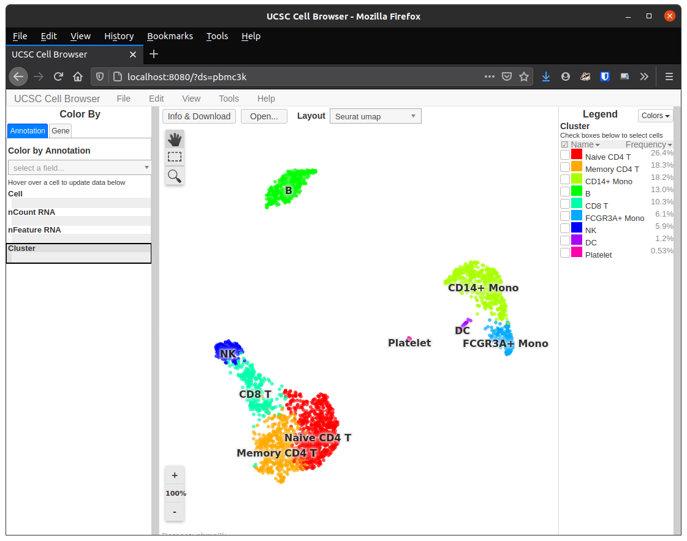

Data Exploration with the UCSC Cell Browser
================
Compiled: August 31, 2020

This vignette demonstrates how to run launch a UCSC Cell Browser
instance populated with data from a Seurat object. If you use cell
browser, please cite:

> *UCSC Single Cell Browser*
> 
> Maximilian Haeussler, Nikolay Markov, Brian Raney, and Lucas Seninge

> Documentation: <https://cellbrowser.readthedocs.io>

Prerequisites to install:

  - [Seurat](https://satijalab.org/seurat/install)
  - [UCSC Cell Browser](https://pypi.org/project/cellbrowser/)
  - [SeuratWrappers](https://github.com/satijalab/seurat-wrappers)
  - [SeuratData](https://github.com/satijalab/seurat-data)

<!-- end list -->

``` r
library(Seurat)
library(SeuratData)
library(SeuratWrappers)
```

### Viewing pbmc3k in a cell browser

``` r
InstallData("pbmc3k")
pbmc3k <- LoadData("pbmc3k", type = "pbmc3k.final")
ExportToCellbrowser(pbmc3k, dir = "out", cb.dir = "cb_out", port = 8080, reductions = "umap")
```



``` r
# Remember to stop your cell browser instance when done
StopCellbrowser()
```
