Running CoGAPS on Seurat Objects
================
Compiled: April 20, 2020

-   [Running CoGAPS with Seurat Data Using Cloud Computing](#running-cogaps-with-seurat-data-using-cloud-computing)
    -   [Using CoGAPS to Identify Cell Lineage](#using-cogaps-to-identify-cell-lineage)
    -   [Using CoGAPS to Identify Cell Type](#using-cogaps-to-identify-cell-type)
-   [Running CoGAPS with Seurat Data Locally](#running-cogaps-with-seurat-data-locally)
    -   [Lymphoid Lineage](#lymphoid-lineage-1)
    -   [Myeloid Lineage](#myeloid-lineage-1)
    -   [Additional Features of CoGAPS](#additional-features-of-cogaps)
    -   [Resoures for CoGAPS](#resoures-for-cogaps)

This vignette demonstrates the use of the CoGAPS package on Seurat objects.

> *Decomposing cell identity for transfer learning across cellular measurements, platforms, tissues, and species*
>
> Genevieve L. Stein-O’Brien, Brian S. Clark, Thomas Sherman, Cristina Zibetti, Qiwen Hu, Rachel Sealfon, Sheng Liu, Jiang Qian, Carlo Colantuoni, Seth Blackshaw, Loyal A.Goff, Elana J.Fertig
>
> Cell Systems, 2019.
>
> doi: [10.1016/j.cels.2019.04.004](https://doi.org/10.1016/j.cels.2019.04.004)
>
> Bioconductor: <https://www.bioconductor.org/packages/release/bioc/html/CoGAPS.html>

Prerequisites to install:

-   [Seurat](https://satijalab.org/seurat/install)
-   [SeuratWrappers](https://github.com/satijalab/seurat-wrappers)
-   [SeuratData](https://github.com/satijalab/seurat-data)
-   [CoGAPS](https://bioconductor.org/packages/release/bioc/vignettes/CoGAPS/inst/doc/CoGAPS.html#vignette-version)

``` r
library(Seurat)
library(SeuratWrappers)
library(SeuratData)
library(CoGAPS)
```

Running CoGAPS with Seurat Data Using Cloud Computing
=====================================================

We suggest using a high number of iterations to get robust results when running CoGAPS. This will allow the algorithm to converge. When the system has converged, the results are fairly robust. 50,000 iterations were used in this example and the runtime was roughly five hours for each run (three patterns and ten patterns). We used Amazon Web Services, a Cloud Computing Service, to run CoGAPS. An example to run locally is featured later on.

### Using CoGAPS to Identify Cell Lineage

*AWS was used to run the below section of CoGAPS to look for three patterns*

To learn more about this dataset, type `?pbmc3k`

``` r
InstallData("pbmc3k")
data("pbmc3k.final")
params <- CogapsParams(singleCell = TRUE, sparseOptimization = TRUE, seed = 123, nIterations = 50000, 
    nPatterns = 3, distributed = "genome-wide")
params <- setDistributedParams(params, nSets = 5)
pbmc3k.final <- RunCoGAPS(pbmc3k.final, temp.file = TRUE, params = params)
```

The two major lineages of blood cells are categorized as either myeloid or lymphoid. This specialization requires transcriptional diversification during lineage commitment. There are specific genes related to each of these lineages. In our data, CoGAPS identifies distinct patterns that segregate cells by immune lineage as shown below.

#### Lymphoid Lineage

``` r
VlnPlot(pbmc3k.final, features = "CoGAPS_3")
```

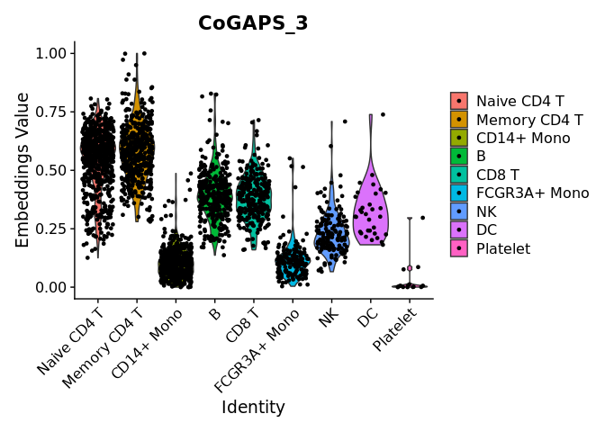

#### Myeloid Lineage

``` r
VlnPlot(pbmc3k.final, features = "CoGAPS_1")
```

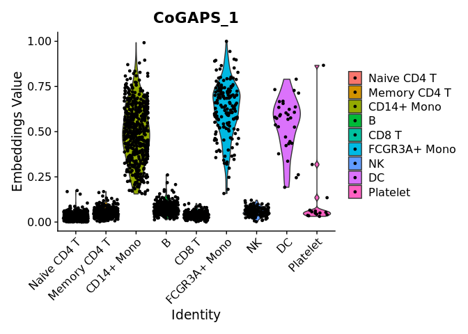

``` r
DimPlot(pbmc3k.final, reduction = "CoGAPS", pt.size = 0.5, dims = c(1, 3))
```

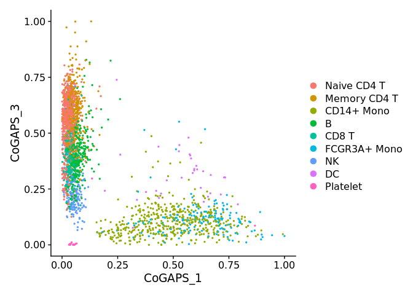

### Using CoGAPS to Identify Cell Type

*AWS was used to run the below section of CoGAPS to look for ten patterns*

To learn more about this dataset, type `?pbmc3k`

``` r
InstallData("pbmc3k")
data("pbmc3k.final")

params <- CogapsParams(singleCell = TRUE, sparseOptimization = TRUE, seed = 123, nIterations = 50000, 
    nPatterns = 10, distributed = "genome-wide")
params <- setDistributedParams(params, nSets = 5)
pbmc3k.final <- RunCoGAPS(object = pbmc3k.final, temp.file = TRUE, params = params)
```

Both the myeloid or lymphoid lineages give rise to many different cell types critical to the immune system. CoGAPS is able to discern cell type specific patterns, such as those shown below for DC (CoGAPS\_3) and B (CoGAPS\_4) cells. Importantly, CoGAPS is also able to identify phenotypic subtypes within a population of cells, such as FCGR3A+ Monocytes (CoGAPS\_6).

#### DC Cells

``` r
VlnPlot(pbmc3k.final, features = "CoGAPS_3")
```

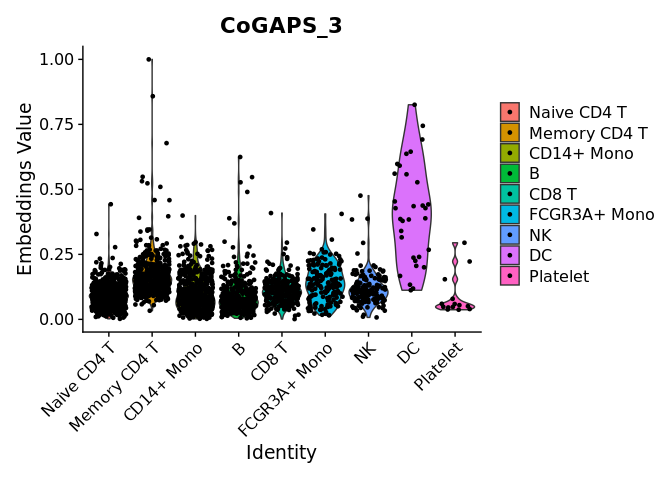

#### B Cells

``` r
VlnPlot(pbmc3k.final, features = "CoGAPS_4")
```

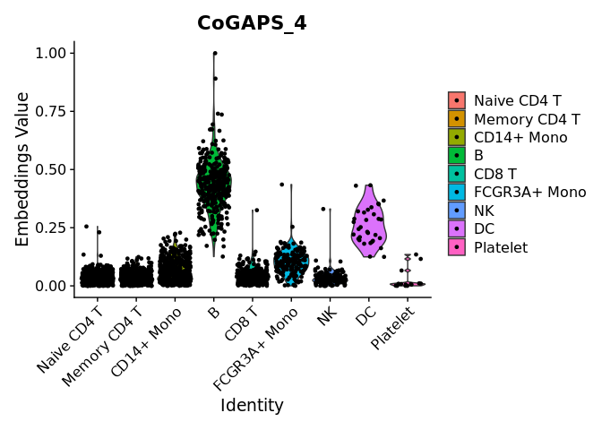

#### FCGR3A+ Monocytes

``` r
VlnPlot(pbmc3k.final, features = "CoGAPS_6")
```

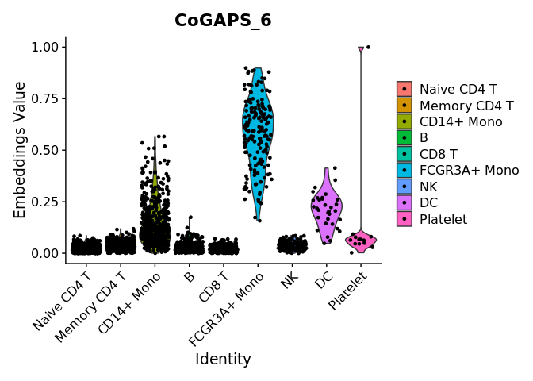

``` r
DimPlot(pbmc3k.final, reduction = "CoGAPS", pt.size = 0.5, dims = c(3, 4))
```

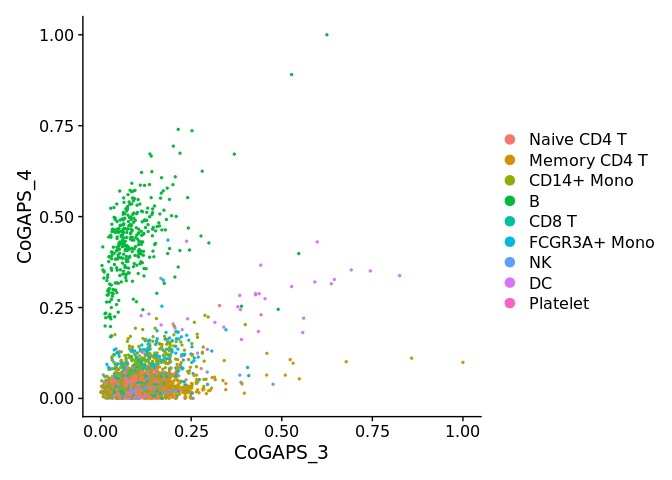

``` r
DimPlot(pbmc3k.final, reduction = "CoGAPS", pt.size = 0.5, dims = c(3, 6))
```

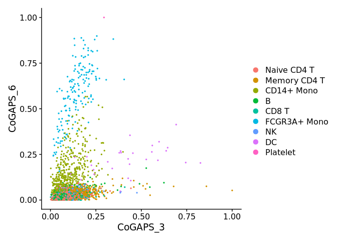

``` r
DimPlot(pbmc3k.final, reduction = "CoGAPS", pt.size = 0.5, dims = c(4, 6))
```

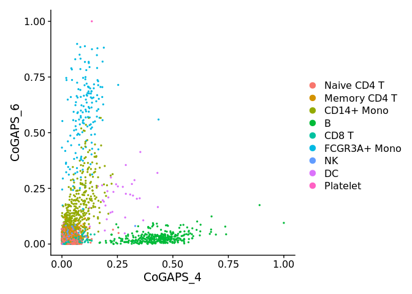

Running CoGAPS with Seurat Data Locally
=======================================

For example purposes, we will run locally using 5,000 iterations. *Note:* Results may be different because of complier dependence. Boost random number processor was used for this example.

To learn more about this dataset, type `?pbmc3k`

``` r
InstallData("pbmc3k")
data("pbmc3k.final")
pbmc3k.final <- RunCoGAPS(object = pbmc3k.final, nPatterns = 3, nIterations = 5000, outputFrequency = 1000, 
    sparseOptimization = TRUE, nThreads = 1, distributed = "genome-wide", singleCell = TRUE, seed = 891)
```

``` r
DimPlot(pbmc3k.final, reduction = "CoGAPS", pt.size = 0.5, dims = c(3, 2))
```

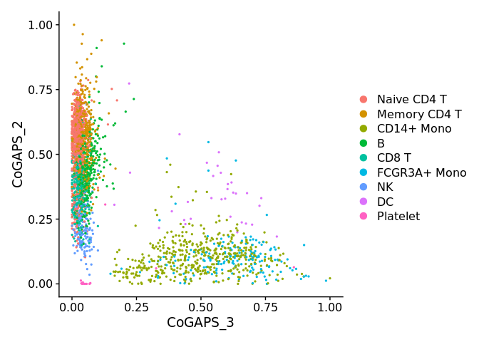

#### Lymphoid Lineage

``` r
VlnPlot(pbmc3k.final, features = "CoGAPS_2")
```

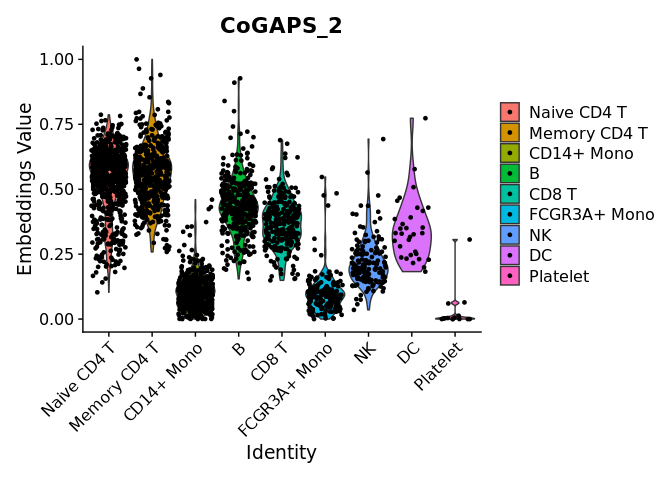

#### Myeloid Lineage

``` r
VlnPlot(pbmc3k.final, features = "CoGAPS_3")
```

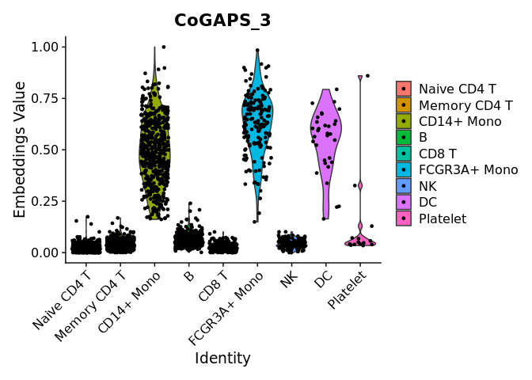

### Additional Features of CoGAPS

#### Uncertainty Matrix

In addition to providing the data, the user can also specify an uncertainty measurement - the standard deviation of each entry in the data matrix. By default, CoGAPS assumes that the standard deviation matrix is 10% of the data matrix. This is a reasonable heuristic to use, but for specific types of data you may be able to provide better information. An uncertainty matrix can be specified using the `uncertainty` argument when running CoCAPS.

``` r
pbmc3k.final <- RunCoGAPS(pbmc3k.final, uncertainty = datMat.uncertainty, nPatterns = 10, nIterations = 100, 
    outputFrequency = 100, sparseOptimization = TRUE, nThreads = 1, singleCell = TRUE, distributed = "genome-wide")
```

#### Running CoGAPS in Parallel for Large Datasets

Non-Negative Matrix Factorization algorithms typically require long computation times and CoGAPS is no exception. The simplest way to run CoGAPS in parallel is to provide the `nThreads` argument when running CoGAPS. This allows the underlying algorithm to run on multiple threads and has no effect on the mathematics of the algorithm. For more information on running CoGAPS in parallel, visit [CoGAPS Vignette](https://bioconductor.org/packages/release/bioc/vignettes/CoGAPS/inst/doc/CoGAPS.html#vignette-version).

``` r
pbmc3k.final <- RunCoGAPS(pbmc3k.final, nPatterns = 10, nIterations = 100, outputFrequency = 100, 
    sparseOptimization = TRUE, nThreads = 3, singleCell = TRUE, distributed = "genome-wide")
```

### Resoures for CoGAPS

Visit the following resources to learn more about CoGAPS and running CoGAPS outside of the Seurat environment:

-   [CoGAPS Vignette](https://bioconductor.org/packages/release/bioc/vignettes/CoGAPS/inst/doc/CoGAPS.html#introduction)
-   [Wiki Link](https://github.com/FertigLab/CoGAPS/wiki)
