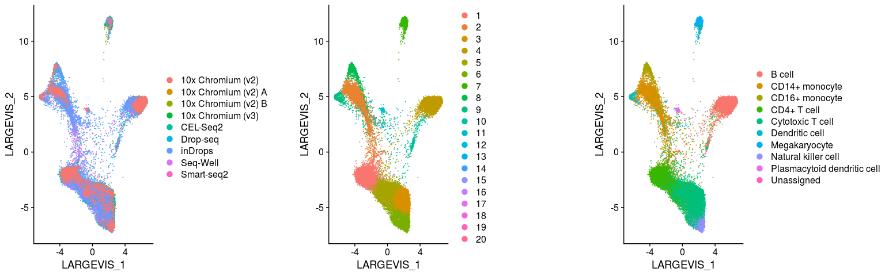
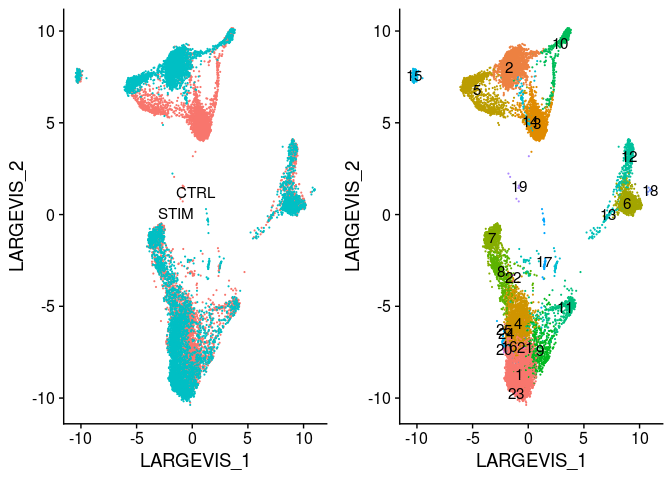
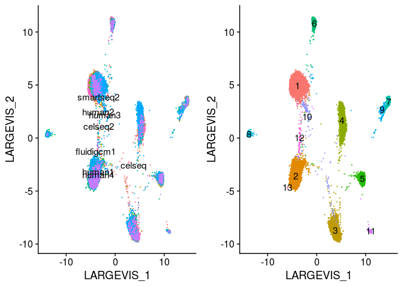

Integration of datasets using Conos
================
Compiled: July 15, 2019

-   [](#section)
    -   [Systematic comparative analysis of human PBMC](#systematic-comparative-analysis-of-human-pbmc)
    -   [Interferon-stimulated and control PBMC](#interferon-stimulated-and-control-pbmc)
    -   [Eight human pancreatic islet datasets](#eight-human-pancreatic-islet-datasets)

This vignette demonstrates the use of the Conos package in Seurat. Commands and parameters are based off of the [Conos tutorial](https://github.com/hms-dbmi/conos/blob/master/vignettes/walkthrough.md). If you use Conos in your work, please cite:

> *Joint analysis of heterogeneous single-cell RNA-seq dataset collections*
>
> Nikolas Barkas, Viktor Petukhov, Daria Nikolaeva, Yaroslav Lozinsky, Samuel Demharter, Konstantin Khodosevich, Peter V. Kharchenko
>
> Nature Methods, 2019.
>
> doi: [10.1038/s41592-019-0466-z](https://doi.org/10.1038/s41592-019-0466-z)
>
> GitHub: <https://github.com/hms-dbmi/conos>

Prerequisites to install:

-   [Seurat](https://satijalab.org/seurat/install)
-   [Conos](https://github.com/hms-dbmi/conos)
-   [SeuratWrappers](https://github.com/satijalab/seurat-wrappers)
-   [SeuratData](https://github.com/satijalab/seurat-data)

``` r
library(conos)
library(Seurat)
library(SeuratData)
library(SeuratWrappers)
```

### Systematic comparative analysis of human PBMC

To learn more about this dataset, type `?pbmcsca`

``` r
InstallData("pbmcsca")
data("pbmcsca")
pbmcsca.panel <- SplitObject(pbmcsca, split.by = "Method")
for (i in 1:length(pbmcsca.panel)) {
    pbmcsca.panel[[i]] <- NormalizeData(pbmcsca.panel[[i]]) %>% FindVariableFeatures() %>% ScaleData() %>% 
        RunPCA(verbose = FALSE)
}
pbmcsca.con <- Conos$new(pbmcsca.panel)
pbmcsca.con$buildGraph(k = 15, k.self = 5, space = "PCA", ncomps = 30, n.odgenes = 2000, matching.method = "mNN", 
    metric = "angular", score.component.variance = TRUE, verbose = TRUE)
pbmcsca.con$findCommunities()
pbmcsca.con$embedGraph()
pbmcsca <- as.Seurat(pbmcsca.con)
DimPlot(pbmcsca, reduction = "largeVis", group.by = c("Method", "ident", "CellType"), ncol = 3)
```



### Interferon-stimulated and control PBMC

To learn more about this dataset, type `?ifnb`

``` r
InstallData("ifnb")
data("ifnb")
ifnb.panel <- SplitObject(ifnb, split.by = "stim")
for (i in 1:length(ifnb.panel)) {
    ifnb.panel[[i]] <- NormalizeData(ifnb.panel[[i]]) %>% FindVariableFeatures() %>% ScaleData() %>% 
        RunPCA(verbose = FALSE)
}
ifnb.con <- Conos$new(ifnb.panel)
ifnb.con$buildGraph(k = 15, k.self = 5, space = "PCA", ncomps = 30, n.odgenes = 2000, matching.method = "mNN", 
    metric = "angular", score.component.variance = TRUE, verbose = TRUE)
ifnb.con$findCommunities()
ifnb.con$embedGraph()
ifnb <- as.Seurat(ifnb.con)
DimPlot(ifnb, reduction = "largeVis", group.by = c("stim", "ident", "seurat_annotations"), ncol = 3)
```



### Eight human pancreatic islet datasets

To learn more about this dataset, type `?panc8`

``` r
InstallData("panc8")
data("panc8")
panc8.panel <- SplitObject(panc8, split.by = "replicate")
for (i in 1:length(panc8.panel)) {
    panc8.panel[[i]] <- NormalizeData(panc8.panel[[i]]) %>% FindVariableFeatures() %>% ScaleData() %>% 
        RunPCA(verbose = FALSE)
}
panc8.con <- Conos$new(panc8.panel)
panc8.con$buildGraph(k = 15, k.self = 5, space = "PCA", ncomps = 30, n.odgenes = 2000, matching.method = "mNN", 
    metric = "angular", score.component.variance = TRUE, verbose = TRUE)
panc8.con$findCommunities()
panc8.con$embedGraph()
panc8 <- as.Seurat(panc8.con)
DimPlot(panc8, reduction = "largeVis", group.by = c("replicate", "ident", "celltype"), ncol = 3)
```


