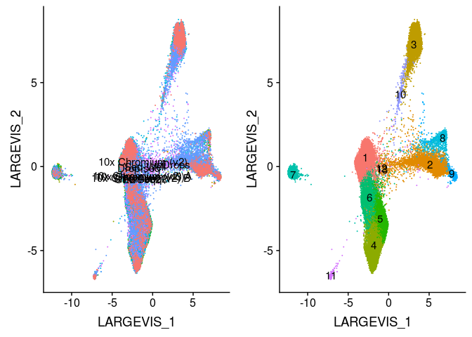
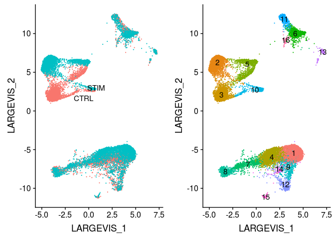

Integration of datasets using Conos
================
Compiled: July 09, 2019

-   [](#section)
    -   [PBMC](#pbmc)
    -   [Immune/Stim](#immunestim)
    -   [Pancreas](#pancreas)

This document serves to showcase Seurat/Conos interoperability. To do this, we need three packages: [Seurat](https://satijalab.org/seurat/) for preprocessing the data, [Conos](https://github.com/hms-dbmi/conos) for the integration methods, and [SeuratWrappers](https://github.com/satijalab/seurat.wrappers) for the Conos → Seurat conversion. We also need [SeuratData](https://github.com/satijalab/seurat-data) to load in datasets for this vignette.

``` r
library(conos)
library(Seurat)
library(SeuratData)
library(SeuratWrappers)
```

### PBMC

``` r
data("broad")
broad.panel <- SplitObject(broad, split.by = "Method")
broad.panel <- sapply(X = broad.panel, FUN = NormalizeData, simplify = FALSE, USE.NAMES = TRUE)
broad.panel <- sapply(X = broad.panel, FUN = FindVariableFeatures, simplify = FALSE, USE.NAMES = TRUE)
broad.panel <- sapply(X = broad.panel, FUN = ScaleData, simplify = FALSE, USE.NAMES = TRUE)
broad.panel <- sapply(X = broad.panel, FUN = RunPCA, verbose = FALSE, simplify = FALSE, USE.NAMES = TRUE)
broad.panel <- sapply(X = broad.panel, FUN = FindNeighbors, dims = 1:30, simplify = FALSE, USE.NAMES = TRUE)
broad.panel <- sapply(X = broad.panel, FUN = FindClusters, simplify = FALSE, USE.NAMES = TRUE)
broad.con <- Conos$new(broad.panel)
broad.con$buildGraph(space = "PCA", score.component.variance = TRUE)
broad.con$findCommunities()
broad.con$embedGraph()
broad <- as.Seurat(broad.con)
DimPlot(broad, reduction = "largeVis", group.by = c("Method", "ident"), label = TRUE, legend = "none")
```



### Immune/Stim

``` r
data("immune")
immune.panel <- SplitObject(immune, split.by = "stim")
immune.panel <- sapply(X = immune.panel, FUN = NormalizeData, simplify = FALSE, USE.NAMES = TRUE)
immune.panel <- sapply(X = immune.panel, FUN = FindVariableFeatures, simplify = FALSE, USE.NAMES = TRUE)
immune.panel <- sapply(X = immune.panel, FUN = ScaleData, simplify = FALSE, USE.NAMES = TRUE)
immune.panel <- sapply(X = immune.panel, FUN = RunPCA, verbose = FALSE, simplify = FALSE, USE.NAMES = TRUE)
immune.panel <- sapply(X = immune.panel, FUN = FindNeighbors, simplify = FALSE, USE.NAMES = TRUE)
immune.panel <- sapply(X = immune.panel, FUN = FindClusters, simplify = FALSE, USE.NAMES = TRUE)
immune.con <- Conos$new(immune.panel)
immune.con$buildGraph(space = "PCA", score.component.variance = TRUE)
immune.con$findCommunities()
immune.con$embedGraph()
immune <- as.Seurat(immune.con)
DimPlot(immune, reduction = "largeVis", group.by = c("stim", "ident"), label = TRUE, legend = "none")
```



### Pancreas

``` r
data("panc8")
panc.panel <- SplitObject(panc8, spit.by = "replicate")
panc.panel <- sapply(X = panc.panel, FUN = NormalizeData, simplify = FALSE, USE.NAMES = TRUE)
panc.panel <- sapply(X = panc.panel, FUN = FindVariableFeatures, simplify = FALSE, USE.NAMES = TRUE)
panc.panel <- sapply(X = panc.panel, FUN = ScaleData, simplify = FALSE, USE.NAMES = TRUE)
panc.panel <- sapply(X = panc.panel, FUN = RunPCA, verbose = FALSE, simplify = FALSE, USE.NAMES = TRUE)
panc.panel <- sapply(X = panc.panel, FUN = FindNeighbors, simplify = FALSE, USE.NAMES = TRUE)
panc.panel <- sapply(X = panc.panel, FUN = FindClusters, simplify = FALSE, USE.NAMES = TRUE)
panc.con <- Conos$new(panc.panel)
panc.con$buildGraph(space = "PCA", score.component.variance = TRUE)
panc.con$findCommunities()
panc.con$embedGraph()
panc8 <- as.Seurat(panc.con)
DimPlot(panc8, reduction = "largeVis", group.by = c("replicate", "ident"), label = TRUE, legend = "none")
```


