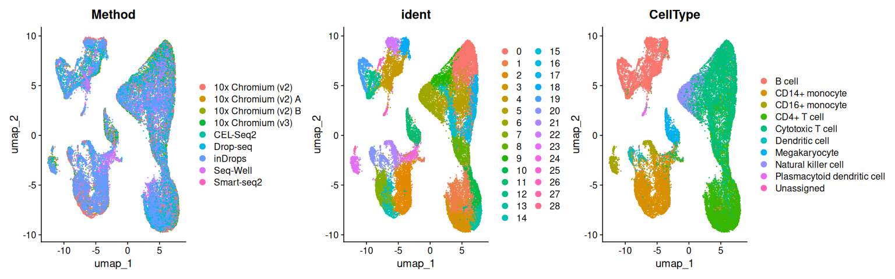
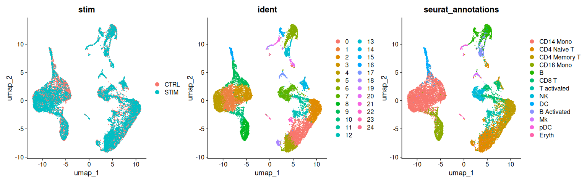
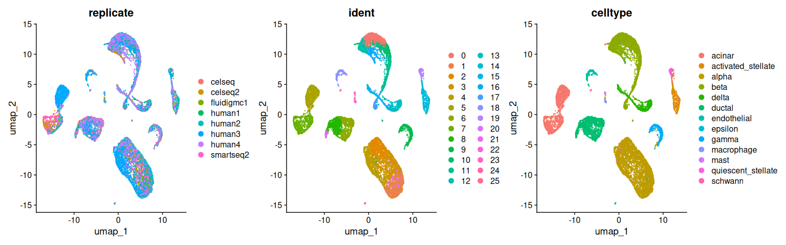

Running Coralysis on Seurat Objects
================
Compiled: June 27, 2025

- [](#section)
  - [Systematic comparative analysis of human
    PBMC](#systematic-comparative-analysis-of-human-pbmc)
  - [Interferon-stimulated and control
    PBMC](#interferon-stimulated-and-control-pbmc)
  - [Eight human pancreatic islet
    datasets](#eight-human-pancreatic-islet-datasets)

This vigettte demonstrates how to run Coralysis on Seurat objects.
Parameters and commands are based off of the [Coralysis reference
manual](https://bioconductor.org/packages/devel/bioc/manuals/Coralysis/man/Coralysis.pdf).
If you use Coralysis, please cite:

> *Coralysis enables sensitive identification of imbalanced cell types
> and states in single-cell data via multi-level integration*
>
> António GG Sousa, Johannes Smolander, Sini Junttila & Laura L Elo
>
> bioRxiv, 2025
>
> doi:
> [10.1101/2025.02.07.637023](https://doi.org/10.1101/2025.02.07.637023)
>
> Bioconductor:
> <https://bioconductor.org/packages/devel/bioc/html/Coralysis.html>

Prerequisites to install:

- [Seurat](https://satijalab.org/seurat/install)
- [SeuratWrappers](https://github.com/satijalab/seurat-wrappers)
- [SeuratData](https://github.com/satijalab/seurat-data)

``` r
library(Seurat)
library(SeuratData)
library(SeuratWrappers)
```

## 

### Systematic comparative analysis of human PBMC

To learn more about this dataset, type `?pbmcsca`

``` r
InstallData("pbmcsca")
pbmcsca <- LoadData("pbmcsca")
pbmcsca <- UpdateSeuratObject(pbmcsca)
pbmcsca[["RNA"]] <- split(pbmcsca[["RNA"]], f = pbmcsca$Method)
pbmcsca <- NormalizeData(pbmcsca)
pbmcsca <- FindVariableFeatures(pbmcsca)
pbmcsca <- ScaleData(pbmcsca)
pbmcsca <- RunPCA(pbmcsca)
set.seed(1239)
pbmcsca <- IntegrateLayers(object = pbmcsca, method = CoralysisIntegration, new.reduction = "integrated.coralysis",
    batch = "Method", threads = 4)
pbmcsca <- RunUMAP(pbmcsca, reduction = "integrated.coralysis", dims = 1:30)
pbmcsca <- FindNeighbors(pbmcsca, reduction = "integrated.coralysis", dims = 1:30)
pbmcsca <- FindClusters(pbmcsca)
DimPlot(pbmcsca, group.by = c("Method", "ident", "CellType"), ncol = 3)
```

<!-- -->

### Interferon-stimulated and control PBMC

To learn more about this dataset, type `?ifnb`

``` r
InstallData("ifnb")
ifnb <- LoadData("ifnb")
ifnb <- UpdateSeuratObject(ifnb)
ifnb[["RNA"]] <- split(ifnb[["RNA"]], f = ifnb$stim)
ifnb <- NormalizeData(ifnb)
ifnb <- FindVariableFeatures(ifnb)
ifnb <- ScaleData(ifnb)
ifnb <- RunPCA(ifnb)
set.seed(45)
ifnb <- IntegrateLayers(object = ifnb, method = CoralysisIntegration, new.reduction = "integrated.coralysis",
    batch = "stim", threads = 4)
ifnb <- RunUMAP(ifnb, reduction = "integrated.coralysis", dims = 1:30)
ifnb <- FindNeighbors(ifnb, reduction = "integrated.coralysis", dims = 1:30)
ifnb <- FindClusters(ifnb)
DimPlot(ifnb, group.by = c("stim", "ident", "seurat_annotations"), ncol = 3)
```

<!-- -->

### Eight human pancreatic islet datasets

To learn more about this dataset, type `?panc8`

``` r
InstallData("panc8")
panc8 <- LoadData("panc8")
panc8 <- UpdateSeuratObject(panc8)
panc8[["RNA"]] <- split(panc8[["RNA"]], f = panc8$replicate)
panc8 <- NormalizeData(panc8)
panc8 <- FindVariableFeatures(panc8)
panc8 <- ScaleData(panc8)
panc8 <- RunPCA(panc8)
set.seed(2893)
panc8 <- IntegrateLayers(object = panc8, method = CoralysisIntegration, new.reduction = "integrated.coralysis",
    batch = "replicate", threads = 4)
panc8 <- RunUMAP(panc8, reduction = "integrated.coralysis", dims = 1:30)
panc8 <- FindNeighbors(panc8, reduction = "integrated.coralysis", dims = 1:30)
panc8 <- FindClusters(panc8)
DimPlot(panc8, group.by = c("replicate", "ident", "celltype"), ncol = 3)
```

<!-- -->
