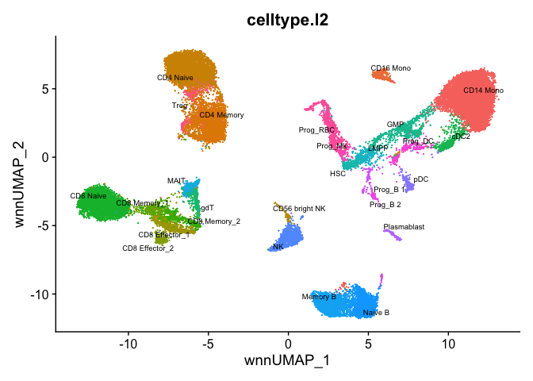

Normalize and denoise ADT protein data using dsb with Seurat - WNN
workflow
================
Compiled: April 28, 2022

This vignette demonstrates
[dsb](https://cran.r-project.org/package=dsb), a method for normalizing
and denoising antibody derived tag (ADT) protein data from CITE-seq and
derivative technologies like cell hashing data, ICICLE-seq, DOGMA-seq,
ASAP-seq, TEA-seq etc. Below we provide an end-to-end CITE-seq analysis
workflow using dsb and Seurat including protein based clustering and
Seurat’s mRNA + protein Weighted Nearest Neighbor method. Please see
[additional vignettes and tutorials on
CRAN](https://cran.r-project.org/package=dsb).

If you use dsb in your work, please cite:

> *Normalizing and denoising protein expression data from droplet-based
> single cell profiling*
> 
> Matthew P. Mulè, Andrew J. Martins and John S. Tsang
> 
> Nature Communications, 2022.
> 
> doi:
> [doi.org/10.1038/s41467-022-29356-8](https://www.nature.com/articles/s41467-022-29356-8)
> 
> Website: <https://CRAN.R-project.org/package=dsb>

### Table of contents

## 

### end to end CITE-seq WNN workflow using dsb to normalize ADTs

install dsb from CRAN with `install.packages('dsb')`

``` r
library(dsb)
```

**Note Please see the current up to date vignette for using dsb here:
[End-to-end CITE-seq analysis workflow using dsb for ADT normalization
and Seurat for multimodal
clustering](https://cran.rstudio.com/web/packages/dsb/vignettes/end_to_end_workflow.html)**

This method requires the ADT umi count matrix (raw) from all cells –
link to data is provided in the vignette link
above.

### Normalizing ADTs for datasets without empty droplets with the dsb function ModelNegativeADTnorm

Empty droplets may not be available in a public dataset. In
[Supplementary
Figure 1](https://static-content.springer.com/esm/art%3A10.1038%2Fs41467-022-29356-8/MediaObjects/41467_2022_29356_MOESM1_ESM.pdf),
we show that the fitted background population mean of each protein
across all cells was concordant mean of each protein in backgorund
droplets. We provide the function `ModelNegativeADTnorm` to use this
estimated / modeled background in place of using empty droplets in step
I and then implement step II (cell to cell technical variation removal)
exactly as in the dsb function DSBNormalizeProtein. This new method has
not been as extendively tested as the default dsb function, but has
performed well on all datasets tested thusfar.

Clustering performance with protein or joint WNN clustering is highly
concordant using the default dsb and this modeled background method.
Below we demonstrate WNN using this method on [bone marrow CITE-seq
dataset](https://www.sciencedirect.com/science/article/pii/S0092867419305598?via%3Dihub)
available through [SeuratData](https://github.com/satijalab/seurat-data)

``` r
# these data were installed with the SeuratData package
# devtools::install_github('satijalab/seurat-data')
library(SeuratData)
# InstallData(ds = 'bmcite')
library(Seurat)
library(magrittr)

# load bone marrow CITE-seq data
data('bmcite')
bm = bmcite; rm(bmcite)

# Extract raw bone marrow ADT data 
adt = GetAssayData(bm, slot = 'counts', assay = 'ADT')

# unfortunately this data does not have isotype controls
dsb.norm = ModelNegativeADTnorm(cell_protein_matrix = adt, 
                                denoise.counts = TRUE,
                                use.isotype.control = FALSE)
```

    ## [1] "fitting models to each cell for dsb technical component and removing cell to cell technical noise"

Examine normalized protein expression distributions:

``` r
library(ggplot2); theme_set(theme_bw())
plist = list(geom_vline(xintercept = 0, color = 'red'), 
             geom_hline(yintercept = 0, color = 'red'), 
             geom_point(size = 0.2, alpha = 0.1))
d = as.data.frame(t(dsb.norm))

# plot distributions
p1 = ggplot(d, aes(x = CD4, y = CD8a)) + plist
p2 = ggplot(d, aes(x = CD19, y = CD3)) + plist
cowplot::plot_grid(p1,p2)
```

<!-- -->

Now we can cluster with WNN using the dsb normalized values as in the
other end to end analysis vignette. We first add the dsb normalized
values to the object directly and we do not normalize with CLR, instead
proceeding directly with the Seurat WNN clustering pipeline.

``` r
bm = SetAssayData(bmcite, slot = 'data', 
                  assay = 'ADT', 
                  new.data = dsb.norm)

# process RNA for WNN 
DefaultAssay(bm) <- 'RNA'
bm <- NormalizeData(bm) %>% 
  FindVariableFeatures() %>% 
  ScaleData() %>% 
  RunPCA()

# process ADT for WNN # see the main dsb vignette for an alternate version
DefaultAssay(bm) <- 'ADT'
VariableFeatures(bm) <- rownames(bm[["ADT"]])
bm = bm %>% 
  ScaleData() %>% 
  RunPCA(reduction.name = 'apca')

# run WNN 
bm <- FindMultiModalNeighbors(
  bm, reduction.list = list("pca", "apca"), 
  dims.list = list(1:30, 1:18), modality.weight.name = "RNA.weight"
)

bm <- FindClusters(bm, graph.name = "wsnn",
                   algorithm = 3, resolution = 2, 
                   verbose = FALSE)
bm <- RunUMAP(bm, nn.name = "weighted.nn", 
              reduction.name = "wnn.umap", 
              reduction.key = "wnnUMAP_")

p2 <- DimPlot(bm, reduction = 'wnn.umap', 
              group.by = 'celltype.l2',
              label = TRUE, repel = TRUE,
              label.size = 2.5) + NoLegend()
p2
```

<!-- -->

Above we removed technical cell to cell variations with each cells
fitted background only–adding isotype controls will further improve the
precision in the technical component estimation. Note, if this dataset
included isotype controls we would have used the following options:

``` r
# specify isotype controls 
isotype.controls = c('isotype1', 'isotype 2')
# normalize ADTs
dsb.norm.2 = ModelNegativeADTnorm(cell_protein_matrix = adt,
                                  denoise.counts = TRUE, 
                                  use.isotype.control = TRUE, 
                                  isotype.control.name.vec = isotype.controls
                                  )
```

In our built in package data, two proteins are expected to be expressed
by every cell–HLA-ABC and CD18. *cells with the lowest expression of
ubiquitously expressed proteins can fall around 0 with this method*.
However, the *relative* values across cells are the same as the default
dsb. Protein levels from the default algorithm using empty droplets can
thus be more interpretable on a per-protein basis than with this method.

``` r
library(dsb)

# specify isotype controls to use in step II 
isotypes = c("MouseIgG1kappaisotype_PROT", "MouseIgG2akappaisotype_PROT", 
             "Mouse IgG2bkIsotype_PROT", "RatIgG2bkIsotype_PROT")

# run ModelNegativeADTnorm to model ambient noise and implement step II
raw.adt.matrix = dsb::cells_citeseq_mtx
norm.adt = ModelNegativeADTnorm(cell_protein_matrix = raw.adt.matrix,
                                denoise.counts = TRUE,
                                use.isotype.control = TRUE,
                                isotype.control.name.vec = isotypes
                                )
```

    ## [1] "fitting models to each cell for dsb technical component and removing cell to cell technical noise"

As shown below, CD18 values span 0 but we retain trimodal distributions
of CD4 with the background population centered at 0. All populations are
nicely recovered with concordant distribution of values as the default
dsb method.

``` r
par(mfrow = c(2,2)); r = '#009ACD80'
lab = 'ModelNegativeADTnorm'

# plot distributions 
hist(norm.adt["CD4_PROT", ], breaks = 45, col = r, main = 'CD4', xlab = lab)
hist(norm.adt["CD8_PROT", ], breaks = 45, col = r, main = 'CD8', xlab = lab)
hist(norm.adt["CD19_PROT", ], breaks = 45, col = r, main = 'CD19', xlab = lab)
hist(norm.adt["CD18_PROT", ], breaks = 45, col = r, main = 'CD18', xlab = lab)
```

<!-- -->

### compatibility with other alignment algorithms

We routinely use alignment pipelines other than Cell Ranger. We simply
need to make sure we align sufficient droplets to retain the empty
droplets capturing ADT
reads:  
[**CITE-seq-count**](https://hoohm.github.io/CITE-seq-Count/Running-the-script/)

To use dsb properly with CITE-seq-Count you need to align background.
One way to do this is to set the `-cells` argument to ~ 200000. That
will align the top 200000 barcodes in terms of ADT library size, making
sure you capture the background.

``` bash
CITE-seq-Count -R1 TAGS_R1.fastq.gz  -R2 TAGS_R2.fastq.gz \
 -t TAG_LIST.csv -cbf X1 -cbl X2 -umif Y1 -umil Y2 \
  -cells 200000 -o OUTFOLDER
```

If you already aligned your mRNA with Cell Ranger or something else but
wish to use a different tool like kallisto or Cite-seq-count for ADT
alignment, you can provide the latter with whitelist of cell barcodes to
align. A simple way to do this is to extract all barcodes with at least
k mRNA where we set k to a tiny number to retain cells *and* cells
capturing ambient ADT reads:

``` r
library(Seurat)
umi = Read10X(data.dir = 'data/raw_feature_bc_matrix/')
k = 3 
barcode.whitelist = 
  WhichCells(
    CreateSeuratObject(counts = umi,
                       min.features = k,  # retain all barcodes with at least k raw mRNA
                       min.cells = 800, # this just speeds up the function by removing genes. 
    )
  )

# write output compatible with Cite-Seq-Count exactly as below: 
# write.table(barcode.whitelist, file = paste0(your_save_path, "barcode.whitelist.tsv"), 
#             sep = '\t', quote = FALSE, col.names = FALSE,row.names = FALSE)
```

With the example dataset in the vignette this retains about 150,000
barcodes.

Now you can provide that as an argument to `-wl` in CITE-seq-count to
align the ADTs and then proceed with the dsb analysis example.

``` bash
CITE-seq-Count -R1 TAGS_R1.fastq.gz  -R2 TAGS_R2.fastq.gz \
 -t TAG_LIST.csv -cbf X1 -cbl X2 -umif Y1 -umil Y2 \
  -wl path_to_barcode.whitelist.tsv -o OUTFOLDER
```

[**kallisto**](https://www.kallistobus.tools/tutorials/kb_kite/python/kb_kite/).
The whitelist created above can also be provided to `-w` in Kallisto.

``` bash
kb count -i index_file -g gtf_file.t2g -x 10xv3 \
-t n_cores -w path_to_barcode.whitelist.tsv -o output_dir \
input.R1.fastq.gz input.R2.fastq.gz
```

One can next define cells and background droplets empirically with
protein and mRNA based thresholding as outlined in the tutorial above
and/or in combination with [the EmptyDrops
method](https://bioconductor.org/packages/release/bioc/html/DropletUtils.html)

If you have questions about our method or encounter an issue please open
an issue on Github:
