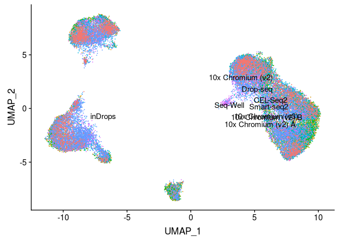
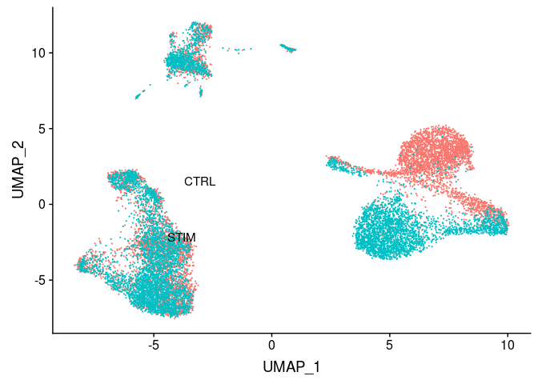
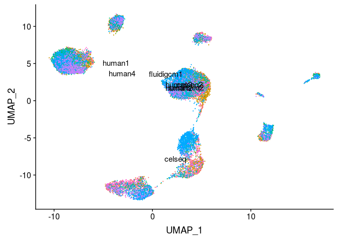

Running fastMNN on Seurat Objects
================
Compiled: July 10, 2019

-   [](#section)
    -   [PBMC](#pbmc)
    -   [Immune/Stim](#immunestim)
    -   [Pancreas](#pancreas)

``` r
library(Seurat)
library(SeuratData)
library(SeuratWrappers)
```

### PBMC

``` r
data("broad")
broad <- NormalizeData(broad)
broad <- FindVariableFeatures(broad)
broad <- ScaleData(broad, split.by = "Method")
broad <- RunFastMNN(object.list = SplitObject(broad, split.by = "Method"))
broad <- RunUMAP(broad, reduction = "mnn", dims = 1:30)
DimPlot(broad, group.by = "Method", label = TRUE) + NoLegend()
```



### Immune/Stim

``` r
data("immune")
immune <- NormalizeData(immune)
immune <- FindVariableFeatures(immune)
immune <- ScaleData(immune, split.by = "stim")
immune <- RunFastMNN(object.list = SplitObject(immune, split.by = "stim"))
immune <- RunUMAP(immune, reduction = "mnn", dims = 1:30)
DimPlot(immune, group.by = "stim", label = TRUE) + NoLegend()
```



### Pancreas

``` r
data("panc8")
panc8 <- NormalizeData(panc8)
panc8 <- FindVariableFeatures(panc8)
panc8 <- ScaleData(panc8, split.by = "replicate")
panc8 <- RunFastMNN(object.list = SplitObject(panc8, split.by = "replicate"))
panc8 <- RunUMAP(panc8, reduction = "mnn", dims = 1:30)
DimPlot(panc8, group.by = "replicate", label = TRUE) + NoLegend()
```


