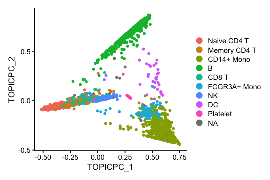
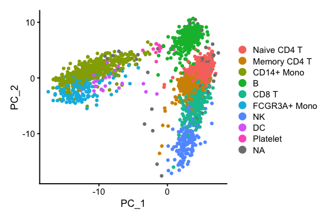
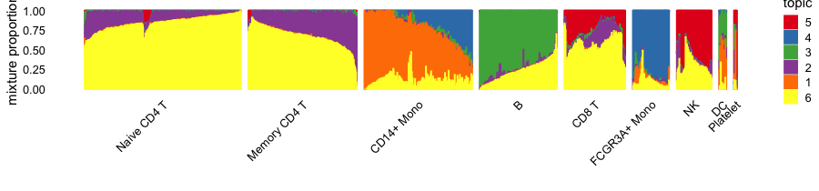

Analyzing Seurat data using fastTopics
================
Compiled: January 15, 2021

Here we illustrate the use of the
[fastTopics](https://github.com/stephenslab/fastTopics) Seurat wrapper
to analyze a Seurat data set. This vignette is only intended to
introduce the basic fastTopics interface for Seurat objects—for
background and guidance on analysis of single-cell RNA-seq data using a
topic model, please see the [fastTopics
vignettes](https://stephenslab.github.io/fastTopics/articles).

If you find the **fastTopics** package useful for your work, please
cite:

Kushal K. Dey, Chiaowen Joyce Hsiao and Matthew Stephens (2017).
[Visualizing the structure of RNA-seq expression data using grade of
membership models.](https://doi.org/10.1371/journal.pgen.1006599) *PLoS
Genetics* **13**, e1006599.

Peter Carbonetto, Kevin Luo, Kushal Dey, Joyce Hsiao and Matthew
Stephens (2021). fastTopics: fast algorithms for fitting topic models
and non-negative matrix factorizations to count data. R package version
0.4-23. <https://github.com/stephenslab/fastTopics>

We begin by loading the packages used to perform the analysis.

``` r
library(Seurat)
library(SeuratData)
library(SeuratWrappers)
library(fastTopics)
library(cowplot)
```

We set the seed so that the results can be reproduced.

``` r
set.seed(1)
```

Load—and, if necessary, install—the PBMC 3k data set containing
transcription profiles for 2,700 cells.

``` r
InstallData("pbmc3k")
data(pbmc3k)
dim(GetAssayData(pbmc3k))
# [1] 13714  2700
```

Fit the multinomial topic model to the raw UMI counts—*no pre-processing
or pre-selection of genes is needed.* Note that it may take several
minutes to complete this model fitting step.

``` r
pbmc3k <- FitTopicModel(pbmc3k,k = 6)
```

To fit a topic model, we must specify \(K\), the number of topics. Here,
we have chosen \(K = 6\) topics. In most settings, a good choice of
\(K\) will not be known in advance, so you will you want to explore the
results from topic models at different settings of \(K\).

This plot shows the cells projected onto the top two principal
components (PCs) of the topic mixture proportions.

``` r
Idents(pbmc3k) <- pbmc3k$seurat_annotations
DimPlot(pbmc3k,reduction = "pca_topics",pt.size = 1) +
  theme_cowplot(font_size = 10)
```



Compare this against the top two PCs of the transformed counts:

``` r
pbmc3k <- FindVariableFeatures(pbmc3k)
pbmc3k <- NormalizeData(pbmc3k)
pbmc3k <- ScaleData(pbmc3k)
pbmc3k <- RunPCA(pbmc3k)
DimPlot(pbmc3k,reduction = "pca",pt.size = 1) +
  theme_cowplot(font_size = 10)
```



The fitted topic model—a “multinom\_topic\_model” object—is stored in
the “misc” slot:

``` r
fit <- Misc(Reductions(pbmc3k,"multinom_topic_model"))
```

Once the fitted topic model is extracted, many functions from the
**fastTopics** package can be used for analysis and visualization. For
example, the Structure plot provides an evocative visual summary of the
estimated mixture proportions for each cell. Here, we have grouped the
cells by previously inferred
labels.

``` r
structure_plot(fit,grouping = Idents(pbmc3k),gap = 25)
```



This is the version of R and the packages that were used to generate
these results.

``` r
sessionInfo()
# R version 3.6.2 (2019-12-12)
# Platform: x86_64-apple-darwin15.6.0 (64-bit)
# Running under: macOS Catalina 10.15.7
# 
# Matrix products: default
# BLAS:   /Library/Frameworks/R.framework/Versions/3.6/Resources/lib/libRblas.0.dylib
# LAPACK: /Library/Frameworks/R.framework/Versions/3.6/Resources/lib/libRlapack.dylib
# 
# locale:
# [1] en_US.UTF-8/en_US.UTF-8/en_US.UTF-8/C/en_US.UTF-8/en_US.UTF-8
# 
# attached base packages:
# [1] stats     graphics  grDevices utils     datasets  methods   base     
# 
# other attached packages:
# [1] cowplot_1.0.0           fastTopics_0.4-23       SeuratWrappers_0.3.2   
# [4] pbmc3k.SeuratData_3.1.4 SeuratData_0.2.1        Seurat_3.2.3           
# 
# loaded via a namespace (and not attached):
#   [1] Rtsne_0.15            colorspace_1.4-1      deldir_0.1-29        
#   [4] ggridges_0.5.2        spatstat.data_1.4-3   farver_2.0.1         
#   [7] leiden_0.3.3          listenv_0.8.0         remotes_2.1.0        
#  [10] MatrixModels_0.4-1    ggrepel_0.9.0         fansi_0.4.0          
#  [13] codetools_0.2-16      splines_3.6.2         knitr_1.26           
#  [16] polyclip_1.10-0       zeallot_0.1.0         jsonlite_1.6         
#  [19] mcmc_0.9-6            ica_1.0-2             cluster_2.1.0        
#  [22] png_0.1-7             uwot_0.1.10           shiny_1.4.0          
#  [25] sctransform_0.3.2     BiocManager_1.30.10   compiler_3.6.2       
#  [28] httr_1.4.2            backports_1.1.5       assertthat_0.2.1     
#  [31] Matrix_1.2-18         fastmap_1.0.1         lazyeval_0.2.2       
#  [34] cli_2.0.0             later_1.0.0           prettyunits_1.1.1    
#  [37] htmltools_0.4.0       quantreg_5.54         tools_3.6.2          
#  [40] rsvd_1.0.2            igraph_1.2.5          coda_0.19-3          
#  [43] gtable_0.3.0          glue_1.3.1            RANN_2.6.1           
#  [46] reshape2_1.4.3        dplyr_0.8.3           rappdirs_0.3.1       
#  [49] Rcpp_1.0.5            spatstat_1.64-1       scattermore_0.7      
#  [52] vctrs_0.2.1           nlme_3.1-142          lmtest_0.9-38        
#  [55] xfun_0.11             stringr_1.4.0         globals_0.13.0       
#  [58] mime_0.8              miniUI_0.1.1.1        lifecycle_0.1.0      
#  [61] irlba_2.3.3           goftest_1.2-2         future_1.18.0        
#  [64] MASS_7.3-51.4         zoo_1.8-7             scales_1.1.0         
#  [67] hms_0.5.2             promises_1.1.0        spatstat.utils_1.17-0
#  [70] parallel_3.6.2        SparseM_1.78          RColorBrewer_1.1-2   
#  [73] yaml_2.2.0            reticulate_1.16       pbapply_1.4-3        
#  [76] gridExtra_2.3         ggplot2_3.3.0         rpart_4.1-15         
#  [79] stringi_1.4.3         rlang_0.4.5           pkgconfig_2.0.3      
#  [82] matrixStats_0.56.0    evaluate_0.14         lattice_0.20-38      
#  [85] ROCR_1.0-11           purrr_0.3.3           tensor_1.5           
#  [88] labeling_0.3          patchwork_1.0.1       htmlwidgets_1.5.1    
#  [91] tidyselect_0.2.5      RcppAnnoy_0.0.18      plyr_1.8.5           
#  [94] magrittr_1.5          R6_2.4.1              pillar_1.4.3         
#  [97] mgcv_1.8-31           fitdistrplus_1.1-1    survival_3.1-8       
# [100] abind_1.4-5           tibble_2.1.3          future.apply_1.6.0   
# [103] crayon_1.3.4          KernSmooth_2.23-16    plotly_4.9.2         
# [106] rmarkdown_2.3         progress_1.2.2        grid_3.6.2           
# [109] data.table_1.12.8     digest_0.6.23         xtable_1.8-4         
# [112] tidyr_1.0.0           httpuv_1.5.2          MCMCpack_1.4-5       
# [115] RcppParallel_4.4.2    munsell_0.5.0         viridisLite_0.3.0    
# [118] quadprog_1.5-8
```
