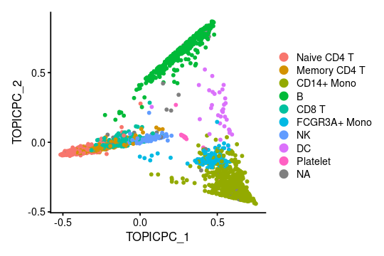
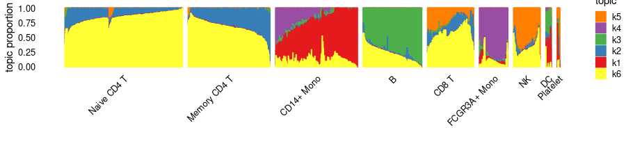
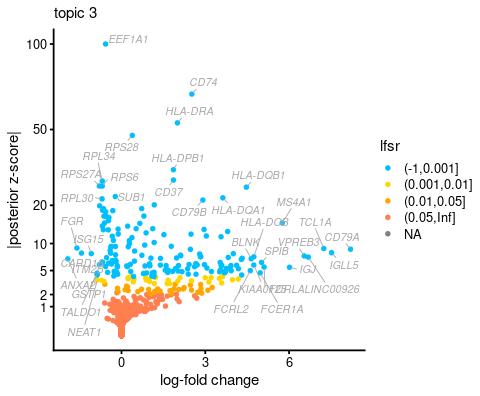
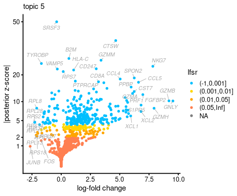
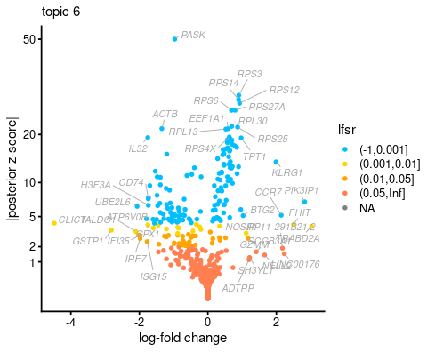

This vignette illustrates the use of the
[fastTopics](https://github.com/stephenslab/fastTopics) Seurat wrapper
to analyze a Seurat data set. This vignette is intended only to
introduce the basic Seurat interface, and for more detailed guidance
please visit the [fastTopics
vignettes](https://stephenslab.github.io/fastTopics/articles).

If you find the **fastTopics** package useful for your work, please
cite:

*Visualizing the structure of RNA-seq expression data using grade of
membership models.*  K. K. Dey, C. J. Hsiao and M. Stephens.  PLoS
Genetics, 2017.  doi:
[10.1371/journal.pgen.1006599](https://doi.org/10.1371/journal.pgen.1006599)

and

*Non-negative matrix factorization algorithms greatly improve topic
model fits.*  P. Carbonetto, A. Sarkar, Z. Wang and M. Stephens. 
arXiv, 2021.  [arXiv 2105.13440](https://arxiv.org/abs/2105.13440)

If you use the **de\_analysis** function in **fastTopics**, please cite:

*Interpreting structure in sequence count data with differential
expression analysis allowing for grades of membership.*  P.
Carbonetto, K. Luo, A. Sarkar, A. Hung, K. Tayeb, S. Pott and M.
Stephens.  bioRxiv, 2023.  doi:
[10.1101/2023.03.03.531029](https://doi.org/10.1101/2023.03.03.531029)

To begin, load the packages we will need to perform the analysis.

    library(Seurat)
    library(SeuratData)
    library(SeuratWrappers)
    library(fastTopics)
    library(cowplot)

Set the seed so that the results can be reproduced.

    set.seed(1)

Load (and install if necessary) the PBMC 3k data set containing
transcription profiles for 2,700 cells.

    InstallData("pbmc3k")
    data(pbmc3k)
    dim(GetAssayData(pbmc3k))
    # [1] 13714  2700

Fit the multinomial topic model to the raw UMI counts. *No data
preprocessing or gene filtering is needed.* Note it may take several
minutes to fit the model.

    pbmc3k <- FitTopicModel(pbmc3k, k = 6)

To fit a topic model, we had to choose *K*, the number of topics. Here,
we chose *K* = 6 topics. In most settings, a good choice of *K* will not
be known in advance, so you will likely want to explore the different
settings of *K*.

This first plot shows the cells projected onto the top two PCs of the
topic proportions.

    Idents(pbmc3k) <- pbmc3k$seurat_annotations
    DimPlot(pbmc3k, reduction = "pca_topics", pt.size = 1) + theme_cowplot(font_size = 10)

Compare this with the top two PCs of the normalized and scaled counts:

    pbmc3k <- FindVariableFeatures(pbmc3k)
    pbmc3k <- NormalizeData(pbmc3k)
    pbmc3k <- ScaleData(pbmc3k)
    pbmc3k <- RunPCA(pbmc3k)
    DimPlot(pbmc3k, reduction = "pca", pt.size = 1) + theme_cowplot(font_size = 10)

The fitted topic model—a “multinom\_topic\_model” object—is stored in
the “misc” slot:

    fit <- Misc(Reductions(pbmc3k, "multinom_topic_model"))$fit

Once the topic model has been extracted from the Seurat object, a
variety of fastTopics functions can be used for downstream analysis and
visualization. For example, we can create a “Structure plot” to
visualize all *K* dimensions of the topic model simultaneously:

    structure_plot(fit, grouping = Idents(pbmc3k), gap = 25)

In the Structure plot, each position along the x-axis is a cell and the
bar heights at each position correspond to topic proportions for that
cell.

Looking closely at the Structure plot, we observe that topic 3 (green)
closely corresponds to B cells. Topics 1 (red) and 4 (purple) also
correspond fairly well to the two types of monocytes, but there is also
some overlap in the topics; in particular, the purple topic is shared by
both types of monocytes. This suggests that expression in these two
types of cells is less distinguishable than B cells vs. other cell
types.

Topic 5 (orange) corresponds closely to natural killer (NK) cells. Topic
2 (blue) appears to capture biological processes common to T cells.
Interestingly, CD8+ T cells have characteristics of both NK cells and T
cells—these are T cells that sometimes become \`\`NK-like’’—and this is
reflected in the topic model by assigning membership to both topics 2
and 5.

The other cell types (platelets, dendritic cells), perhaps because they
are less abundant and/or difficult to distinguish from the other cell
types, are represented as combinations of the topics for the other cell
types.

Topic 6 is present in almost all cells to varying degrees, and therefore
its biological interpretation is not at all clear from the cell
labeling.

Having compared the topic model with the existing cell-type labels, our
next aim is to annotate the topics by identifying genes that are
distinctive to each topic. To do this, we perform a “grade of
membership” differential expression analysis (GoM DE):

    pbmc3k <- PerformGoMDEAnalysis(pbmc3k, pseudocount = 0.1, control = list(ns = 10000, nc = 4))
    # Fitting 13714 Poisson models with k=6 using method="scd".
    # Computing log-fold change statistics from 13714 Poisson models with k=6.
    # Stabilizing posterior log-fold change estimates using adaptive shrinkage.

Note this step may take some time to run on your computer—10 minutes, or
perhaps more. This is an expensive step because posterior estimation is
performed through Monte Carlo simulation.

Once the differential expression analysis is complete, we can use a
“volcano plot” to visualize the results. For example, this is the
volcano plot for topic 3:

    de <- Misc(Reductions(pbmc3k, "multinom_topic_model"))$de
    volcano_plot(de, k = 3, ymax = 100)

The volcano plot shows the log-fold change (LFC) on the x-axis and some
measure of statistical support on the y-axis. For the measure of
support, we use the posterior *z*-score (posterior mean divided by
posterior standard deviation). To report which LFCs are significant,
instead of a *p*-value we give the local false sign rate (lfsr), which
is typically slightly more conservative than a *p*-value. Note the LFC
is defined with the base-2 log by convention.

Typically, the most interesting genes are found on the right-hand side
of the volcano plot—the genes with the largest LFCs. Indeed, *CD79A* is
on the far right-hand side of the plot, which aligns with our previous
finding that topic 3 corresponds closely to B cells.

Similarly, NK genes such as *NKG7* and *GNLY* emerge on the right-hand
side of the volcano plot for topic 1:

    volcano_plot(de, k = 5, ymax = 50)

Topic 6 captures continuous structure and is present in almost all
cells, and the GoM DE results for topic 6 show a striking enrichment of
ribosome-associated genes:

    volcano_plot(de, k = 6, ymax = 50)

This is the version of R and the packages that were used to generate
these results:

    sessionInfo()
    # R version 4.2.0 (2022-04-22)
    # Platform: x86_64-pc-linux-gnu (64-bit)
    # Running under: Red Hat Enterprise Linux 8.4 (Ootpa)
    # 
    # Matrix products: default
    # BLAS/LAPACK: /software/openblas-0.3.13-el8-x86_64/lib/libopenblas_skylakexp-r0.3.13.so
    # 
    # locale:
    #  [1] LC_CTYPE=en_US.UTF-8       LC_NUMERIC=C              
    #  [3] LC_TIME=en_US.UTF-8        LC_COLLATE=en_US.UTF-8    
    #  [5] LC_MONETARY=en_US.UTF-8    LC_MESSAGES=en_US.UTF-8   
    #  [7] LC_PAPER=en_US.UTF-8       LC_NAME=C                 
    #  [9] LC_ADDRESS=C               LC_TELEPHONE=C            
    # [11] LC_MEASUREMENT=en_US.UTF-8 LC_IDENTIFICATION=C       
    # 
    # attached base packages:
    # [1] stats     graphics  grDevices utils     datasets  methods   base     
    # 
    # other attached packages:
    # [1] cowplot_1.1.1           fastTopics_0.6-150      SeuratWrappers_0.3.1   
    # [4] pbmc3k.SeuratData_3.1.4 SeuratData_0.2.2        SeuratObject_4.1.3     
    # [7] Seurat_4.3.0            rmarkdown_2.14         
    # 
    # loaded via a namespace (and not attached):
    #   [1] plyr_1.8.7             igraph_1.3.1           lazyeval_0.2.2        
    #   [4] sp_1.6-0               splines_4.2.0          listenv_0.8.0         
    #   [7] scattermore_0.8        ggplot2_3.3.6          digest_0.6.29         
    #  [10] invgamma_1.1           htmltools_0.5.2        SQUAREM_2021.1        
    #  [13] fansi_1.0.3            magrittr_2.0.3         tensor_1.5            
    #  [16] cluster_2.1.3          ROCR_1.0-11            remotes_2.4.2         
    #  [19] globals_0.14.0         RcppParallel_5.1.5     matrixStats_0.62.0    
    #  [22] R.utils_2.11.0         MCMCpack_1.6-3         spatstat.sparse_3.0-0 
    #  [25] prettyunits_1.1.1      colorspace_2.0-3       rappdirs_0.3.3        
    #  [28] ggrepel_0.9.1          xfun_0.30              dplyr_1.0.9           
    #  [31] crayon_1.5.1           jsonlite_1.8.0         progressr_0.10.0      
    #  [34] spatstat.data_3.0-0    survival_3.3-1         zoo_1.8-10            
    #  [37] glue_1.6.2             polyclip_1.10-0        gtable_0.3.0          
    #  [40] MatrixModels_0.5-0     leiden_0.3.10          future.apply_1.9.0    
    #  [43] abind_1.4-5            SparseM_1.81           scales_1.2.0          
    #  [46] DBI_1.1.2              spatstat.random_3.1-3  miniUI_0.1.1.1        
    #  [49] Rcpp_1.0.9             progress_1.2.2         viridisLite_0.4.0     
    #  [52] xtable_1.8-4           reticulate_1.24        rsvd_1.0.5            
    #  [55] truncnorm_1.0-8        htmlwidgets_1.5.4      httr_1.4.2            
    #  [58] RColorBrewer_1.1-3     ellipsis_0.3.2         ica_1.0-2             
    #  [61] farver_2.1.0           pkgconfig_2.0.3        R.methodsS3_1.8.1     
    #  [64] sass_0.4.1             uwot_0.1.14            deldir_1.0-6          
    #  [67] utf8_1.2.2             labeling_0.4.2         tidyselect_1.1.2      
    #  [70] rlang_1.1.0            reshape2_1.4.4         later_1.3.0           
    #  [73] munsell_0.5.0          tools_4.2.0            cli_3.3.0             
    #  [76] generics_0.1.2         ggridges_0.5.3         evaluate_0.15         
    #  [79] stringr_1.4.0          fastmap_1.1.0          yaml_2.3.5            
    #  [82] goftest_1.2-3          mcmc_0.9-7             knitr_1.39            
    #  [85] fitdistrplus_1.1-8     purrr_0.3.4            RANN_2.6.1            
    #  [88] pbapply_1.5-0          future_1.25.0          nlme_3.1-157          
    #  [91] mime_0.12              quantreg_5.93          formatR_1.12          
    #  [94] R.oo_1.24.0            compiler_4.2.0         plotly_4.10.0         
    #  [97] png_0.1-7              spatstat.utils_3.0-1   tibble_3.1.7          
    # [100] bslib_0.3.1            stringi_1.7.6          highr_0.9             
    # [103] lattice_0.20-45        Matrix_1.5-3           vctrs_0.4.1           
    # [106] pillar_1.7.0           lifecycle_1.0.1        BiocManager_1.30.20   
    # [109] spatstat.geom_3.0-6    lmtest_0.9-40          jquerylib_0.1.4       
    # [112] RcppAnnoy_0.0.19       data.table_1.14.4      irlba_2.3.5           
    # [115] httpuv_1.6.5           patchwork_1.1.1        R6_2.5.1              
    # [118] promises_1.2.0.1       KernSmooth_2.23-20     gridExtra_2.3         
    # [121] parallelly_1.31.1      codetools_0.2-18       MASS_7.3-56           
    # [124] assertthat_0.2.1       sctransform_0.3.5      hms_1.1.1             
    # [127] parallel_4.2.0         quadprog_1.5-8         grid_4.2.0            
    # [130] tidyr_1.2.0            coda_0.19-4            ashr_2.2-54           
    # [133] Rtsne_0.16             mixsqp_0.3-48          spatstat.explore_3.0-6
    # [136] shiny_1.7.1
