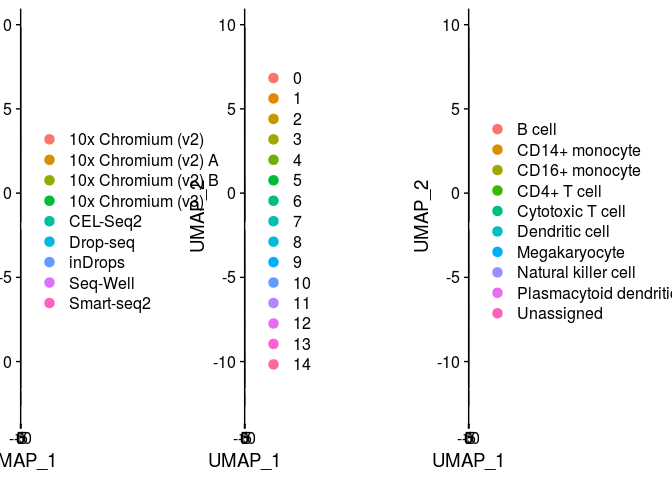
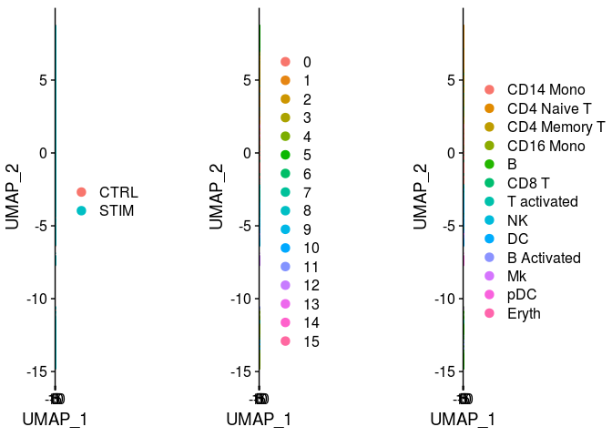
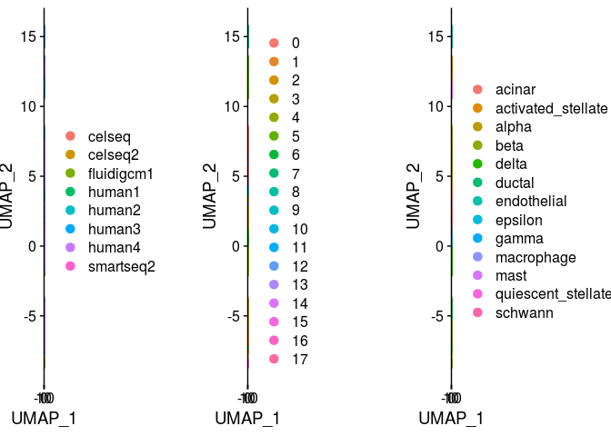

Integration of datasets using Harmony
================
Compiled: July 15, 2019

-   [](#section)
    -   [Systematic comparative analysis of human PBMC](#systematic-comparative-analysis-of-human-pbmc)
    -   [Interferon-stimulated and control PBMC](#interferon-stimulated-and-control-pbmc)
    -   [Eight human pancreatic islet datasets](#eight-human-pancreatic-islet-datasets)

This vigettte demonstrates the use of the Harmony package in Seurat. Commands and parameters are based off of the [Harmony use page](https://github.com/immunogenomics/harmony). If you use Harmony in your work, please cite:

> *Fast, sensitive, and flexible integration of single cell data with Harmony*
>
> Ilya Korsunsky, Jean Fan, Kamil Slowikowski, Fan Zhang, Kevin Wei, Yuriy Baglaenko, Michael Brenner, Po-Ru Loh, Soumya Raychaudhuri
>
> bioRxiv, 2019
>
> doi: [10.1101/461954v2](https://www.biorxiv.org/content/10.1101/461954v2)
>
> GitHub: <https://github.com/immunogenomics/harmony>

Prerequisites to install:

-   [Seurat](https://satijalab.org/seurat/install)
-   [Harmony](https://github.com/immunogenomics/harmony)
-   [SeuratData](https://github.com/satijalab/seurat-data)

Note that SeuratWrappers is not necessary, as the wrapper functions were generously provided by the Harmony authors, and are included when installing Harmony.

``` r
library(harmony)
library(Seurat)
library(SeuratData)
```

### Systematic comparative analysis of human PBMC

To learn more about this dataset, type `?pbmcsca`

``` r
InstallData("pbmcsca")
data("pbmcsca")
pbmcsca <- NormalizeData(pbmcsca) %>% FindVariableFeatures() %>% ScaleData() %>% RunPCA(verbose = FALSE)
pbmcsca <- RunHarmony(pbmcsca, group.by.vars = "Method")
pbmcsca <- RunUMAP(pbmcsca, reduction = "harmony", dims = 1:30)
pbmcsca <- FindNeighbors(pbmcsca, reduction = "harmony", dims = 1:30) %>% FindClusters()
DimPlot(pbmcsca, group.by = c("Method", "ident", "CellType"), ncol = 3)
```



### Interferon-stimulated and control PBMC

To learn more about this dataset, type `?ifnb`

``` r
InstallData("ifnb")
data("ifnb")
ifnb <- NormalizeData(ifnb) %>% FindVariableFeatures() %>% ScaleData() %>% RunPCA(verbose = FALSE)
ifnb <- RunHarmony(ifnb, group.by.vars = "stim")
ifnb <- RunUMAP(ifnb, reduction = "harmony", dims = 1:30)
ifnb <- FindNeighbors(ifnb, reduction = "harmony", dims = 1:30) %>% FindClusters()
DimPlot(ifnb, group.by = c("stim", "ident", "seurat_annotations"), ncol = 3)
```



### Eight human pancreatic islet datasets

To learn more about this dataset, type `?panc8`

``` r
InstallData("panc8")
data("panc8")
panc8 <- NormalizeData(panc8) %>% FindVariableFeatures() %>% ScaleData() %>% RunPCA(verbose = FALSE)
panc8 <- RunHarmony(panc8, group.by.vars = "replicate")
panc8 <- RunUMAP(panc8, reduction = "harmony", dims = 1:30)
panc8 <- FindNeighbors(panc8, reduction = "harmony", dims = 1:30) %>% FindClusters()
DimPlot(panc8, group.by = c("replicate", "ident", "celltype"), ncol = 3)
```


