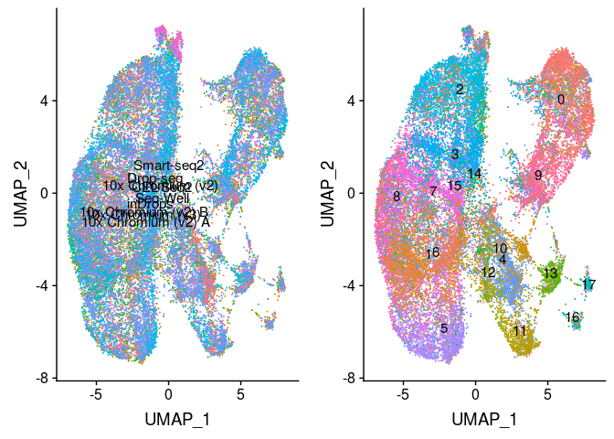
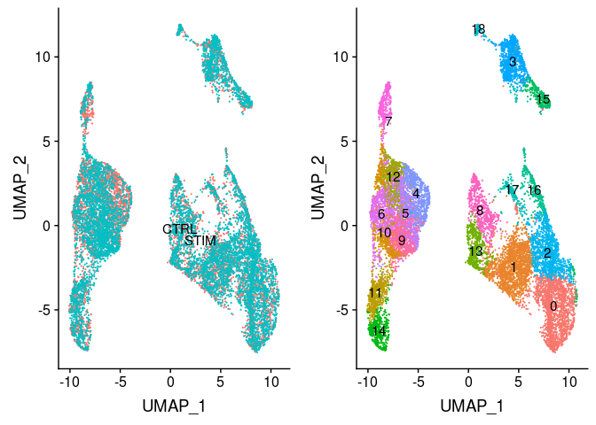

Integrating Seurat objects using LIGER
================
Compiled: July 10, 2019

-   [](#section)
    -   [PBMC](#pbmc)
    -   [Immune/Stim](#immunestim)
    -   [Pancreas](#pancreas)

This document serves to showcase running the [LIGER](https://github.com/MacoskoLab/liger) integration workflow on a `Seurat` object. To do this, we need three packages: [Seurat](https://satijalab.org/seurat/) for preprocessing the data, LIGER for the generic defintions and underlying methods, and [SeuratWrappers](https://github.com/satijalab/seurat.wrappers) for the `Seurat`-object methods for LIGER's generics. We also need [SeuratData](https://github.com/satijalab/seurat-data) to load in datasets for this vignette.

``` r
library(liger)
library(Seurat)
library(SeuratData)
library(SeuratWrappers)
```

In order to replicate LIGER's multi-dataset functionality, we will use the `split.by` parameter to preprocess the Seurat object on subsets of the data belonging to each dataset separately. Also, as LIGER does not center data when scaling, we will skip that step as well. Values for \(k\) and \(lambda\) were selected on a previous analysis of this dataset contained in a `liger` object instead.

### PBMC

``` r
data("broad")
broad <- subset(broad, subset = nFeature_RNA > 200)
broad <- NormalizeData(broad)
broad <- FindVariableFeatures(broad, nfeatures = 14000)
broad <- ScaleData(broad, split.by = "Method", do.center = FALSE)
broad <- optimizeALS(broad, k = 20, lambda = 5, split.by = "Method")
broad <- quantileAlignSNF(broad, split.by = "Method")
broad <- RunUMAP(broad, dims = 1:ncol(broad[["iNMF"]]), reduction = "iNMF")
DimPlot(broad, group.by = c("Method", "ident"), label = TRUE, legend = "none")
```



### Immune/Stim

``` r
data("immune")
immune <- NormalizeData(immune)
immune <- FindVariableFeatures(immune, nfeatures = 4000)
immune <- ScaleData(immune, split.by = "stim", do.center = FALSE)
immune <- optimizeALS(immune, k = 21, lambda = 3, split.by = "stim")
immune <- quantileAlignSNF(immune, split.by = "stim")
immune <- RunUMAP(immune, dims = 1:ncol(immune[["iNMF"]]), reduction = "iNMF")
DimPlot(immune, group.by = c("stim", "ident"), label = TRUE, legend = "none")
```



### Pancreas

``` r
data("panc8")
panc8 <- NormalizeData(panc8)
panc8 <- FindVariableFeatures(panc8, nfeatures = 13000)
panc8 <- ScaleData(panc8, split.by = "replicate", do.center = FALSE)
panc8 <- optimizeALS(panc8, k = 25, lambda = 5, split.by = "replicate")
panc8 <- quantileAlignSNF(panc8, split.by = "replicate")
panc8 <- RunUMAP(panc8, dims = 1:ncol(panc8[["iNMF"]]), reduction = "iNMF")
DimPlot(panc8, group.by = c("replicate", "ident"), label = TRUE, legend = "none")
```


