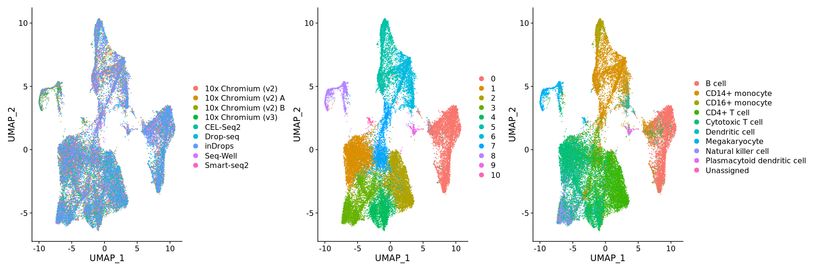
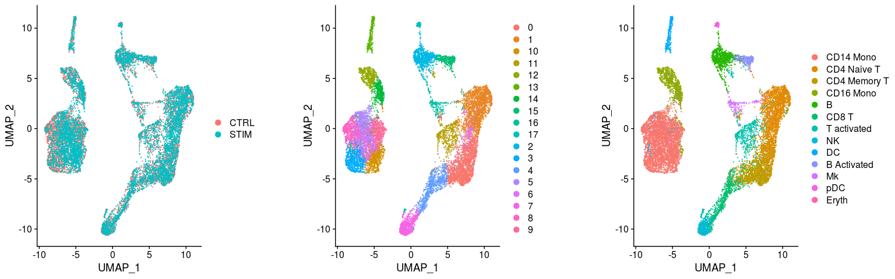
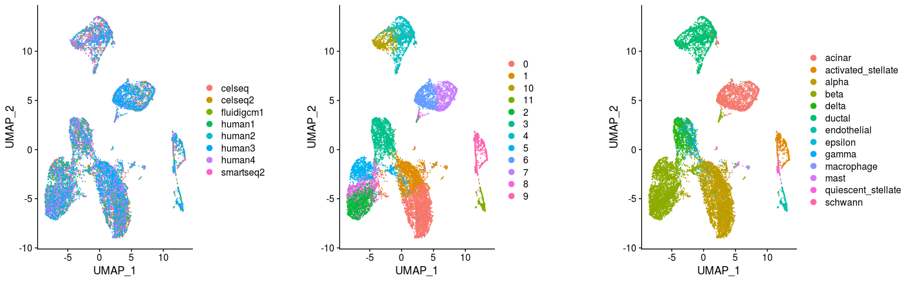

Integrating Seurat objects using LIGER
================
Compiled: July 13, 2019

-   [](#section)
    -   [Systematic comparative analysis of human PBMC](#systematic-comparative-analysis-of-human-pbmc)
    -   [Interferon-stimulated and control PBMC](#interferon-stimulated-and-control-pbmc)
    -   [Eight human pancreatic islet datasets](#eight-human-pancreatic-islet-datasets)

This vigettte demonstrates how to run LIGER on Seurat objects. Parameters and commands are based off of the [LIGER tutorial](https://macoskolab.github.io/liger/liger-vignette.html). If you use LIGER, please cite:

> *Single-Cell Multi-omic Integration Compares and Contrasts Features of Brain Cell Identity*
>
> Joshua Welch, Velina Kozareva, Ashley Ferreira, Charles Vanderburg, Carly Martin, Evan Z.Macosko
>
> Cell, 2019.
>
> doi: [10.1016/j.cell.2019.05.006](https://doi.org/10.1016/j.cell.2019.05.006)
>
> GitHub: <https://github.com/MacoskoLab/liger>

Prerequisites to install:

-   [Seurat](https://satijalab.org/seurat/install)
-   [LIGER](https://github.com/MacoskoLab/liger)
-   [SeuratWrappers](https://github.com/satijalab/seurat.wrappers)
-   [SeuratData](https://github.com/satijalab/seurat-data)

``` r
library(liger)
library(Seurat)
library(SeuratData)
library(SeuratWrappers)
```

In order to replicate LIGER's multi-dataset functionality, we will use the `split.by` parameter to preprocess the Seurat object on subsets of the data belonging to each dataset separately. Also, as LIGER does not center data when scaling, we will skip that step as well. Values for \(k\) and \(lambda\) were selected on a previous analysis of this dataset contained in a `liger` object instead.

### Systematic comparative analysis of human PBMC

To learn more about this dataset, type `?pbmcsca`

``` r
InstallData("pbmcsca")
data("pbmcsca")
pbmcsca <- NormalizeData(pbmcsca)
pbmcsca <- FindVariableFeatures(pbmcsca)
pbmcsca <- ScaleData(pbmcsca, split.by = "Method", do.center = FALSE)
pbmcsca <- RunOptimizeALS(pbmcsca, k = 20, lambda = 5, split.by = "Method")
pbmcsca <- RunQuantileAlignSNF(pbmcsca, split.by = "Method")
pbmcsca <- RunUMAP(pbmcsca, dims = 1:ncol(pbmcsca[["iNMF"]]), reduction = "iNMF")
DimPlot(pbmcsca, group.by = c("Method", "ident", "CellType"), ncol = 3)
```



### Interferon-stimulated and control PBMC

To learn more about this dataset, type `?ifnb`

``` r
InstallData("ifnb")
data("ifnb")
ifnb <- subset(ifnb, downsample = 1000)
ifnb <- NormalizeData(ifnb)
ifnb <- FindVariableFeatures(ifnb)
ifnb <- ScaleData(ifnb, split.by = "stim", do.center = FALSE)
ifnb <- RunOptimizeALS(ifnb, k = 20, lambda = 5, split.by = "stim")
ifnb <- RunQuantileAlignSNF(ifnb, split.by = "stim")
ifnb <- RunUMAP(ifnb, dims = 1:ncol(ifnb[["iNMF"]]), reduction = "iNMF")
DimPlot(ifnb, group.by = c("stim", "ident", "seurat_annotations"), ncol = 3)
```



### Eight human pancreatic islet datasets

To learn more about this dataset, type `?panc8`

``` r
InstallData("panc8")
data("panc8")
panc8 <- NormalizeData(panc8)
panc8 <- FindVariableFeatures(panc8)
panc8 <- ScaleData(panc8, split.by = "replicate", do.center = FALSE)
panc8 <- RunOptimizeALS(panc8, k = 20, lambda = 5, split.by = "replicate")
panc8 <- RunQuantileAlignSNF(panc8, split.by = "replicate")
panc8 <- RunUMAP(panc8, dims = 1:ncol(panc8[["iNMF"]]), reduction = "iNMF")
DimPlot(panc8, group.by = c("replicate", "ident", "celltype"), ncol = 3)
```


