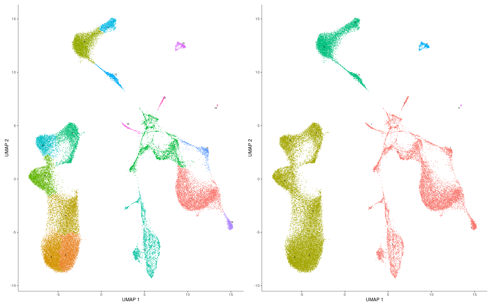
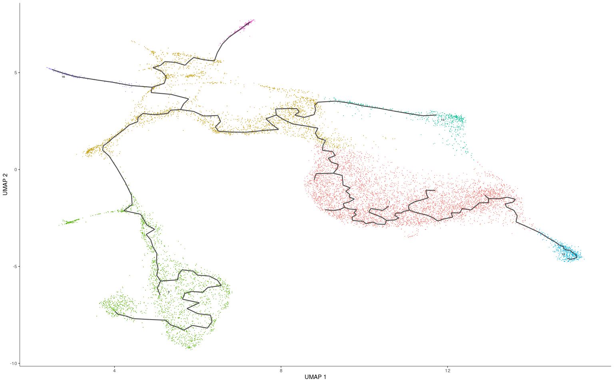
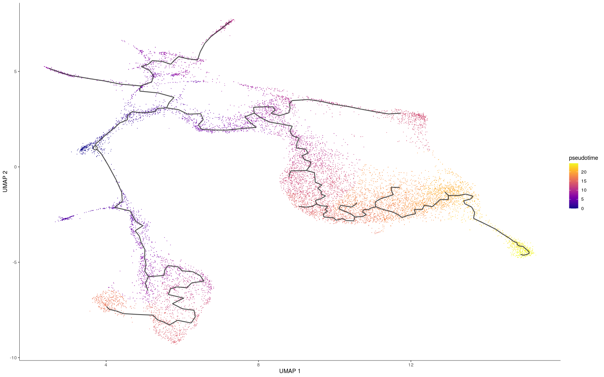
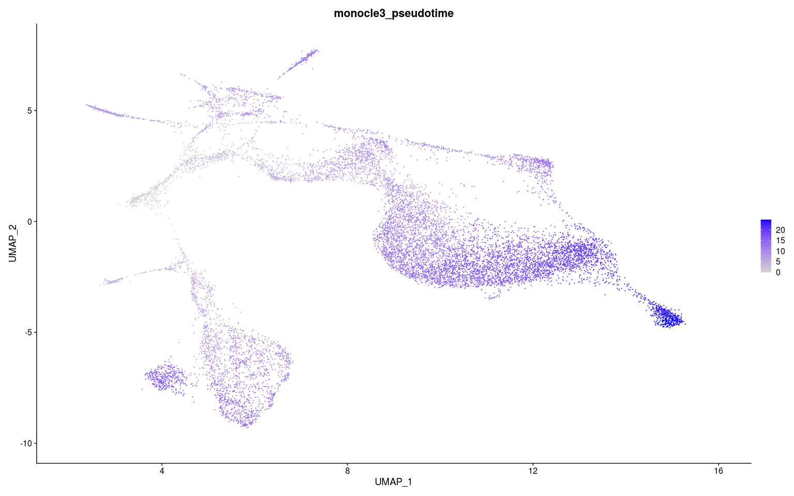

Calculating Trajectories with Monocle 3 and Seurat
================
Compiled: June 17, 2020

This vigettte demonstrates how to run trajectory inference and
pseudotime calculations with Monocle 3 on Seurat objects. If you use
Monocle 3, please cite:

> *The single-cell transcriptional landscape of mammalian organogenesis*
> 
> Junyue Cao, Malte Spielmann, Xiaojie Qiu, Xingfan Huang, Daniel M.
> Ibrahim, Andrew J. Hill, Fan Zhang, Stefan Mundlos, Lena Christiansen,
> Frank J. Steemers, Cole Trapnell & Jay Shendure
> 
> doi:
> [10.1038/s41586-019-0969-x](https://doi.org/10.1038/s41586-019-0969-x)
> 
> Website: <https://cole-trapnell-lab.github.io/monocle3/>

Prerequisites to install:

  - [Seurat](https://satijalab.org/seurat/install)
  - [SeuratWrappers](https://github.com/satijalab/seurat-wrappers)
  - [SeuratData](https://github.com/satijalab/seurat-data)
  - [Monocle 3](https://cole-trapnell-lab.github.io/monocle3/docs/installation/)

<!-- end list -->

``` r
library(monocle3)
library(Seurat)
library(SeuratData)
library(SeuratWrappers)
library(ggplot2)
library(patchwork)
library(magrittr)
```

## HCA Bone Marrow 40k

``` r
InstallData("hcabm40k")
data("hcabm40k")
```

``` r
hcabm40k <- SplitObject(hcabm40k, split.by = "orig.ident")
for (i in seq_along(hcabm40k)) {
    hcabm40k[[i]] <- NormalizeData(hcabm40k[[i]]) %>% FindVariableFeatures()
}
features <- SelectIntegrationFeatures(hcabm40k)
for (i in seq_along(along.with = hcabm40k)) {
    hcabm40k[[i]] <- ScaleData(hcabm40k[[i]], features = features) %>% RunPCA(features = features)
}
```

``` r
anchors <- FindIntegrationAnchors(hcabm40k, reference = c(1, 2), reduction = "rpca", dims = 1:30)
integrated <- IntegrateData(anchors, dims = 1:30)
```

``` r
integrated <- ScaleData(integrated)
integrated <- RunPCA(integrated)
integrated <- RunUMAP(integrated, dims = 1:30, reduction.name = "UMAP")
integrated <- FindNeighbors(integrated, dims = 1:30)
integrated <- FindClusters(integrated)
DimPlot(integrated, group.by = c("orig.ident", "ident"))
```

<!-- -->

``` r
cds <- as.cell_data_set(integrated)
cds <- cluster_cells(cds)
p1 <- plot_cells(cds, show_trajectory_graph = FALSE)
p2 <- plot_cells(cds, color_cells_by = "partition", show_trajectory_graph = FALSE)
wrap_plots(p1, p2)
```

<!-- -->

``` r
integrated.sub <- subset(as.Seurat(cds), monocle3_partitions == 1)
cds <- as.cell_data_set(integrated.sub)
cds <- learn_graph(cds)
plot_cells(cds, label_groups_by_cluster = FALSE, label_leaves = FALSE, label_branch_points = FALSE)
```

<!-- -->

``` r
max.avp <- which.max(unlist(FetchData(integrated.sub, "AVP")))
max.avp <- colnames(integrated.sub)[max.avp]
cds <- order_cells(cds, root_cells = max.avp)
plot_cells(cds, color_cells_by = "pseudotime", label_cell_groups = FALSE, label_leaves = FALSE, 
    label_branch_points = FALSE)
```

<!-- -->

``` r
integrated.sub <- as.Seurat(cds)
FeaturePlot(integrated.sub, "monocle3_pseudotime")
```

<!-- -->
