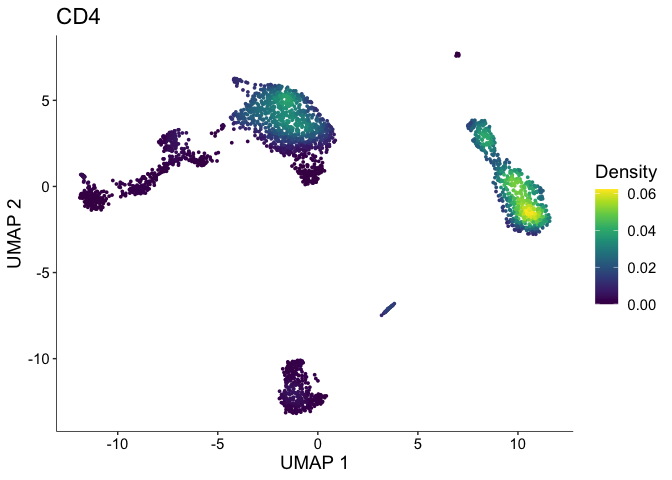
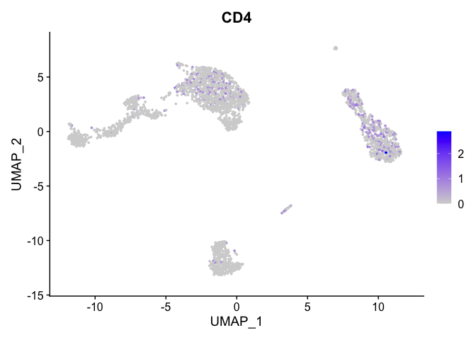
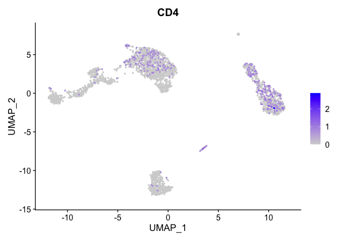
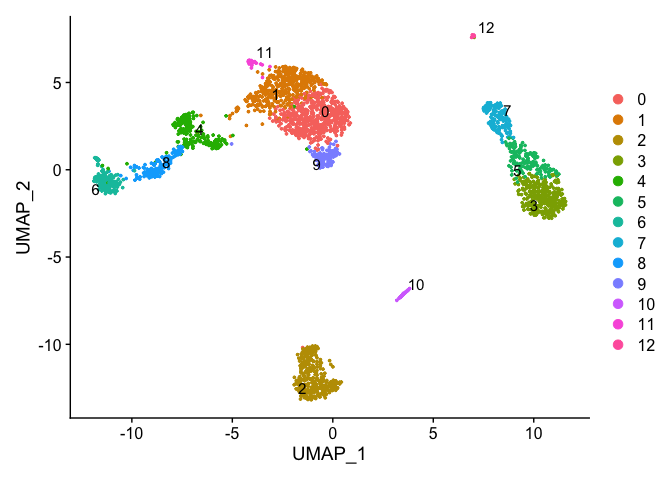
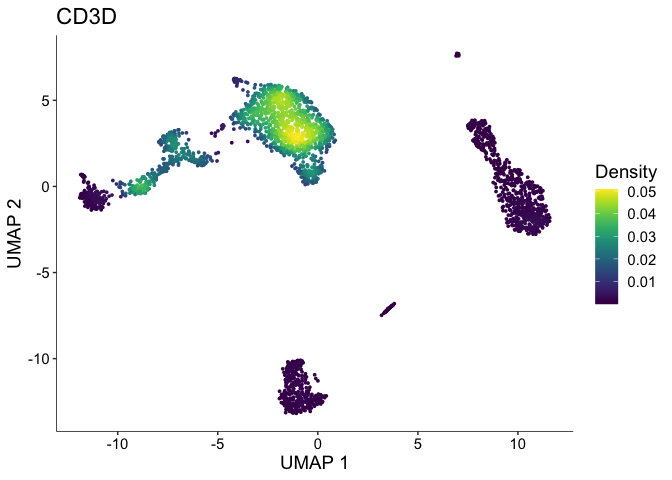
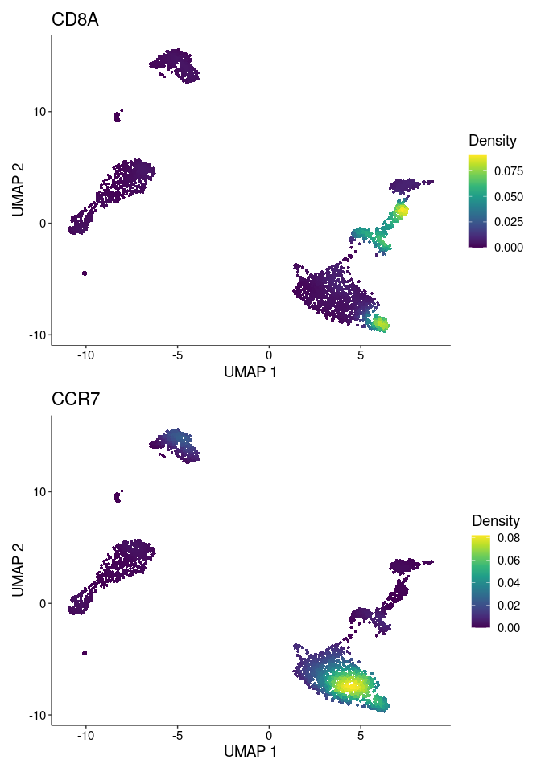
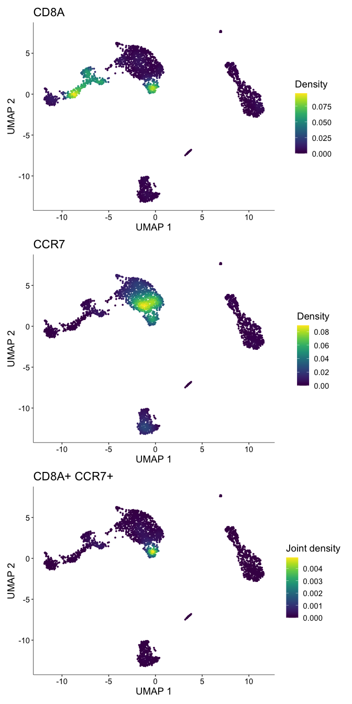
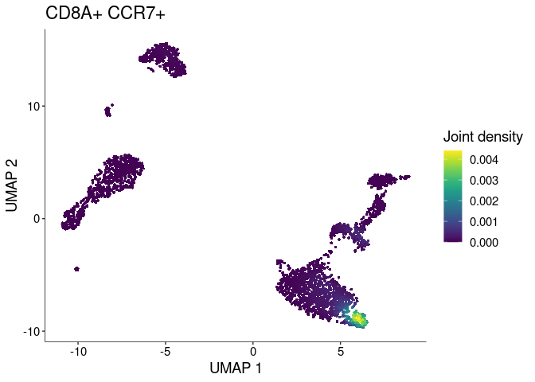
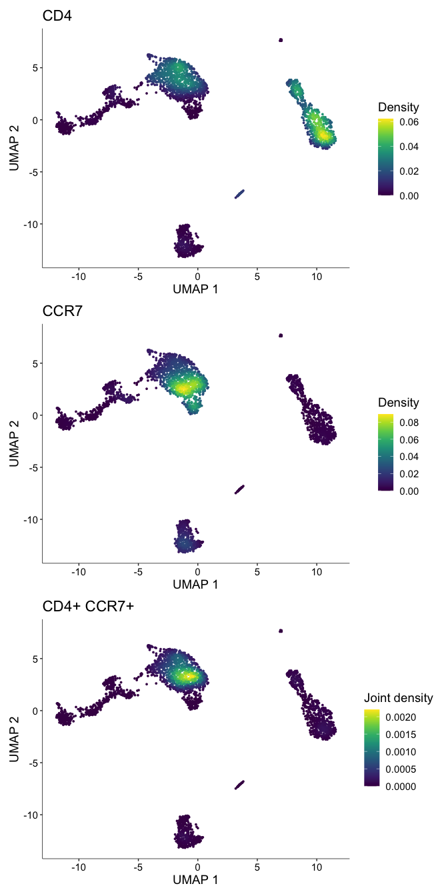

Visualization of gene expression with Nebulosa
================
Compiled: September 29, 2020

This vignette demonstrates how to run Nebulosa on a Seurat object. If
you use this, please cite:

> *Nebulosa recovers single cell gene expression signals by kernel
> density estimation*
> 
> Jose Alquicira-Hernandez and Joseph E. Powell
> 
> (Under review), 2020.
> 
> doi: [10.18129](10.18129/B9.bioc.Nebulosa)
> 
> Website: <https://github.com/powellgenomicslab/Nebulosa>

# Overview

Due to the sparsity observed in single-cell data (e.g. RNA-seq,
ATAC-seq), the visualization of cell features (e.g. gene, peak) is
frequently affected and unclear, especially when it is overlaid with
clustering to annotate cell types. `Nebulosa` is an R package to
visualize data from single cells based on kernel density estimation. It
aims to recover the signal from dropped-out features by incorporating
the similarity between cells allowing a “convolution” of the cell
features.

# Import libraries

For this vignette, let’s use `Nebulosa` with the `Seurat` package.
First, we’ll do a brief/standard data processing.

``` r
library("Nebulosa")
library("Seurat")
library("BiocFileCache")
```

# Data pre-processing

Let’s download a dataset of 3k PBMCs (available from 10X Genomics). This
same dataset is commonly used in Seurat vignettes. The code below will
download, store, and uncompress the data in a temporary directory.

``` r
bfc <- BiocFileCache(ask = FALSE)
data_file <- bfcrpath(bfc, file.path("https://s3-us-west-2.amazonaws.com/10x.files/samples/cell", 
    "pbmc3k", "pbmc3k_filtered_gene_bc_matrices.tar.gz"))

untar(data_file, exdir = tempdir())
```

Then, we can read the gene expression matrix using the `Read10X` from
`Seurat`

``` r
data <- Read10X(data.dir = file.path(tempdir(), "filtered_gene_bc_matrices", "hg19"))
```

Let’s create a Seurat object with features being expressed in at least 3
cells and cells expressing at least 200 genes.

``` r
pbmc <- CreateSeuratObject(counts = data, project = "pbmc3k", min.cells = 3, min.features = 200)
```

Remove outlier cells based on the number of genes being expressed in
each cell (below 2500 genes) and expression of mitochondrial genes
(below 5%).

``` r
pbmc[["percent.mt"]] <- PercentageFeatureSet(pbmc, pattern = "^MT-")
pbmc <- subset(pbmc, subset = nFeature_RNA < 2500 & percent.mt < 5)
```

## Data normalization

Let’s use `SCTransform` to stabilize the variance of the data by
regressing out the effect of the sequencing depth from each cell.

``` r
pbmc <- SCTransform(pbmc, verbose = FALSE)
```

## Dimensionality reduction

Once the data is normalized and scaled, we can run a *Principal
Component Analysis* (PCA) first to reduce the dimensions of our data
from 26286 features to 50 principal components. To visualize the
principal components, we can run a *Uniform Manifold Approximation and
Projection for Dimension Reduction* (UMAP) using the first 30 principal
components to obtain a two-dimentional space.

``` r
pbmc <- RunPCA(pbmc)
pbmc <- RunUMAP(pbmc, dims = 1:30)
```

## Clustering

To assess cell similarity, let’s cluster the data by constructing a
*Shared Nearest Neighbor *(SNN) *Graph* using the first 30 principal
components and applying the *Louvain algorithm*.

``` r
pbmc <- FindNeighbors(pbmc, dims = 1:30)
pbmc <- FindClusters(pbmc)
```

    ## Modularity Optimizer version 1.3.0 by Ludo Waltman and Nees Jan van Eck
    ## 
    ## Number of nodes: 2638
    ## Number of edges: 113368
    ## 
    ## Running Louvain algorithm...
    ## Maximum modularity in 10 random starts: 0.8272
    ## Number of communities: 13
    ## Elapsed time: 0 seconds

# Visualize data with `Nebulosa`

The main function from `Nebulosa` is the `plot_density`. For usability,
it resembles the `FeaturePlot` function from `Seurat`.

Let’s plot the kernel density estimate for `CD4` as follows

``` r
plot_density(pbmc, "CD4")
```

<!-- -->

For comparison, let’s also plot a standard scatterplot using `Seurat`

``` r
FeaturePlot(pbmc, "CD4")
```

<!-- -->

``` r
FeaturePlot(pbmc, "CD4", order = TRUE)
```

<!-- -->

By smoothing the data, `Nebulosa` allows a better visualization of the
global expression of CD4 in myeloid and CD4+ T cells. Notice that the
“random” expression of CD4 in other areas of the plot is removed as
the expression of this gene is not supported by many cells in those
areas. Furthermore, CD4+ cells appear to show considerable dropout rate.

Let’s plot the expression of CD4 with `Nebulosa` next to the clustering
results

``` r
DimPlot(pbmc, label = TRUE, repel = TRUE)
```

<!-- -->

We can now easily identify that clusters `0` and `2` correspond to CD4+
T cells if we plot CD3D too.

``` r
plot_density(pbmc, "CD3D")
```

<!-- -->

# Multi-feature visualization

Characterize cell populations usually relies in more than a single
marker. Nebulosa allows the visualization of the joint density of from
multiple features in a single plot.

## Identifying Naive CD8+ T cells

Users familiarized with PBMC datasets may know that CD8+ CCR7+ cells
usually cluster next to CD4+ CCR7+ and separate from the rest of CD8+
cells. Let’s aim to identify Naive CD8+ T cells. To do so, we can just
add another gene to the vector containing the features to visualize.

``` r
p3 <- plot_density(pbmc, c("CD8A", "CCR7"))
p3 + plot_layout(ncol = 1)
```

<!-- -->

`Nebulosa` can return a *joint density* plot by multiplying the
densities from all query genes by using the `joint = TRUE` parameter:

``` r
p4 <- plot_density(pbmc, c("CD8A", "CCR7"), joint = TRUE)
p4 + plot_layout(ncol = 1)
```

<!-- -->

When compared to the clustering results, we can easily identify that
Naive CD8+ T cells correspond to cluster `8`.

`Nebulosa` returns the density estimates for each gene along with the
joint density across all provided genes. By setting `combine = FALSE`,
we can obtain a list of ggplot objects where the last plot corresponds
to the joint density estimate.

``` r
p_list <- plot_density(pbmc, c("CD8A", "CCR7"), joint = TRUE, combine = FALSE)
p_list[[length(p_list)]]
```

<!-- -->

## Identifying Naive CD4+ T cells

Likewise, the identification of Naive CD4+ T cells becomes
straightforward by combining `CD4` and `CCR7`:

``` r
p4 <- plot_density(pbmc, c("CD4", "CCR7"), joint = TRUE)
p4 + plot_layout(ncol = 1)
```

<!-- -->

Notice that these cells are mainly constrained to cluster `0`

``` r
p4[[3]]/DimPlot(pbmc, label = TRUE, repel = TRUE)
```

<!-- -->

# Conclusions

In summary,`Nebulosa`can be useful to recover the signal from
dropped-out genes and improve their visualization in a two-dimensional
space. We recommend using `Nebulosa` particularly for dropped-out genes.
For fairly well-expressed genes, the direct visualization of the gene
expression may be preferable. We encourage users to use `Nebulosa` along
with the core visualization methods from the `Seurat` and `Bioconductor`
environments as well as other visualization methods to draw more
informed conclusions about their data.
