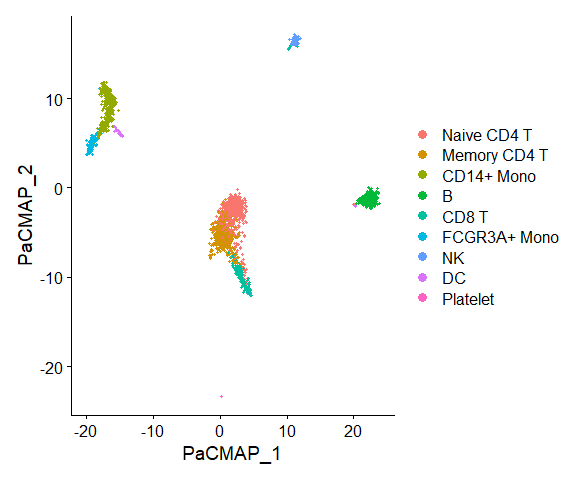

Running PaCMAP on a Seurat Object
================
Compiled: 十月 09, 2024

This vignette demonstrates how to run PaCMAP, a dimensionality reduction
method that can be used for providing robust and trustworthy
visualization, on a Seurat object. If you use our work, please cite both
papers:

> *Understanding How Dimension Reduction Tools Work: An Empirical
> Approach to Deciphering t-SNE, UMAP, TriMap, and PaCMAP for Data
> Visualization*
>
> Yingfan Wang, Haiyang Huang, Cynthia Rudin & Yaron Shaposhnik
>
> Journal of Machine Learning Research, 2021
>
> doi: <https://doi.org/10.48550/arXiv.2012.04456>
>
> *Towards a comprehensive evaluation of dimension reduction methods for
> transcriptomic data visualization*
>
> Haiyang Huang, Yingfan Wang, Cynthia Rudin and Edward P. Browne
>
> Communications biology, 2022
>
> doi: <https://doi.org/10.1038/s42003-022-03628-x>
>
> GitHub: <https://github.com/YingfanWang/PaCMAP>

Prerequisites to install:

- [Seurat](https://satijalab.org/seurat/install)
- [SeuratWrappers](https://github.com/satijalab/seurat-wrappers)
- [SeuratData](https://github.com/satijalab/seurat-data)
- [Reticulate](https://rstudio.github.io/reticulate/)

In addition to R packages, PaCMAP relies on Python to deliver high
performance. To streamline the installation process and make environment
management easier, we strongly recommend you to use
anaconda(<https://www.anaconda.com/download>) or
miniconda(<https://docs.anaconda.com/miniconda/miniconda-install/>) for
managing Python environments. Below, we provide step-by-step
instructions on how to properly install PaCMAP **after** you have
installed one of these tools.

Create a conda environment with PaCMAP installed:

``` conda
conda create -n "pacmap" python=3.12  # Install in the environment called "pacmap"
conda activate pacmap
conda install -y conda-forge::pacmap
```

To run PaCMAP, you need to connect your R console to the corresponding
conda environment. If your Conda/Miniconda installation is located in a
non-default directory, you might set up the conda variable as
`/path/to/your/conda`. This ensures the correct environment is used
during the installation.

``` r
reticulate::use_condaenv(condaenv = "pacmap", conda = "auto")
```

``` r
library(Seurat)
library(SeuratData)
library(SeuratWrappers)
```

### PaCMAP on PBMC3k

To learn more about this dataset, type `?pbmc3k`

``` r
InstallData("pbmc3k")
data("pbmc3k.final")

# Initial processing to select variable features
pbmc3k.final <- Seurat::UpdateSeuratObject(pbmc3k.final)
pbmc3k.final <- Seurat::FindVariableFeatures(pbmc3k.final)

# run PaCMAP on Seurat object. 
pbmc3k.final <- RunPaCMAP.Seurat(object = pbmc3k.final, features=Seurat::VariableFeatures(pbmc3k.final))
```

    ## Applied PCA, the dimensionality becomes 100
    ## PaCMAP(n_neighbors=10, n_MN=5, n_FP=20, distance=euclidean, lr=1.0, n_iters=(100, 100, 450), apply_pca=True, opt_method='adam', verbose=True, intermediate=False, seed=11)
    ## Finding pairs
    ## Found nearest neighbor
    ## Calculated sigma
    ## Found scaled dist
    ## Pairs sampled successfully.
    ## ((26380, 2), (13190, 2), (52760, 2))
    ## Initial Loss: 32494.857421875
    ## Iteration:   10, Loss: 25802.580078
    ## Iteration:   20, Loss: 21603.363281
    ## Iteration:   30, Loss: 19970.650391
    ## Iteration:   40, Loss: 18992.988281
    ## Iteration:   50, Loss: 18181.544922
    ## Iteration:   60, Loss: 17354.800781
    ## Iteration:   70, Loss: 16440.773438
    ## Iteration:   80, Loss: 15367.431641
    ## Iteration:   90, Loss: 14006.279297
    ## Iteration:  100, Loss: 11969.539062
    ## Iteration:  110, Loss: 14622.074219
    ## Iteration:  120, Loss: 14481.925781
    ## Iteration:  130, Loss: 14432.553711
    ## Iteration:  140, Loss: 14414.109375
    ## Iteration:  150, Loss: 14406.267578
    ## Iteration:  160, Loss: 14402.332031
    ## Iteration:  170, Loss: 14400.175781
    ## Iteration:  180, Loss: 14398.969727
    ## Iteration:  190, Loss: 14398.415039
    ## Iteration:  200, Loss: 14398.177734
    ## Iteration:  210, Loss: 7290.769531
    ## Iteration:  220, Loss: 7165.277344
    ## Iteration:  230, Loss: 7109.806641
    ## Iteration:  240, Loss: 7076.959961
    ## Iteration:  250, Loss: 7059.577148
    ## Iteration:  260, Loss: 7048.008301
    ## Iteration:  270, Loss: 7038.852539
    ## Iteration:  280, Loss: 7031.291504
    ## Iteration:  290, Loss: 7024.563477
    ## Iteration:  300, Loss: 7018.940430
    ## Iteration:  310, Loss: 7013.954102
    ## Iteration:  320, Loss: 7009.539062
    ## Iteration:  330, Loss: 7005.522949
    ## Iteration:  340, Loss: 7001.719727
    ## Iteration:  350, Loss: 6998.311523
    ## Iteration:  360, Loss: 6995.219727
    ## Iteration:  370, Loss: 6992.364258
    ## Iteration:  380, Loss: 6989.705566
    ## Iteration:  390, Loss: 6987.210449
    ## Iteration:  400, Loss: 6984.850586
    ## Iteration:  410, Loss: 6982.660156
    ## Iteration:  420, Loss: 6980.610840
    ## Iteration:  430, Loss: 6978.653320
    ## Iteration:  440, Loss: 6976.790039
    ## Iteration:  450, Loss: 6975.051758
    ## Iteration:  460, Loss: 6973.373535
    ## Iteration:  470, Loss: 6971.781250
    ## Iteration:  480, Loss: 6970.295410
    ## Iteration:  490, Loss: 6968.885254
    ## Iteration:  500, Loss: 6967.526367
    ## Iteration:  510, Loss: 6966.229492
    ## Iteration:  520, Loss: 6965.000977
    ## Iteration:  530, Loss: 6963.808105
    ## Iteration:  540, Loss: 6962.668945
    ## Iteration:  550, Loss: 6961.575195
    ## Iteration:  560, Loss: 6960.505371
    ## Iteration:  570, Loss: 6959.466309
    ## Iteration:  580, Loss: 6958.451172
    ## Iteration:  590, Loss: 6957.499023
    ## Iteration:  600, Loss: 6956.579102
    ## Iteration:  610, Loss: 6955.684570
    ## Iteration:  620, Loss: 6954.833984
    ## Iteration:  630, Loss: 6954.013672
    ## Iteration:  640, Loss: 6953.199219
    ## Iteration:  650, Loss: 6952.405762
    ## Elapsed time: 0.94s

``` r
# visualize markers
features.plot <- c('CD3D', 'MS4A1', 'CD8A', 'GZMK', 'GZMB', 'FCGR3A')
DimPlot(object=pbmc3k.final,reduction="pacmap")
```

<!-- -->

``` r
pbmc3k.final <- NormalizeData(pbmc3k.final, verbose = FALSE) 
FeaturePlot(pbmc3k.final, features.plot, ncol = 2, reduction="pacmap")
```

<!-- -->
