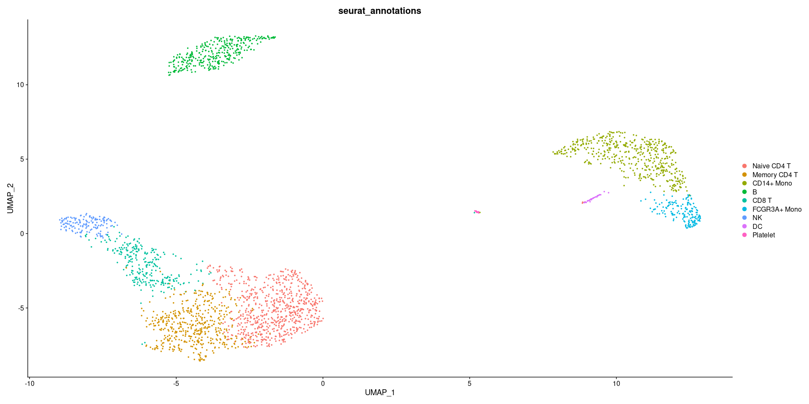
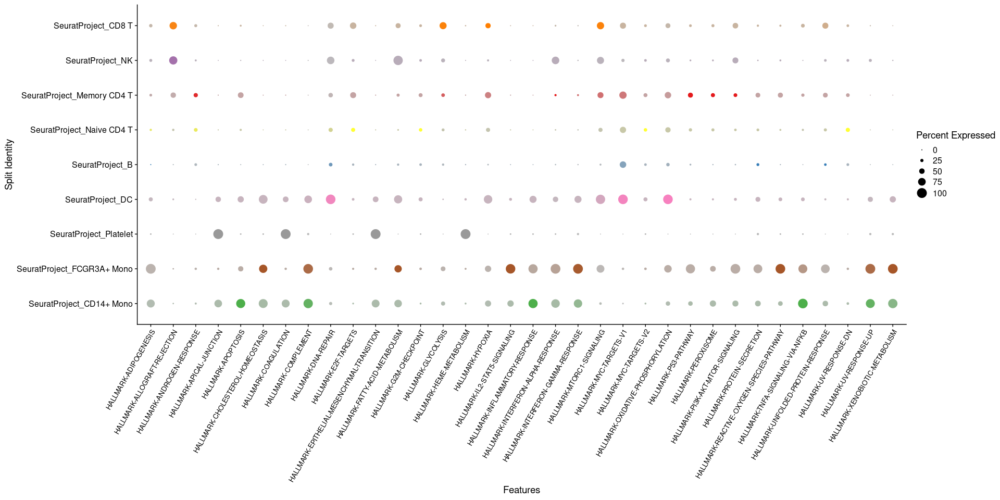
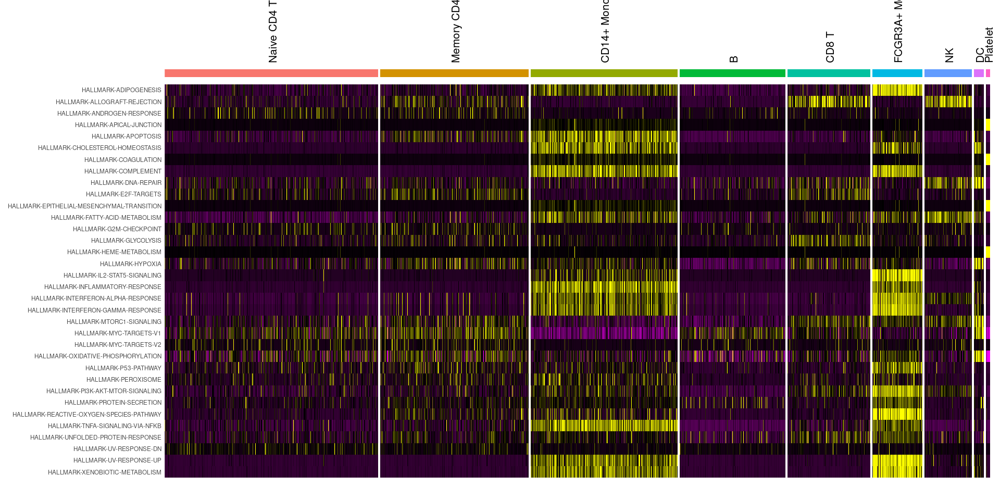
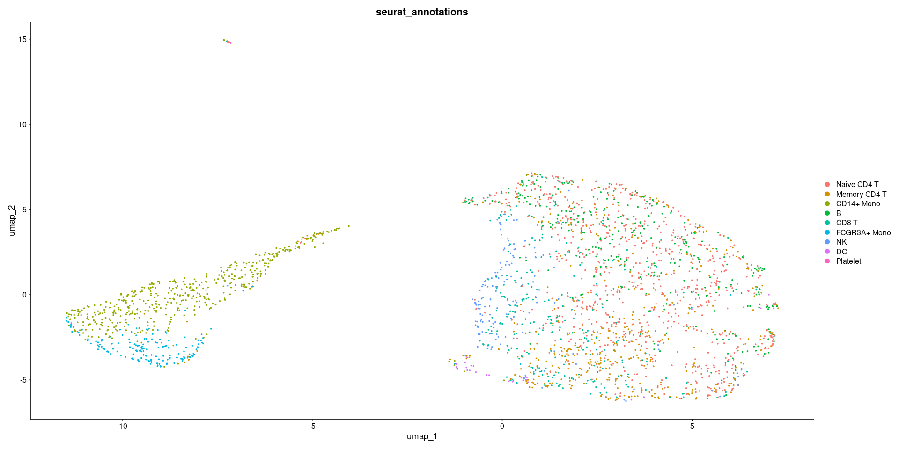
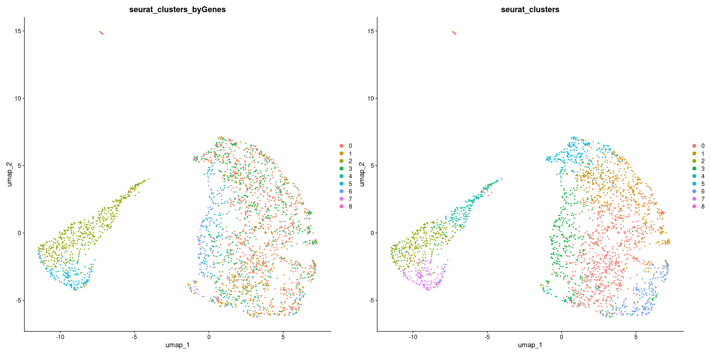
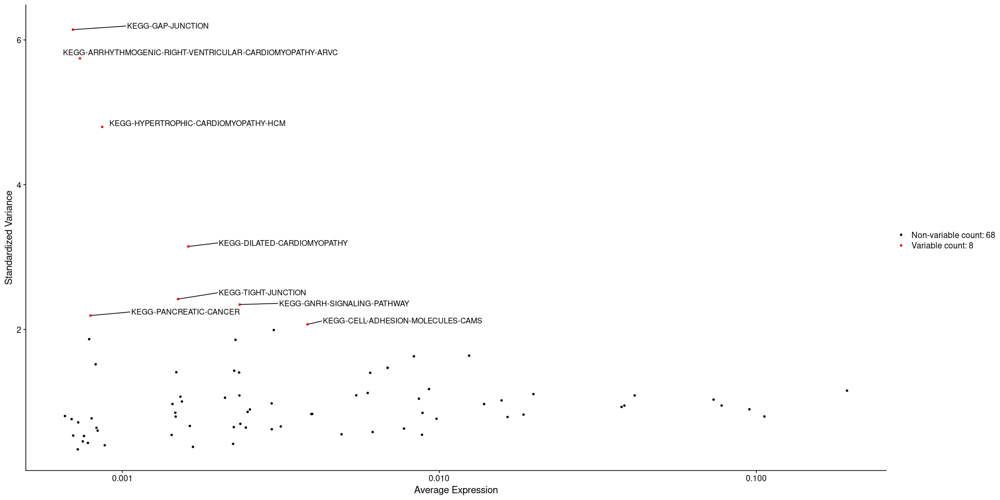
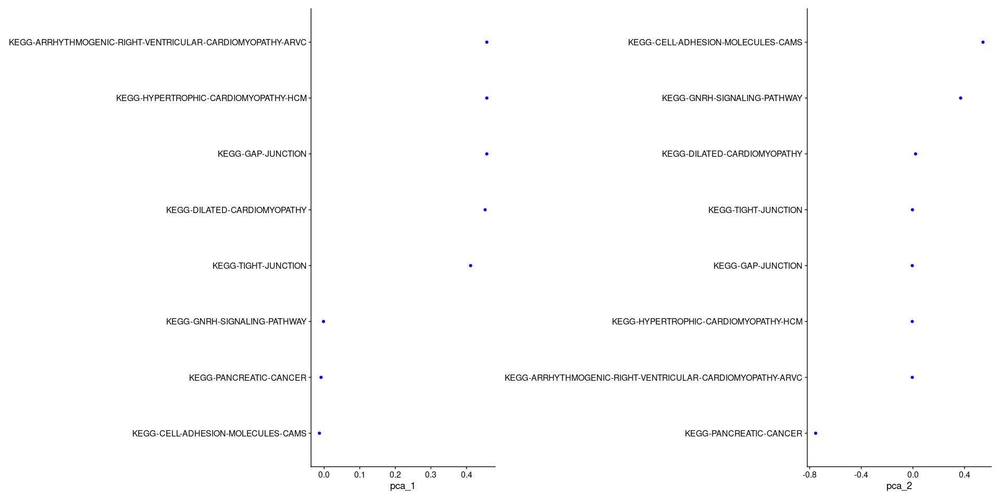

Running ScGSEA from gficf on Seurat Objects
================
Compiled: gennaio 12, 2023

-   [Introduction](#introduction)
    -   [Load examle data from
        SeuratData](#load-examle-data-from-seuratdata)
    -   [Compute pathways activity at single-cell
        resolution](#compute-pathways-activity-at-single-cell-resolution)
-   [PART 1 : Evaluate pathways activity in single-cell
    data](#part-1--evaluate-pathways-activity-in-single-cell-data)
    -   [Visualize UMAP plot computed on genes
        expression](#visualize-umap-plot-computed-on-genes-expression)
    -   [Identify how pathways activity change across cell
        type](#identify-how-pathways-activity-change-across-cell-type)
    -   [Inspect pathways activation in each cell of a given cell
        type](#inspect-pathways-activation-in-each-cell-of-a-given-cell-type)
-   [PART 2 : Analyze data based on pathways activity
    scores](#part-2--analyze-data-based-on-pathways-activity-scores)
    -   [Visualize UMAP plot computed on pathways activity
        scores](#visualize-umap-plot-computed-on-pathways-activity-scores)
    -   [Cluster cells based on pathways activity
        scores](#cluster-cells-based-on-pathways-activity-scores)
-   [TIPS](#tips)
    -   [How can I handle collection with an high number of
        genesets?](#how-can-i-handle-collection-with-an-high-number-of-genesets)

This vignette demonstrates how to run single-cell gene set enrichment
analysis with gficf on Seurat objects.

> *Single-cell gene set enrichment analysis and transfer learning for
> functional annotation of scRNA-seq data*
>
> Pellecchia Simona , Viscido Gaetano, Franchini Melania, Gambardella
> Gennaro
>
> bioRxiv, 2022
>
> doi: <https://doi.org/10.1101/2022.10.24.513476>
>
> GitHub: <https://github.com/gambalab/gficf>

Prerequisites to install:

-   [Seurat](https://satijalab.org/seurat/install)
-   [SeuratData](https://github.com/satijalab/seurat-data)
-   [SeuratWrappers](https://github.com/satijalab/seurat-wrappers)
-   [gficf](https://github.com/gambalab/gficf)

``` r
library(Seurat)
library(SeuratData)
library(SeuratWrappers)
library(gficf)
```

# Introduction

GF-ICF is an R package for normalization, visualization and analysis of
of single-cell RNA sequencing data, based on a data transformation model
called term frequency–inverse document frequency (TF-IDF), which has
been extensively used in the field of text mining. Here, we show one of
the latest implementation which enables the pathway activity computation
at single-cell level.

## Load examle data from SeuratData

To demonstrate how to run runScGSEA() function on a single-cell RNA-seq
dataset. We will use the pbmc3k.final dataset from the SeuratData
package which contains 2,638 PBMCs processed using the standard Seurat
workflow as demonstrated in Seurat’s guided clustering tutorial.

``` r
InstallData("pbmc3k")
data("pbmc3k.final")
pbmc3k.final
```

    ## An object of class Seurat 
    ## 13714 features across 2638 samples within 1 assay 
    ## Active assay: RNA (13714 features, 2000 variable features)
    ##  2 dimensional reductions calculated: pca, umap

## Compute pathways activity at single-cell resolution

Single cell gene set enrichment analysis is performed by the function
runScGSEA() of gficf package which computes GSEA scores for each cell
across a set of input pathways by using NMF. The list of gene sets to
use can can be specified trough the category and subcategory parameters.

``` r
pbmc.ptw <- RunScGSEA(object = pbmc3k.final, geneID = "symbol", species = "human", category = "H")
```

# PART 1 : Evaluate pathways activity in single-cell data

## Visualize UMAP plot computed on genes expression

As dimensionality reduction results computed on genes expression are
preserved, let’s graph the UMAP computed on genes x cells matrix. In
this case cells are colored by their cell type.

``` r
DimPlot(pbmc.ptw, reduction = "umap_byGenes", group.by = "seurat_annotations")
```

<!-- -->

## Identify how pathways activity change across cell type

To evaluate how pathways activity change across cell type, we utilize
DotPlot() function where dot size encodes for the percentage of cells of
each cell type in which the given pathway is active. Finally, cell types
are ordered (by hierarchical clustering) based on given features by
setting cluster.idents = TRUE.

``` r
library(ggplot2)
library(RColorBrewer)

all.pathways = rownames(pbmc.ptw)

DotPlot(object = pbmc.ptw, features = all.pathways, split.by = "seurat_annotations", cols = RColorBrewer::brewer.pal(n = length(unique(pbmc.ptw$seurat_annotations)),
    name = "Set1"), cluster.idents = TRUE) + theme(axis.text.x = element_text(angle = 60, vjust = 1,
    hjust = 1, size = 10))
```

<!-- -->

## Inspect pathways activation in each cell of a given cell type

To inspect pathways activation in each cell of a given cell type, we use
DoHeatmap() function. In this case, we are plotting all given pathways
for each cell type.

``` r
DoHeatmap(pbmc.ptw, features = all.pathways, group.by = "seurat_annotations", angle = 90) + NoLegend()
```

<!-- -->

# PART 2 : Analyze data based on pathways activity scores

## Visualize UMAP plot computed on pathways activity scores

Now, let’s see the UMAP computed on pathways activity scores. To this
end, we follow the standard Seurat workflow which requires the
computation of PCA on scaled data (i.e. pathway scores normalized by
gene-set) before run the UMAP reduction. Results will be stored in
separate reduction slot of the Seurat object. Finally, we display the
UMAP plot where cells are colored by their cell type.

``` r
pbmc.ptw <- RunPCA(pbmc.ptw, features = all.pathways)
pbmc.ptw <- RunUMAP(pbmc.ptw, dims = 1:5)
DimPlot(pbmc.ptw, reduction = "umap", group.by = "seurat_annotations")
```

<!-- -->

## Cluster cells based on pathways activity scores

Now that we reconstructed pathway’s activity at single cell level we can
try to cluster cell according to these values using Seurat functions
FindNeighbors() and FindClusters(). Finally, we graph clustering results
computed both on gene expression and pathway activity scores as UMAP
plot form.

``` r
pbmc.ptw <- FindNeighbors(pbmc.ptw, dims = 1:10)
pbmc.ptw <- FindClusters(pbmc.ptw, resolution = 0.5)
```

    ## Modularity Optimizer version 1.3.0 by Ludo Waltman and Nees Jan van Eck
    ## 
    ## Number of nodes: 2638
    ## Number of edges: 85312
    ## 
    ## Running Louvain algorithm...
    ## Maximum modularity in 10 random starts: 0.8276
    ## Number of communities: 9
    ## Elapsed time: 0 seconds

``` r
DimPlot(pbmc.ptw, reduction = "umap", group.by = c("seurat_clusters_byGenes", "seurat_clusters"))
```

<!-- -->

# TIPS

## How can I handle collection with an high number of genesets?

In the case you are handling collections containing a lot of gene-sets,
it could be useful to perform a feature selection step. To this end, we
first store pathways metadata in a separate variable (i.e. feat.meta),
then we create an empty dataframe in the meta.features slot to enable
the storing of the output of the Seurat function FindVariableFeatures()
setting nfeatures equal to 10% of the number of genesets used.

``` r
pbmc.ptw.kegg <- RunScGSEA(object = pbmc3k.final, geneID = "symbol", species = "human", category = "C2",
    subcategory = "CP:KEGG")

feat.meta <- pbmc.ptw.kegg[["RNA"]]@meta.features
pbmc.ptw.kegg[["RNA"]]@meta.features <- data.frame(row.names = rownames(pbmc.ptw.kegg))
nfeatures <- round(nrow(pbmc.ptw.kegg) * 0.1)
pbmc.ptw.kegg <- FindVariableFeatures(pbmc.ptw.kegg, selection.method = "vst", nfeatures = nfeatures)
top <- head(VariableFeatures(pbmc.ptw.kegg), nfeatures)
LabelPoints(plot = VariableFeaturePlot(pbmc.ptw.kegg), points = top, repel = TRUE)
```

<!-- -->

``` r
pbmc.ptw.kegg <- RunPCA(pbmc.ptw.kegg, features = VariableFeatures(object = pbmc.ptw.kegg))
VizDimLoadings(pbmc.ptw.kegg, dims = 1:2, reduction = "pca")
```

<!-- -->
