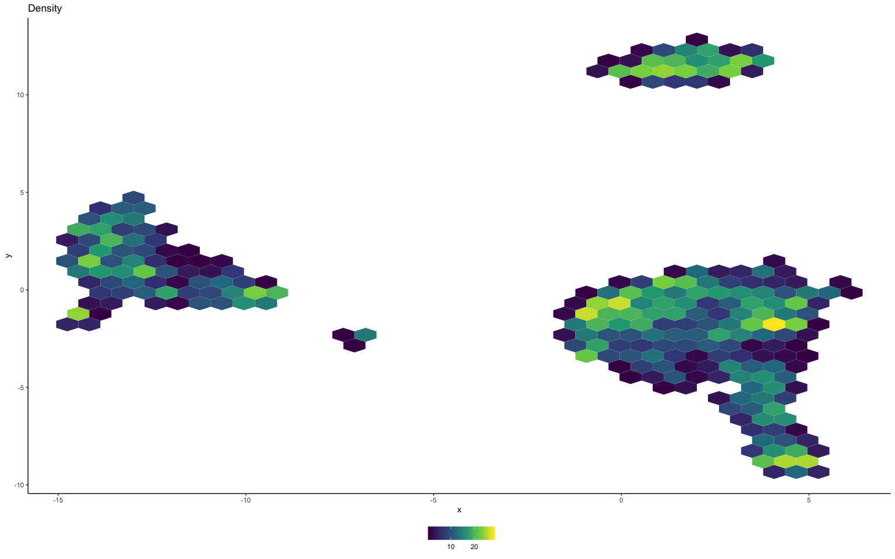

Using schex with Seurat
================
Compiled: August 07, 2019

This vigettte demonstrates how to run schex on Seurat objects, which aims to provide better plots. If you use schex, please cite:

> *Single cell transcriptomics reveals spatial and temporal dynamics of gene expression in the developing mouse spinal cord*
>
> Delile, Julien, Teresa Rayon, Manuela Melchionda, Amelia Edwards, James Briscoe, and Andreas Sagner.
>
> doi: [0.1242/dev.173807](https://doi.org/0.1242/dev.173807)
>
> Github: <https://github.com/SaskiaFreytag/schex>

Reduced dimension plotting is one of the essential tools for the analysis of single cell data. However, as the number of cells/nuclei in these these plots increases, the usefulness of these plots decreases. Many cells are plotted on top of each other obscuring information, even when taking advantage of transparency settings. This package provides binning strategies of cells/nuclei into hexagon cells. Plotting summarized information of all cells/nuclei in their respective hexagon cells presents information without obstructions. The package seemlessly works with the two most common object classes for the storage of single cell data; `SingleCellExperiment` from the [SingleCellExperiment](https://bioconductor.org/packages/3.9/bioc/html/SingleCellExperiment.html) package and `Seurat` from the [Seurat](https://satijalab.org/seurat/) package. In this vignette I will be presenting the use of `schex` for `Seurat` objects.

Load libraries
--------------

Prerequisites to install that are not available via `install.packages`:

-   [schex](https://github.com/SaskiaFreytag/schex)
-   [SeuratData](https://github.com/satijalab/seurat-data)

``` r
library(Seurat)
library(SeuratData)
library(ggplot2)
library(ggrepel)
theme_set(theme_classic())
library(schex)
```

Setup single cell data
----------------------

In order to demonstrate the capabilities of the schex package, I will use the a dataset of Peripheral Blood Mononuclear Cells (PBMC) freely available from 10x Genomics. There are 2,700 single cells that were sequenced on the Illumina NextSeq 500. You can download the data from the [Seurat website](https://s3-us-west-2.amazonaws.com/10x.files/samples/cell/pbmc3k/pbmc3k_filtered_gene_bc_matrices.tar.gz).

``` r
InstallData("pbmc3k")
pbmc <- pbmc3k
```

In the next few sections, I will perform some simple quality control steps outlined in the [Seurat vignette](https://satijalab.org/seurat/v3.0/pbmc3k_tutorial.html). I will then calculate various dimension reductions and cluster the data, as also outlined in the vignette.

Standard pre-processing workflow
--------------------------------

### Filtering

Cells with high mitochondrial content as well as cells with too low or too high feature count are filtered.

``` r
pbmc[["percent.mt"]] <- PercentageFeatureSet(pbmc, pattern = "^MT-")
pbmc <- subset(pbmc, subset = nFeature_RNA > 200 & nFeature_RNA < 2500 & percent.mt < 5)
```

### Normalization

Next a global-scaling normalization method is employed to normalizes the feature expression measurements for each cell.

``` r
pbmc <- NormalizeData(pbmc, normalization.method = "LogNormalize", scale.factor = 10000, verbose = FALSE)
```

### Identification of highly variable genes

Many of the downstream methods are based on only the highly variable genes, hence we require their identification.

``` r
pbmc <- FindVariableFeatures(pbmc, selection.method = "vst", nfeatures = 2000, verbose = FALSE)
```

### Scaling

Prior to dimension reduction the data is scaled.

``` r
all.genes <- rownames(pbmc)
pbmc <- ScaleData(pbmc, features = all.genes, verbose = FALSE)
```

### Perform dimensionality reductions

First a PCA is applied to the data. Using the PCA you will have to decide on the dimensionality of the data. Here the dimensionality was decided to be 10. Please refer to the original Seurat vignette for methods on how this is assessed.

``` r
pbmc <- RunPCA(pbmc, features = VariableFeatures(object = pbmc), verbose = FALSE)
```

Next a UMAP dimensionality reduction is also run.

``` r
pbmc <- RunUMAP(pbmc, dims = 1:10, verbose = FALSE)
```

### Clustering

Finally the data is clustered.

``` r
pbmc <- FindNeighbors(pbmc, dims = 1:10, verbose = FALSE)
pbmc <- FindClusters(pbmc, resolution = 0.5, verbose = FALSE)
```

Plotting single cell data
-------------------------

At this stage in the workflow we usually would like to plot aspects of our data in one of the reduced dimension representations. Instead of plotting this in an ordinary fashion, I will demonstrate how schex can provide a better way of plotting this.

#### Calculate hexagon cell representation

First, I will calculate the hexagon cell representation for each cell for a specified dimension reduction representation. I decide to use `nbins=40` which specifies that I divide my x range into 40 bins. Note that this might be a parameter that you want to play around with depending on the number of cells/ nuclei in your dataset. Generally, for more cells/nuclei, `nbins` should be increased.

``` r
pbmc <- make_hexbin(pbmc, nbins = 40, dimension_reduction = "UMAP")
```

#### Plot number of cells/nuclei in each hexagon cell

First I plot how many cells are in each hexagon cell. This should be relatively even, otherwise change the `nbins` parameter in the previous calculation.

``` r
plot_hexbin_density(pbmc)
```



#### Plot meta data in hexagon cell representation

Next I colour the hexagon cells by some meta information, such as the median total count or cluster membership in each hexagon cell.

``` r
plot_hexbin_meta(pbmc, col = "nCount_RNA", action = "median")
```


``` r
plot_hexbin_meta(pbmc, col = "RNA_snn_res.0.5", action = "majority")
```


For convenience there is also a function that allows the calculation of label positions for factor variables. These can be overlayed with the package `ggrepel`.

``` r
label_df <- make_hexbin_label(pbmc, col = "RNA_snn_res.0.5")
pp <- plot_hexbin_meta(pbmc, col = "RNA_snn_res.0.5", action = "majority")
pp + ggrepel::geom_label_repel(data = label_df, aes(x = x, y = y, label = label), colour = "black", 
    label.size = NA, fill = NA)
```


#### Plot gene expression in hexagon cell representation

Finally, I will visualize the gene expression of the CD19 gene in the hexagon cell representation.

``` r
gene_id <- "CD19"
plot_hexbin_gene(pbmc, type = "logcounts", gene = gene_id, action = "mean", xlab = "UMAP1", ylab = "UMAP2", 
    title = paste0("Mean of ", gene_id))
```


