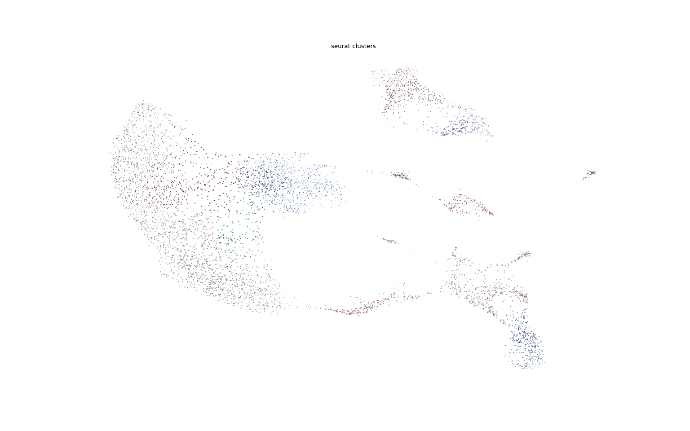
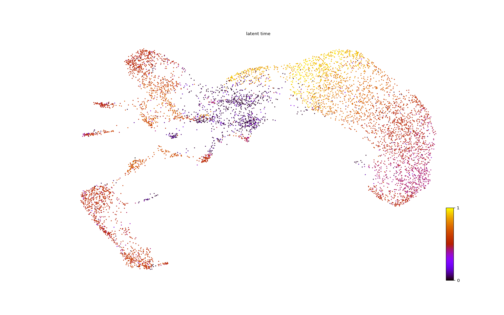
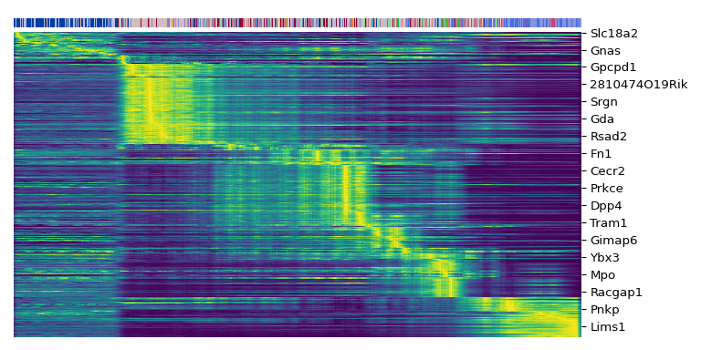

Estimating RNA Velocity using Seurat and scVelo
================
Compiled: June 10, 2020

This vignette demonstrates analysing RNA Velocity quantifications stored
in a Seurat object using scVelo. If you use scVelo in your work, please
cite:

> *Generalizing RNA velocity to transient cell states through dynamical
> modeling*
> 
> Volker Bergen, Marius Lange, Stefan Peidli, F. Alexander Wolf & Fabian
> J. Theis
> 
> doi: [10.1101/820936](https://doi.org/10.1101/820936)
> 
> Website: <https://scvelo.readthedocs.io/>

Prerequisites to
    install:

  - [Seurat](https://satijalab.org/seurat/install)
  - [scVelo](https://scvelo.readthedocs.io/installation.html)
  - [SeuratDisk](https://mojaveazure.github.io/seurat-disk/#installation)
  - [SeuratWrappers](https://github.com/satijalab/seurat-wrappers)

<!-- end list -->

``` r
library(Seurat)
library(SeuratDisk)
library(SeuratWrappers)
```

``` r
# If you don't have velocyto's example mouse bone marrow dataset, download with the CURL command
# curl::curl_download(url = 'http://pklab.med.harvard.edu/velocyto/mouseBM/SCG71.loom', destfile
# = '~/Downloads/SCG71.loom')
ldat <- ReadVelocity(file = "~/Downloads/SCG71.loom")
bm <- as.Seurat(x = ldat)
bm[["RNA"]] <- bm[["spliced"]]
bm <- SCTransform(bm)
bm <- RunPCA(bm)
bm <- RunUMAP(bm, dims = 1:20)
bm <- FindNeighbors(bm, dims = 1:20)
bm <- FindClusters(bm)
DefaultAssay(bm) <- "RNA"
SaveH5Seurat(bm, filename = "mouseBM.h5Seurat")
Convert("mouseBM.h5Seurat", dest = "h5ad")
```

``` python
# In Python
import scvelo as scv
adata = scv.read("mouseBM.h5ad")
adata
```

    ## AnnData object with n_obs × n_vars = 6667 × 24421
    ##     obs: 'orig.ident', 'nCount_spliced', 'nFeature_spliced', 'nCount_unspliced', 'nFeature_unspliced', 'nCount_ambiguous', 'nFeature_ambiguous', 'nCount_RNA', 'nFeature_RNA', 'nCount_SCT', 'nFeature_SCT', 'SCT_snn_res.0.8', 'seurat_clusters'
    ##     var: 'features', 'ambiguous_features', 'spliced_features', 'unspliced_features'
    ##     obsm: 'X_umap'
    ##     layers: 'ambiguous', 'spliced', 'unspliced'

``` python
scv.pp.filter_and_normalize(adata, min_shared_counts=20, n_top_genes=2000)
```

``` python
scv.pp.moments(adata, n_pcs=30, n_neighbors=30)
```

``` python
scv.tl.velocity(adata)
```

``` python
scv.tl.velocity_graph(adata)
```

``` python
scv.pl.velocity_embedding_stream(adata, basis="umap", color="seurat_clusters")
```



``` python
scv.pl.velocity_embedding(adata, basis="umap", color="seurat_clusters", arrow_length=3, arrow_size=2, dpi=120)
```


``` python
scv.tl.recover_dynamics(adata)
```

``` python
scv.tl.latent_time(adata)
```

``` python
scv.pl.scatter(adata, color="latent_time", color_map="gnuplot")
```



``` python
top_genes = adata.var["fit_likelihood"].sort_values(ascending=False).index[:300]
scv.pl.heatmap(adata, var_names=top_genes, sortby="latent_time", col_color="seurat_clusters", n_convolve=100)
```


