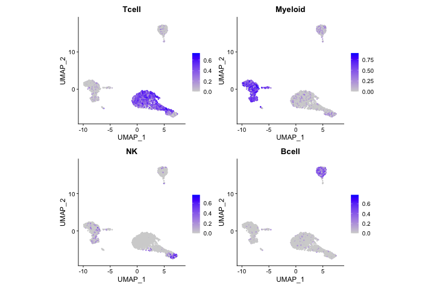
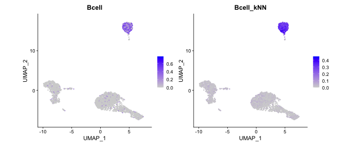
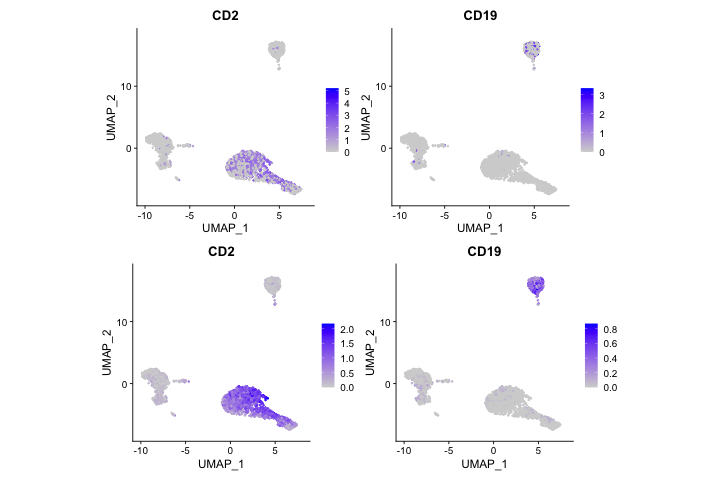

Single-cell signature scoring with UCell
================
Compiled: April 27, 2023

- <a href="#overview" id="toc-overview">Overview</a>
- <a href="#installation-and-setup"
  id="toc-installation-and-setup">Installation and setup</a>
- <a href="#get-some-testing-data" id="toc-get-some-testing-data">Get some
  testing data</a>
- <a href="#define-gene-signatures" id="toc-define-gene-signatures">Define
  gene signatures</a>
- <a href="#run-ucell-on-seurat-object"
  id="toc-run-ucell-on-seurat-object">Run UCell on Seurat object</a>
- <a href="#signature-smoothing" id="toc-signature-smoothing">Signature
  smoothing</a>
- <a href="#multi-core-processing"
  id="toc-multi-core-processing">Multi-core processing</a>
- <a href="#resources" id="toc-resources">Resources</a>
- <a href="#session-info" id="toc-session-info">Session Info</a>

This vignette demonstrates how to run UCell on single-cell datasets
stored as Seurat objects. If you use UCell in your research, please
cite:

> *UCell: Robust and scalable single-cell gene signature scoring*
>
> Massimo Andreatta and Santiago J. Carmona
>
> Computational and Structural Biotechnology Journal (2021)
>
> DOI: <https://doi.org/10.1016/j.csbj.2021.06.043>
>
> Website: [GitHub](https://github.com/carmonalab/UCell) and
> [Bioconductor](https://bioconductor.org/packages/release/bioc/html/UCell.html)

# Overview

In single-cell RNA-seq analysis, gene signature (or “module”) scoring
constitutes a simple yet powerful approach to evaluate the strength of
biological signals, typically associated to a specific cell type or
biological process, in a transcriptome.

UCell is an R package for evaluating gene signatures in single-cell
datasets. UCell signature scores, based on the Mann-Whitney U statistic,
are robust to dataset size and heterogeneity, and their calculation
demands less computing time and memory than other available methods,
enabling the processing of large datasets in a few minutes even on
machines with limited computing power. UCell can be applied to any
single-cell data matrix, and includes functions to directly interact
with Seurat objects.

# Installation and setup

UCell is available from
[Bioconductor](https://bioconductor.org/packages/release/bioc/html/UCell.html)

``` r
if (!require("BiocManager", quietly = TRUE)) install.packages("BiocManager")

BiocManager::install("UCell")
```

Load required packages

``` r
library(Seurat)
library(SeuratData)
library(UCell)
```

# Get some testing data

For this demo, we will use a small dataset of human PBMCs distributed
with [SeuratData](https://github.com/satijalab/seurat-data)

``` r
InstallData("pbmc3k")
data("pbmc3k")
pbmc3k
```

# Define gene signatures

Here we define some simple gene sets based on the “Human Cell Landscape”
signatures [Han et al. (2020)
Nature](https://www.nature.com/articles/s41586-020-2157-4). You may edit
existing signatures, or add new one as elements in a list.

Note that UCell supports gene sets with both positive and negative
genes:

``` r
signatures <- list(Tcell = c("CD3D", "CD3E", "CD3G", "CD2", "TRAC"), Myeloid = c("CD14", "LYZ",
    "CSF1R", "FCER1G", "SPI1", "LCK-"), NK = c("KLRD1", "NCAM1", "NKG7", "CD3D-", "CD3E-"), Bcell = c("MS4A1",
    "BANK1", "PAX5", "CD19"))
```

# Run UCell on Seurat object

``` r
pbmc3k <- AddModuleScore_UCell(pbmc3k, features = signatures, name = NULL)
head(pbmc3k[[]])
```

    ##                orig.ident nCount_RNA nFeature_RNA seurat_annotations     Tcell
    ## AAACATACAACCAC     pbmc3k       2419          779       Memory CD4 T 0.3609333
    ## AAACATTGAGCTAC     pbmc3k       4903         1352                  B 0.0000000
    ## AAACATTGATCAGC     pbmc3k       3147         1129       Memory CD4 T 0.5426667
    ## AAACCGTGCTTCCG     pbmc3k       2639          960         CD14+ Mono 0.1161333
    ## AAACCGTGTATGCG     pbmc3k        980          521                 NK 0.0000000
    ## AAACGCACTGGTAC     pbmc3k       2163          781       Memory CD4 T 0.4417333
    ##                  Myeloid        NK     Bcell
    ## AAACATACAACCAC 0.1344667 0.0000000 0.0000000
    ## AAACATTGAGCTAC 0.2572667 0.1395556 0.4511667
    ## AAACATTGATCAGC 0.1642667 0.0000000 0.0000000
    ## AAACCGTGCTTCCG 0.5048667 0.1920000 0.0000000
    ## AAACCGTGTATGCG 0.1591333 0.5943333 0.0000000
    ## AAACGCACTGGTAC 0.1338667 0.0000000 0.0000000

Generate PCA and UMAP embeddings

``` r
pbmc3k <- pbmc3k |>
    NormalizeData() |>
    FindVariableFeatures(nfeatures = 500) |>
    ScaleData() |>
    RunPCA(npcs = 20) |>
    RunUMAP(dims = 1:20)
```

Visualize UCell scores on low-dimensional representation (UMAP)

``` r
library(ggplot2)
library(patchwork)

FeaturePlot(pbmc3k, reduction = "umap", features = names(signatures)) & theme(aspect.ratio = 1)
```

<!-- -->

# Signature smoothing

Single-cell data are sparse. It can be useful to ‘impute’ scores by
neighboring cells and partially correct this sparsity. The function
`SmoothKNN` performs smoothing of single-cell scores by weighted average
of the k-nearest neighbors in a given dimensionality reduction. It can
be applied directly on Seurat objects to smooth UCell scores:

``` r
pbmc3k <- SmoothKNN(pbmc3k, signature.names = names(signatures), reduction = "pca")
```

``` r
FeaturePlot(pbmc3k, reduction = "umap", features = c("Bcell", "Bcell_kNN")) & theme(aspect.ratio = 1)
```

<!-- -->

Smoothing (or imputation) has been designed for UCell scores, but it can
be applied to any other data or metadata. For instance, we can perform
knn-smoothing directly on gene expression measurements:

``` r
genes <- c("CD2", "CD19")
pbmc3k <- SmoothKNN(pbmc3k, signature.names = genes, assay = "RNA", reduction = "pca", k = 20, suffix = "_smooth")

DefaultAssay(pbmc3k) <- "RNA"
a <- FeaturePlot(pbmc3k, reduction = "umap", features = genes) & theme(aspect.ratio = 1)
DefaultAssay(pbmc3k) <- "RNA_smooth"
b <- FeaturePlot(pbmc3k, reduction = "umap", features = genes) & theme(aspect.ratio = 1)
a/b
```

<!-- -->

# Multi-core processing

If your machine has multi-core capabilities and enough RAM, running
UCell in parallel can speed up considerably your analysis. The example
below runs on 4 cores in parallel:

``` r
BPPARAM <- BiocParallel::MulticoreParam(workers = 4)
pbmc3k <- AddModuleScore_UCell(pbmc3k, features = signatures, BPPARAM = BPPARAM)
```

# Resources

Please report any issues at the [UCell GitHub
repository](https://github.com/carmonalab/UCell).

More demos available on
[Bioconductor](https://bioconductor.org/packages/release/bioc/html/UCell.html)
and at the [UCell demo
repository](https://github.com/carmonalab/UCell_demo).

If you find UCell useful, you may also check out the [scGate
package](https://github.com/carmonalab/scGate), which relies on UCell
scores to automatically purify populations of interest based on gene
signatures.

See also [SignatuR](https://github.com/carmonalab/SignatuR) for easy
storing and retrieval of gene signatures.

# Session Info

``` r
sessionInfo()
```

    ## R version 4.3.0 (2023-04-21)
    ## Platform: x86_64-apple-darwin20 (64-bit)
    ## Running under: macOS Monterey 12.6
    ## 
    ## Matrix products: default
    ## BLAS:   /Library/Frameworks/R.framework/Versions/4.3-x86_64/Resources/lib/libRblas.0.dylib 
    ## LAPACK: /Library/Frameworks/R.framework/Versions/4.3-x86_64/Resources/lib/libRlapack.dylib;  LAPACK version 3.11.0
    ## 
    ## locale:
    ## [1] en_US.UTF-8/en_US.UTF-8/en_US.UTF-8/C/en_US.UTF-8/en_US.UTF-8
    ## 
    ## time zone: Europe/Zurich
    ## tzcode source: internal
    ## 
    ## attached base packages:
    ## [1] stats     graphics  grDevices utils     datasets  methods   base     
    ## 
    ## other attached packages:
    ## [1] patchwork_1.1.2         ggplot2_3.4.2           UCell_2.4.0            
    ## [4] pbmc3k.SeuratData_3.1.4 SeuratData_0.2.2        SeuratObject_4.1.3     
    ## [7] Seurat_4.3.0            BiocManager_1.30.20    
    ## 
    ## loaded via a namespace (and not attached):
    ##   [1] RColorBrewer_1.1-3          rstudioapi_0.14            
    ##   [3] jsonlite_1.8.4              magrittr_2.0.3             
    ##   [5] spatstat.utils_3.0-2        farver_2.1.1               
    ##   [7] rmarkdown_2.21              zlibbioc_1.46.0            
    ##   [9] vctrs_0.6.2                 ROCR_1.0-11                
    ##  [11] spatstat.explore_3.1-0      RCurl_1.98-1.12            
    ##  [13] htmltools_0.5.5             BiocNeighbors_1.18.0       
    ##  [15] sctransform_0.3.5           parallelly_1.35.0          
    ##  [17] KernSmooth_2.23-20          htmlwidgets_1.6.2          
    ##  [19] ica_1.0-3                   plyr_1.8.8                 
    ##  [21] plotly_4.10.1               zoo_1.8-12                 
    ##  [23] igraph_1.4.2                mime_0.12                  
    ##  [25] lifecycle_1.0.3             pkgconfig_2.0.3            
    ##  [27] Matrix_1.5-4                R6_2.5.1                   
    ##  [29] fastmap_1.1.1               GenomeInfoDbData_1.2.10    
    ##  [31] MatrixGenerics_1.12.0       fitdistrplus_1.1-8         
    ##  [33] future_1.32.0               shiny_1.7.4                
    ##  [35] digest_0.6.31               colorspace_2.1-0           
    ##  [37] S4Vectors_0.38.0            tensor_1.5                 
    ##  [39] irlba_2.3.5.1               GenomicRanges_1.52.0       
    ##  [41] labeling_0.4.2              progressr_0.13.0           
    ##  [43] fansi_1.0.4                 spatstat.sparse_3.0-1      
    ##  [45] httr_1.4.5                  polyclip_1.10-4            
    ##  [47] abind_1.4-5                 compiler_4.3.0             
    ##  [49] withr_2.5.0                 BiocParallel_1.34.0        
    ##  [51] highr_0.10                  MASS_7.3-59                
    ##  [53] DelayedArray_0.25.0         rappdirs_0.3.3             
    ##  [55] tools_4.3.0                 lmtest_0.9-40              
    ##  [57] httpuv_1.6.9                future.apply_1.10.0        
    ##  [59] goftest_1.2-3               glue_1.6.2                 
    ##  [61] nlme_3.1-162                promises_1.2.0.1           
    ##  [63] grid_4.3.0                  Rtsne_0.16                 
    ##  [65] cluster_2.1.4               reshape2_1.4.4             
    ##  [67] generics_0.1.3              gtable_0.3.3               
    ##  [69] spatstat.data_3.0-1         tidyr_1.3.0                
    ##  [71] data.table_1.14.8           XVector_0.40.0             
    ##  [73] sp_1.6-0                    utf8_1.2.3                 
    ##  [75] BiocGenerics_0.46.0         spatstat.geom_3.1-0        
    ##  [77] RcppAnnoy_0.0.20            ggrepel_0.9.3              
    ##  [79] RANN_2.6.1                  pillar_1.9.0               
    ##  [81] stringr_1.5.0               later_1.3.0                
    ##  [83] splines_4.3.0               dplyr_1.1.2                
    ##  [85] lattice_0.21-8              survival_3.5-5             
    ##  [87] deldir_1.0-6                tidyselect_1.2.0           
    ##  [89] SingleCellExperiment_1.22.0 miniUI_0.1.1.1             
    ##  [91] pbapply_1.7-0               knitr_1.42                 
    ##  [93] gridExtra_2.3               IRanges_2.34.0             
    ##  [95] SummarizedExperiment_1.30.0 scattermore_0.8            
    ##  [97] stats4_4.3.0                xfun_0.39                  
    ##  [99] Biobase_2.60.0              matrixStats_0.63.0         
    ## [101] stringi_1.7.12              lazyeval_0.2.2             
    ## [103] yaml_2.3.7                  evaluate_0.20              
    ## [105] codetools_0.2-19            tibble_3.2.1               
    ## [107] cli_3.6.1                   uwot_0.1.14                
    ## [109] xtable_1.8-4                reticulate_1.28            
    ## [111] munsell_0.5.0               GenomeInfoDb_1.36.0        
    ## [113] Rcpp_1.0.10                 globals_0.16.2             
    ## [115] spatstat.random_3.1-4       png_0.1-8                  
    ## [117] parallel_4.3.0              ellipsis_0.3.2             
    ## [119] bitops_1.0-7                listenv_0.9.0              
    ## [121] viridisLite_0.4.1           scales_1.2.1               
    ## [123] ggridges_0.5.4              leiden_0.4.3               
    ## [125] purrr_1.0.1                 crayon_1.5.2               
    ## [127] rlang_1.1.0                 cowplot_1.1.1              
    ## [129] formatR_1.14
