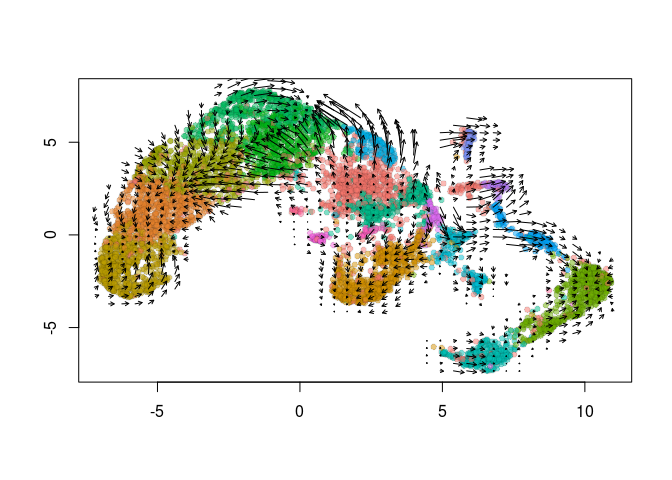

Estimating RNA Velocity using Seurat
================
Compiled: July 15, 2019

This vignette demonstrates analysing RNA Velocity quantifications stored in a Seurat object. Parameters are based off of the [RNA Velocity tutorial](http://pklab.med.harvard.edu/velocyto/notebooks/R/SCG71.nb.html). If you use velocyto in your work, please cite:

> *RNA velocity of single cells*
>
> Gioele La Manno, Ruslan Soldatov, Amit Zeisel, Emelie Braun, Hannah Hochgerner, Viktor Petukhov, Katja Lidschreiber, Maria E. Kastriti, Peter Lönnerberg, Alessandro Furlan, Jean Fan, Lars E. Borm, Zehua Liu, David van Bruggen, Jimin Guo, Xiaoling He, Roger Barker, Erik Sundström, Gonçalo Castelo-Branco, Patrick Cramer, Igor Adameyko, Sten Linnarsson & Peter V. Kharchenko
>
> doi: [10.1038/s41586-018-0414-6](https://doi.org/10.1038/s41586-018-0414-6)
>
> Website: <https://velocyto.org>

Prerequisites to install:

-   [Seurat](https://satijalab.org/seurat/install)
-   [velocyto.R](https://github.com/velocyto-team/velocyto.R)
-   [SeuratWrappers](https://github.com/satijalab/seurat-wrappers)

``` r
library(Seurat)
library(velocyto.R)
library(SeuratWrappers)
```

``` r
# If you don't have velocyto's example mouse bone marrow dataset, download with the CURL command
# curl::curl_download(url = 'http://pklab.med.harvard.edu/velocyto/mouseBM/SCG71.loom', destfile
# = '~/Downloads/SCG71.loom')
ldat <- ReadVelocity(file = "~/Downloads/SCG71.loom")
bm <- as.Seurat(x = ldat)
bm <- SCTransform(object = bm, assay = "spliced")
bm <- RunPCA(object = bm, verbose = FALSE)
bm <- FindNeighbors(object = bm, dims = 1:20)
bm <- FindClusters(object = bm)
bm <- RunUMAP(object = bm, dims = 1:20)
bm <- RunVelocity(object = bm, deltaT = 1, kCells = 25, fit.quantile = 0.02)
ident.colors <- (scales::hue_pal())(n = length(x = levels(x = bm)))
names(x = ident.colors) <- levels(x = bm)
cell.colors <- ident.colors[Idents(object = bm)]
names(x = cell.colors) <- colnames(x = bm)
show.velocity.on.embedding.cor(emb = Embeddings(object = bm, reduction = "umap"), vel = Tool(object = bm, 
    slot = "RunVelocity"), n = 200, scale = "sqrt", cell.colors = ac(x = cell.colors, alpha = 0.5), 
    cex = 0.8, arrow.scale = 3, show.grid.flow = TRUE, min.grid.cell.mass = 0.5, grid.n = 40, arrow.lwd = 1, 
    do.par = FALSE, cell.border.alpha = 0.1)
```


